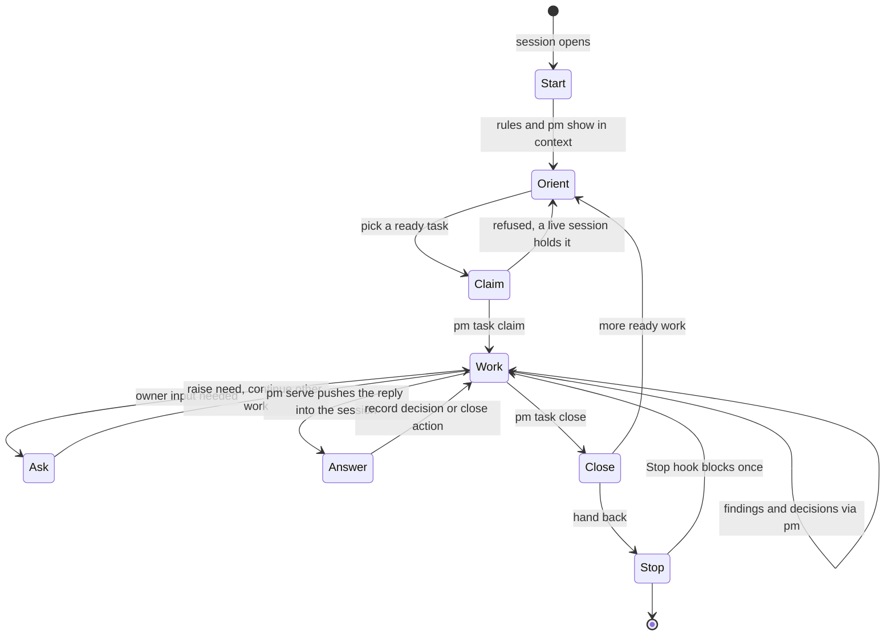
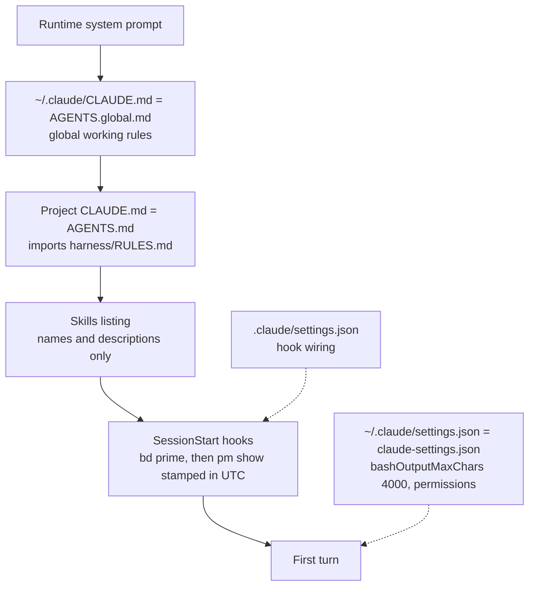
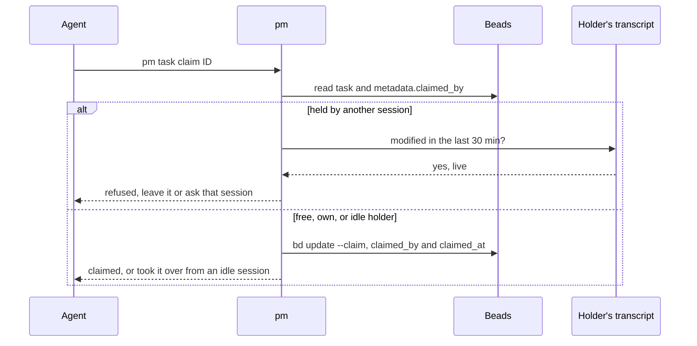
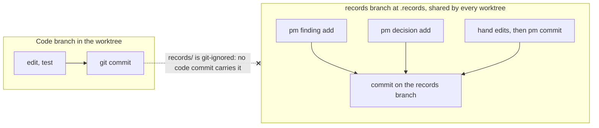
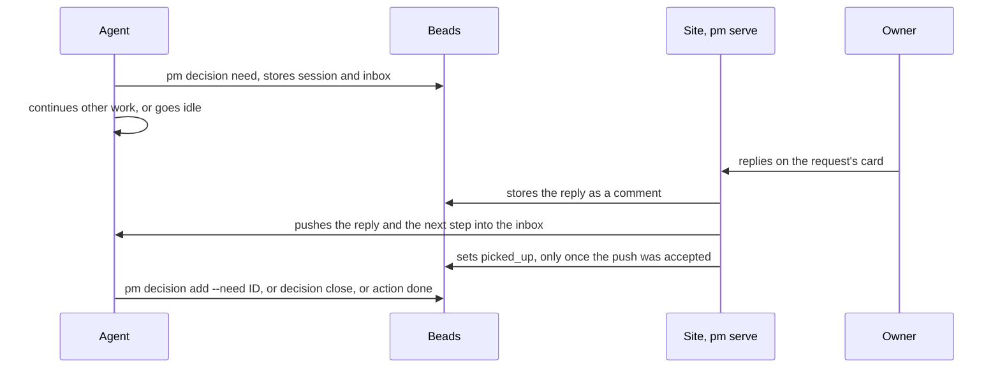
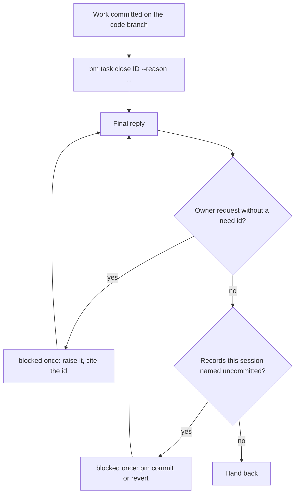

## Problem

> What are we solving, and why now?

Part of the [Project management harness](pm-harness.md) design. Many agent
sessions, in Claude Code and Codex, work the same Beads database and records
store at once, and the owner is rarely watching. Each session must start
knowing the project state, take only work nobody else holds, leave its
findings and decisions where the owner reads them, ask the owner without
stopping, and hand back with nothing half-written. This page follows one
session from start to hand-back and names the command or hook behind each
step; the sprint-level flow is [Sprint lifecycle](sprint-lifecycle.md).

## Goals and non-goals

> What must the design achieve, and what does it deliberately leave out?

**Goals**

- A session starts oriented: rules and project state are in its context
  before its first turn, without it running anything.
- Two live sessions never work the same task.
- Every request to the owner is a Beads need the site shows; the agent keeps
  working while it waits and is woken by the answer.
- A session cannot hand back with uncommitted records or a request asked
  only in chat.

**Non-goals**

- Scheduling which agent takes which work; agents pick from `pm show` and
  `bd ready`.
- Cross-machine liveness; see [Session claims](session-claims.md).
- Sessions pushing Beads data or records; the scheduled `pm push` does.

## Constraints and key facts

> Which facts, findings and constraints shaped the design? Only those that
> still hold; sprint records keep the findings as they happened.

- Rules cost context on every turn, so the always-loaded layer is short:
  `AGENTS.global.md` and `RULES.md`; skill bodies load only when invoked
  (Context efficiency (a yeeef-agents record)).
- Claude Code caps a hook's `additionalContext` at 10,000 characters; the
  start hook cuts at a line and says so. So session start injects only the
  top level of `pm show` (about 1,200 characters in this repo); a project's
  sprints and tasks are one command deeper.
- A session is identified by `CLAUDE_CODE_SESSION_ID` (Claude Code) or
  `CODEX_THREAD_ID` (Codex), which both runtimes export to every command.
- A session counts as live while its transcript was written in the last 30
  minutes; that is the only liveness signal, and it is local to the machine.
- Agents forget instructions: four of six owner requests were asked only in
  chat while the rule alone guarded them
  ([Owner request hook](owner-request-hook.md)). Each step that matters is
  therefore a command that refuses or a hook that blocks.
- Hooks fail open: a broken hook must never stop a session from starting or
  stopping.
- Claude Code binds a per-session inbox socket and exports its path to every
  command as `CLAUDE_CODE_MESSAGING_SOCKET`; a line written to it starts a
  new turn in an idle session and is read between tool calls in a busy one
  ([Reply delivery](reply-delivery.md)). Codex has no such inbox.

## Design

> What is it, in its final state? Free `###` subsections. Decisions and plans
> live in the project and sprint records.

### Overview

A session orients, claims, works and closes in a loop; owner questions branch
off without stopping the work, and the Stop hooks can send it back once
before it hands back.

The hooks behind it, by runtime:

| Event | Claude Code (`.claude/settings.json`) | Codex (`.codex/hooks.json`) | What it does |
|---|---|---|---|
| SessionStart | `bd prime --hook-json`, `session_context_hook.py` | `bd codex-hook SessionStart`, `session_context_hook.py` (startup, resume, clear) | Beads workflow, then the `pm show --refresh-inbox` snapshot, which first points this session's open requests at its current inbox |
| SubagentStart | `session_context_hook.py` | same | One line naming the Beads agent profile |
| Stop | prompt hook judged by Claude Haiku | `owner_request_hook.py` (phrase patterns) | Blocks a reply that asks the owner without a need id |
| Stop | `uncommitted_records_hook.py` | same | Blocks while records this session named are uncommitted |
| Pre/PostCompact, UserPromptSubmit | none | `bd codex-hook …` | Refreshes Beads context |

### Start: what is in the context

Instructions stack from global to project to live state; settings shape the
session without entering its context.

- `make setup-agent` links `AGENTS.global.md` as `~/.claude/CLAUDE.md`,
  `claude-settings.json` as `~/.claude/settings.json`, and each skill under
  `skills/` into `~/.claude/skills/`.
- `bd prime` prints the Beads workflow. `session_context_hook.py` runs
  `pm show` as the starting session and prepends "Project state from
  `bin/pm show` at session start, <time> UTC", so the warning at its top
  lists only tasks other live sessions hold. When `pm show` fails the context
  is one line saying so.
- Claude Code fires SessionStart again after compaction and `/clear`, so the
  snapshot is refreshed then too. The snapshot goes stale while the session
  runs: run `pm show` again before stating project state to the owner.
- **Subagents** get neither `bd prime` nor `pm show`. SubagentStart injects
  one line, such as "Beads agent profile: team-maintainer (commit and push
  are routine unless your brief says otherwise)."; everything else comes in
  the parent's brief.
- **Codex** reads `AThe agent orients from the injected snapshot, the top level of `pm show`,
rather than re-running it, and drills down one level at a time, only as far
as its work needs:

| Level | Command | What the agent reads there |
|---|---|---|
| Top | `pm show` (injected) | A failed push; tasks other live sessions hold (`[held by <sid>, <age>, live\|idle]`); the site; one line per open project with its open and running sprint counts and owner requests; one line per owner request, flagged `[undelivered reply: pm reply read ID]` when its site reply or PR merge did not reach its session |
| Project | `pm show --project NAME` | The goal, owner requests in full, feedback, open sprints with their tasks and holders, sprints with no tasks, the last decisions |
| Sprint | `pm show --sprint ID` | One sprint's frame, findings and tasks |
| Section | `pm show --record … --section …` | One record section instead of a whole record |

`bd ready --exclude-type=epic` lists unblocked tasks. The agent never starts
or briefs a task another live session holds, and work outside any sprint
first becomes a small sprint.
f a whole record. The agent never starts or briefs a task
another live session holds, and work outside any sprint first becomes a
small sprint.

### Claim

A claim records who holds the task and when; only a live other holder
refuses it.

`pm task claim` fails hard when no session id is set (`--session` names
one). A subagent runs with its parent's session id, so it claims and closes
its own task without a conflict. Raw `bd update --claim` skips the check and
records no session, so the harness never uses it.

### Work

Code and records never share a commit: code goes on a branch off main,
records on the `records` branch, which each `pm` write commits itself.

- Each worktree reads the store through `records/`, a git-ignored link set up
  by `bin/pm setup` ([Shared records store](records-store.md)). A `pm` write
  refuses a record that would not render, or one with uncommitted changes.
- Findings are bullets in the sprint's Findings as they happen, with their
  numbers.
- Decisions: `--level project` when later sprints must follow it,
  `--level sprint` for this sprint's own work. The agent's own are
  `source=agent`; `source=owner` only with `--need` (it answers a need) or
  `--confirmed`.
- Goal, Done when, delivery reports and design pages are edited by hand in
  the store and committed with `pm commit -m "…" <path>`.
- Delegation: the main agent decides and briefs; a subagent claims
  (`pm task claim`) and closes its own task and reports back, and the main
  agent checks the report against the files before accepting it.

### Asking the owner

When work waits on the owner, the agent raises a need and keeps working on
other ready tasks:

- **Decision need**, `pm decision need --title … --parent ID`: the owner
  must choose. Its body stands alone: the question, Options with their cost,
  a Default.
- **Action need**, `pm action need --title … --parent ID`: the owner must do
  something only they can, such as run a command or apply a setting.
- **PR review**, `pm action need --pr URL --sprint ID --focus …`: refused
  until the sprint's delivery report is written; a need that asks to
  review, merge or approve a PR without `--pr` is refused.

In Claude Code each stores the raising session in `metadata.session` and its
inbox socket in `metadata.inbox`, with the machine's hostname; never the
inbox's token, since Beads syncs to the remote. Nothing is started: no hook
or process waits for the answer.

The site that stores the reply delivers it: the session takes it as a new
turn when idle, or between tool calls when busy, with the next command to
run.

- **PR merges** take the same path: every 60 s `pm serve` looks at each
  open review's PR through `gh`, and once its merge commit is on
  `origin/main` pushes it once, naming `pm action done` and the
  `git pull --ff-only` that updates the main checkout.
- **A failed push** (timeout, socket briefly missing) stays undelivered;
  `pm serve` sweeps open requests every 60 s and pushes again. A repeat
  delivery is tolerated; a lost one is not.
- **A session that cannot be reached** (it ended, it runs in Codex with no
  inbox, or its inbox is on another machine than `pm serve`) keeps the
  reply undelivered: `pm show`, and so the next session's start, flags the
  request, and `pm reply read ID` prints the reply and marks it delivered.
  A resumed session binds a new socket; its start hook points its open
  requests at it, and the sweep delivers what the old one missed.
- Closing a request (`pm decision add --need`, `pm decision close`,
  `pm action done`) refuses while it holds an undelivered site reply, so no
  close buries one.
- An answer that sets a rule becomes a decision citing the need; one that
  sets none closes with `pm decision close` and its reason. An action is
  closed with `pm action done` once the agent sees it done. Only site
  replies count as replies, so an answer given in chat, pm's own comments
  and an agent's comment leave nothing undelivered.
- How a site reply is stored: [Replies on the site](site-replies.md); how
  it is delivered: [Reply delivery](reply-delivery.md).

### Finish and hand back

Closing a task stamps its commit; two Stop hooks each block once, and on
`stop_hook_active` let the stop through so they never loop.

- `pm task close` appends "(commit <sha>)" from `--commit` or from HEAD when
  HEAD is newer than the claim, and warns when there is none or the working
  tree is dirty. It refuses a need; needs close through `pm decision` or
  `pm action done`.
- The uncommitted-records hook names only dirty store files whose paths
  appear in this session's tool calls, since other sessions write the same
  store.
- The session pushes neither Beads data nor records: the scheduled
  `pm push` does every 10 minutes from the main checkout. Code goes up as
  a PR; the sprint's report, review and close follow
  [Sprint lifecycle](sprint-lifecycle.md).

## Alternatives considered

> What else was considered and not adopted, and why not?

- **Raw `bd update --claim`:** records no session and checks no holder;
  wrapping or blocking it was not chosen, so the rules require
  `pm task claim` ([Session claims](session-claims.md)).
- **The agent starting its own reply waiter (`pm reply wait`):** it
  depended on the agent remembering.
- **A PostToolUse hook starting the waiter (`reply_wait_hook.py`,
  `asyncRewake`):** it learned the ids from the raising command's printed
  output and woke the session only by exiting, so it lost replies when the
  output was piped through grep, when several requests shared one waiter,
  and on a second reply to one request. A poller restarted on every Bash
  call and turn end fixed those but tied delivery to Claude Code's hook
  lifecycle; both are weighed in [Reply delivery](reply-delivery.md).
- **The rule alone for owner requests:** four of six requests stayed in
  chat; the Stop hooks enforce it
  ([Owner request hook](owner-request-hook.md)).

## Prior art

> Optional. What existing work did we learn from, and what did we take?

None yet.

## Open questions

> What is still unresolved?

- Reply delivery rests on an inbox message line that was observed, not
  documented, and a push into a busy session is not yet seen live
  ([Reply delivery](reply-delivery.md)).
- Cross-machine liveness: a live session on another machine looks idle, so
  its claim can be taken over ([Session claims](session-claims.md)).
