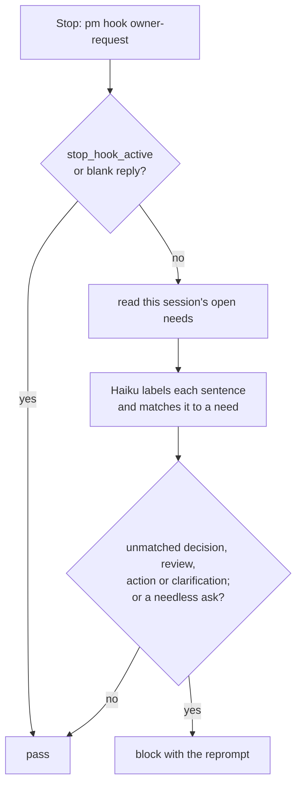

## Problem

> What are we solving, and why now?

- Agents ask the owner for decisions and actions in chat ("needs input: …", "please review …"). When the owner is not watching the chat, those requests never reach the site, so the owner may never see them.
- In context-efficiency sprint 1, four of six things waiting on the owner were asked only in chat, although the rules already required raising them. A rule the agent must remember did not work; the owner wants a check that runs on its own when an agent ends its turn.
- The rule and the check must say the same thing. On 2026-10-10 the hook blocked three of four replies in a conversation the owner was having with an agent: it judges every request, while prime.md and the block text claim a "sprint work waits on it" condition that nothing checks (pm-harness sprint 107, Findings).

## Goals and non-goals

> What must the design achieve, and what does it deliberately leave out?

Goals:

- An agent cannot end its turn with a request to the owner left only in chat. Each request is raised as a need first: a decision, an action or a PR review, under the sprint or task it belongs to; with none, the agent opens one first.
- When the agent has a clear reason not to raise a need, such as the owner plainly being in the chat and wanting to answer there, it asks with AskUserQuestion, never as a question in plain text.
- The agent does what it can itself first, and asks the owner only for what only the owner can do.
- One rule in three texts: prime.md's request rules, the judge prompt and the reprompt allow and block the same cases.
- Few false alarms: a reply that quotes, reports or describes a request without asking it, and an offer nothing waits on, pass.
- Cheap enough to run at every turn end: a few seconds at most.

Non-goals:

- A per-session mode that turns the hook off while the owner is in the chat: AskUserQuestion covers that case (Alternatives considered).
- Checking subagent reports: they end with SubagentStop and go to the main agent, not the owner.
- Proving a matched need is the right one: a semantic match to an open need of this session is enough.

## Constraints and key facts

> Which facts, findings and constraints shaped the design? Only those that
> still hold; sprint records keep the findings as they happened.

- A Stop hook sees the final reply (`last_assistant_message`), `session_id` and `cwd`, and can block once; on `stop_hook_active` the next stop must pass, so the hook can never loop.
- AskUserQuestion runs mid-turn and waits for the answer, so its question is never in `last_assistant_message` and the hook never judges it. In a session nobody watches it waits forever, and the question is not on the site.
- The judge, `claude -p --model claude-haiku-5-5` with thinking off and no settings, tools or MCP, takes about 2 s; with thinking on a verdict took 5 to 36 s. Its timeout is 15 s, inside the hook's 30 s.
- The judge sees only the reply and this session's open needs (title and the first 400 characters of the description). It knows nothing of sprints or tasks, so a rule that depends on them cannot be enforced.
- A need's `--parent` must be an open item inside a project with a record. A project itself is refused ("not inside a project with a record"), so every need sits under a sprint or a task.
- Codex runs only command hooks, and trusts each hook per file path and hash: a new or changed hook entry runs only after the owner approves it in `/hooks`.
- Phrase patterns (sprint 13) missed requests worded differently and blocked a reply that cited every request because one line said "waiting on you".
- Agents cite requests by the short id `pm show` prints (`9va.29.4`). An id written in a reply is not a match by itself: only an open need of this session matches.

## Design

> What is it, in its final state? Free `###` subsections. Decisions and plans
> live in the project and sprint records.

### Overview

Reading: every reply is judged; a question asked with AskUserQuestion never reaches the judge, because it is not in the final reply.

### One rule

The rule, as all three texts state it:

1. Do what you can yourself first. Ask the owner only for what only the owner can do: a choice, a credential, a review or merge, a step outside the agent's reach.
2. Raise each such request as a need under the task or sprint it belongs to. If no sprint or task holds it, open one first (`pm task add`, or `pm sprint open` for work no open sprint fits).
3. When there is a clear reason not to raise a need, such as the owner plainly being in the chat and wanting to answer there, ask with AskUserQuestion, never as a question in plain text.
4. Do not ask leave for a step you are authorized to take: working a sprint's tasks, committing, pushing its branch, opening its PR.

| Text | Where | States the rule as |
|---|---|---|
| prime.md | the "Never leave a request only in chat" invariant | the rule in one line: ask only for what you cannot do yourself, as a need under its task or sprint (opened if none holds it), or with AskUserQuestion; item 4 is the invariant that agents push and open PRs without asking. The detail is left to the reprompt, which the agent gets whenever it matters, to keep every session's context small |
| Judge prompt | `owner_request_system.txt` | what to block: an unmatched decision, review, action or clarification, and a needless ask (items 2 and 4); what passes: offers nothing waits on, and quotes, reports and plans |
| Reprompt | `owner_request_reason.txt`, `owner_request_needless.txt` | how to get past a block: items 1, 2 and 3 in that order; item 4 for a needless ask |

- prime.md is short and the reprompt is detailed, but no text adds a condition the others lack. The "sprint work waits on it" condition goes from all three: the judge cannot check it, and a chat request is lost whether a sprint holds it or not.
- A rule change edits all three in one commit, and adds a labelled case to `tests/owner_request_cases.json` for each case it moves.

### The judge

- `pm hook owner-request` reads the session's open needs from the work store, then asks Haiku for every sentence of the reply that addresses the owner, its kind, and the open need it matches, by meaning.
- Kinds that block when no open need matches: `decision`, `review`, `action`, `clarification`. A sentence that makes the agent's next step depend on something the owner must first provide or do is an `action`, worded as a condition ("If you paste the log, I'll find the cause") or a statement ("Without the log I can't tell which"). A clarification asked in plain text is lost when nobody reads the chat; asked with AskUserQuestion it is not in the reply.
- Kinds that pass: `offer` and `suggestion` that nothing waits on, and `not asked` (quotes, reports, examples, the agent's own plan, text in code blocks). An offer the work cannot finish without is a request, however politely put.
- `authorized` (a needless ask) blocks even when a need matches.

### The reprompt

The block reason the agent sees (`owner_request_reason.txt`), in this order:

1. The quoted sentences that blocked.
2. Do it yourself first: read the file, run the command, find the transcript, take the step the rules authorize. Only what only the owner can do is a request.
3. For each request left, raise it, with the `pm decision need`, `pm action need` and `pm action need --pr` forms; the parent is the task or sprint it belongs to. If there is no such sprint or task, create one first (`pm task add`, or `pm sprint open` for work no open sprint fits).
4. If there is a clear reason not to raise a need (for example, the owner is plainly in the chat and wants to answer there), ask with the AskUserQuestion tool, never as a question in plain text.
5. Then end the reply, with no plain-text question to the owner left in it.

The needless-ask reason (`owner_request_needless.txt`): take the authorized step instead of asking; it lists the same authorized steps as item 4 of the rule, committing included.

### Runtimes

- Claude Code and Codex run the same command hook, `pm hook owner-request || exit 1`, written by `pm init` into `.claude/settings.json` and `.codex/hooks.json` (Stop, 30 s), before `pm hook stop`.

### How it is checked

- Review: prime.md, the judge prompt and the reprompt read side by side; no case is allowed by one and blocked by another.
- `make test-live` on `tests/owner_request_cases.json`, each case 3 runs by default (`PM_LIVE_RUNS`), all with the case's verdict; after a prompt change, run 10, since a case at 4 in 10 can pass 3 of 3 by chance. Cases include the three replies blocked on 2026-10-10, labelled by the rule (a chat request with no sprint blocks), and a reply whose only question went through AskUserQuestion (passes).
- A live session: a reply that asks the owner for a file only in chat is blocked and the reprompt names doing it yourself first; it passes once a need is raised under a sprint or task, or once the question moves to AskUserQuestion.

## Alternatives considered

> What else was considered and not adopted, and why not?

| Option | How it works | Why not chosen |
|---|---|---|
| **Keep the sprint-work condition** | Exempt requests no sprint waits on | The judge cannot see sprints or tasks, so the condition was never checked; and a chat request in an unattended session is lost whether a sprint holds it or not |
| **Per-session interactive mode** | The owner sends `pm interactive`; the hook reads the last such prompt from the transcript and skips the judge | AskUserQuestion already keeps a live question out of the judged reply; the mode adds a transcript reader for two runtimes and open questions on Codex's transcript format and on compaction, for one block-and-retry per plain-text question (owner decision 2026-10-10) |
| **Pass when the session holds no claimed task and no open need** | Deterministic gate before the judge | Lets every request through in a planning or Q&A session where the owner may not be watching |
| **Needs filed under the project** | A request outside any sprint becomes a project-level need | The owner ruled that every request is tracked work: open a sprint or task first (2026-10-10); pm also refuses a project as `--parent` |
| **Claude Code prompt hook** (`"type": "prompt"`, the earlier design) | Haiku reads the reply in-process | Cannot read the work store, so it checked that an id was cited, not that the need was open; Claude Code only |
| **Phrase patterns** (sprint 13) | A phrase list plus a cited-id check | Missed requests worded differently; blocked a reply that cited its needs |
| **Rule only** | The agent remembers | Four of six requests were asked only in chat |

## Prior art

> Optional. What existing work did we learn from, and what did we take?

- The hooks survey for this project ([Hooks for the pm harness](../docs/2026-10-04-hooks-for-pm.md)) measured hook costs and found that Codex has no prompt hooks.

## Open questions

> What is still unresolved?

1. **Codex:** Codex has no AskUserQuestion. Does it have a tool that asks the owner mid-turn, so item 3 of the rule has a Codex form, or does a Codex agent always raise a need?
2. **Unattended AskUserQuestion:** the agent's judgement of a "clear reason" is the only guard against a question that waits forever in a session nobody watches. If agents misjudge it, the rule narrows item 3.
