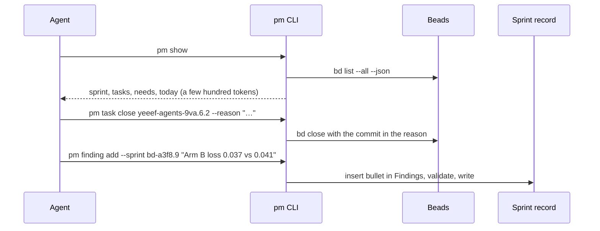

## Problem

> What are we solving, and why now?

Part of the [Project management harness](pm-harness.md) design. Records that agents edit freely drift from their format, and an
action that touches both Beads and a record (opening a sprint, answering a
need) takes several steps an agent can get wrong. Agents also need project
state without reading every record.

## Goals and non-goals

> What must the design achieve, and what does it deliberately leave out?

**Goals**

- Agents read project state in a few hundred tokens (`pm show`) and write
  through commands that check every write.
- One command for each action that changes both Beads and a record, or that
  needs a check Beads cannot do.

**Non-goals**

- Wrapping all of `bd`: `pm` wraps only actions that touch both layers or need
  a check Beads cannot do.
- Editing or deleting an existing entry; that is done by hand.

## Constraints and key facts

> Which facts, findings and constraints shaped the design? Only those that
> still hold; sprint records keep the findings as they happened.

- A repo holds many projects, each with several sprints that can be open at
  once, so nothing can be inferred from "the only project" or "the open sprint".
- Agents run under the owner's git identity, so git and Beads cannot tell an
  agent's change from the owner's.
- Some tasks commit nothing, so a task close cannot require a commit.
- An agent's shell may give a command stdin as a socket that never closes, so
  a read of stdin can hang forever. A body passed as
  `--text="$(cat <<'EOF' … EOF)"` breaks on macOS bash 3.2 when it holds an
  apostrophe or a lone `)`, and a backtick inside double quotes executes.

## Design

> What is it, in its final state? Free `###` subsections. Decisions and plans
> live in the project and sprint records.

`pm` is the write path for records and for project actions that touch both Beads and a record. Finding, claiming and linking tasks stay plain `bd`. Every `pm` write validates the whole record set before and after, and writes nothing if the result would not render.

A command that takes a body ("in the body" below) takes it with `--text` for one plain line, or with
`--text-file PATH`; the two are exclusive. `--text-file -` reads stdin, and only when it is a pipe or a file,
so agents give multi-line text as `--text-file - <<'EOF'` … `EOF`. Any other stdin (a tty, a socket, a
device) is refused before reading. No other command reads stdin.

### Commands

| Command | Arguments | Records | Beads | Refuses when |
|---|---|---|---|---|
| `pm show` | `[--json]` | Reads; prints the top level: push-failure and held-task warnings, one fixed-size `site:` line naming the site and how a record maps to its page, then one line per open project with one line per owner request (shown below); `--json` prints every level's data as one object, the day summary too, with `site` and a `url` per project and open sprint | Reads `bd list --all --json` | Records do not validate (prints the errors) |
| `pm show --project` | `NAME` (a project name or its Beads id) | Reads; prints that project's level: goal, decision and action lists, feedback, open sprints with their tasks, sprints with no tasks, last decisions | Reads `bd list --all --json` | No open project matches (lists the open ones); `--json` or `--sprint` given with it |
| `pm show --sprint` | `ID` | Reads; prints one sprint's frame, findings and tasks | Reads `bd list --all --json` | `--json` or `--project` given with it |
| `pm show --record --section` | `--record <target>` (a record path, sprint or project id, project name or design slug), `--section <name>` (a heading's text, any level), both required together | Reads one record; prints the section from its heading through the next heading of the same or a higher level, prompt lines included. Headings are found as the renderer parses them, so a `#` line in a code fence or raw HTML block is not one | None | No record or several match; no heading or several headings have that name (prints the record's section names, indented by level); `--sprint`, `--project` or `--json` given with it |
| `pm record link` | `<target>`: sprint or project id, project name, design slug or record path (`records/` and `.md` optional) | Reads; prints the page's URL on the served site, with no render step since `pm serve` renders on every load | None | No record or several match; nothing answers on `127.0.0.1:$PORT` (names `make docs`); the server does not send `X-PM-Store` naming this store (names: stop it, then `make docs`) |
| `pm day summarize` | `[--dry-run]` | Builds a digest of today's activity; when it changed, asks `claude -p --model haiku` for a 2–4 sentence ASD-STE100 summary and commits `records/days/<date>.summary.json`; `--dry-run` prints it and writes nothing. Run by the scheduled `pm push` as its `summary` step, every 10 minutes; it first regenerates yesterday's summary when yesterday's digest changed | `claude -p` | `claude` missing, failing or returning nothing (writes nothing) |
| `pm finding add` | `"<text>"` `--sprint ID` (required) | Appends a bullet to that sprint's Findings, replacing "None yet." | None | `--sprint` missing, unknown or closed |
| `pm decision add` | `--level project\|sprint` (required); `--project NAME` for project level or `--sprint ID` for sprint level (required); `[--until "…"]`; `--decision "…"` and `--reason "…"` (required, one line each; stdin is not read); `[--need ID \| --confirmed]` | Appends a `::: decision` block to that project's or sprint's Decisions, `date` = today, replacing "None yet.": the decision line, then the reason line. `source=agent`, or `source=owner` with `--need` (the block then ends "Answers `<need-id>`.") or `--confirmed`; there is no `--source` flag | With `--need` on an open need: `bd human respond <id>` with the same text, which comments and closes; it runs first, and a failed record write prints `bd reopen <id>` to undo it. A need the owner already closed is only recorded | No `--level`; the target for that level is missing, unknown, closed or given with the other level's flag; `--decision` or `--reason` missing (argparse), empty, more than one line, or starting with `:::`; `--need` is not an issue labelled `human`, is an action, or was dismissed |
| `pm decision need` | `--title "…"` `--parent ID` (a sprint or task, both required); `--question`, repeatable `--fact`, repeatable `--option LABEL TEXT` with one `--cost LABEL TEXT` each, `--default LABEL REASON` (all required, one line each; stdin is not read). [Decision need layout](decision-need-layout.md) has the rules | None | `bd create --type=task --parent=ID --labels=human` with the description, and `metadata.session` naming the raising session when `$CLAUDE_CODE_SESSION_ID` is set (also for `pm action need`) | `--parent` missing, unknown, closed or outside every project with a record; a part missing, empty or malformed, as the [Decision need layout](decision-need-layout.md) refusals list |
| `pm decision close` | `<need-id>` `--reason "<why it sets no rule>"`, the answer in the body | None | Open need: `bd human respond <id>` with the answer and "No decision record: <why>", then `bd update <id> --add-label=no-decision`. Need the owner already closed: `bd comments add` with the reason, then the label | The reason empty; an open need with no answer; an action, a dismissed need or one already marked |
| `pm action need` | `--title "…"` `--parent ID` (both required without `--pr`), what to do and why in the body; `--sprint`, `--focus` and `--design` refused without `--pr` | None | `bd create --type=task --parent=ID --labels=human,action` with the description | As `pm decision need`; description empty, refused with the expected shape and an example |
| `pm action need --pr URL` | `--sprint ID` (repeatable) and `--focus "…"` required, `--parent` not allowed; `--design SLUG` (repeatable), `--title` (default `Review PR #<n>`); extra context in the body | None | `bd create --type=task --parent=<first sprint> --labels=human,action --external-ref=<pr>` with `metadata.review` holding the PR, sprints, focus and named design pages; the review blocks that sprint's close. The card adds the sprints' delivery reports and the design pages the sprint records list | `--pr` not a URL; focus empty; a sprint without a record, closed, or whose committed report is not written (Outcome or Against "Done when" still "Not closed yet."); a design slug with no page |
| `pm action done` | `<id>` `--reason "…"` (required) | None | `bd close <id> --reason=…` | The issue is unknown, closed, not labelled `human` or not an action; the reason empty |
| `pm reply wait` | `[ID…]` (default: the open requests whose `metadata.session` is `$CLAUDE_CODE_SESSION_ID`), `--timeout SECONDS` | None | Polls `bd show` every 5 s until a request is labelled `replied` or closed, or, for a PR review, until `gh pr view` reports it merged and its merge commit is on `origin/main` (checked every 60 s; without gh, replies only); prints its site replies (comments by `owner (site reply)`) or the merge commit, and the next step, then `bd update <id> --remove-label=replied`. In Claude Code the reply-wait hook starts it after a raise. See [Replies on the site](site-replies.md) | An id not labelled `human`; no ids and no session, or a session with no open request; no reply before the timeout |
| `pm doc new` | `<slug>` `--title "…"`, exactly one of `--bead ID` or `--project NAME`, body in the body | Creates `records/docs/<today>-<slug>.md` with header `type: doc`, `title`, `date` and `bead` or `project`; the sprint, day, project and root pages list it by query, no edit | None | The slug is not lowercase words joined by `-`; the file exists; neither or both of `--bead` and `--project`; the bead is unknown or outside every project with a record, or the project is unknown; title or body empty |
| `pm design new` | `<slug>` `--title "…"` `--project NAME` | Creates `records/design/<slug>.md` with header `type: design`, `title`, `project` and every template section, each with its prompt line and "None yet."; the page is then written by hand | None | The slug is not lowercase words joined by `-`; the file exists; the project is unknown; title empty |
| `pm postmortem new` | `<slug>` `--title "…"`, exactly one of `--sprint ID` or `--project NAME` | Creates `records/postmortems/<today>-<slug>.md` with header `type: postmortem`, `title`, `date` and `sprint` or `project`, and every section (Summary, Timeline, Cost, Root cause, What changed, What would have caught it earlier), each with its prompt line and "None yet."; the text is then written by hand; the sprint, project and root pages list it by query | None | The slug is not lowercase words joined by `-`; the file exists; neither or both of `--sprint` and `--project`; the sprint has no record (open or closed both work), or the project is unknown; title empty |
| `pm project open` | `<name>` `--title "…"`, Goal in the body | Creates `records/projects/<name>.md` with every section, the rest as placeholders | `bd create --type epic` | The name exists; Goal is empty |
| `pm sprint open` | `<project>` `--title "…"`, frame in the body (Goal, Scope with **In**/**Out**, Done when) | Creates `records/sprints/<project>-<n>.md` with every section, the rest as placeholders | `bd create --type epic --parent <project epic>` | Goal, Scope (In and Out) or Done when missing or empty; the project epic is closed |
| `pm sprint close` | `<sprint-id>` | Appends "Merged as <sha> (PR #N)." to the Outcome after its verdict paragraph and commits the record on the records branch as `[SPRINT] …`; a sprint with no review gets no stamp | `bd close <epic> --reason="<outcome> (records commit <records HEAD>)"` | Uncommitted changes in the store; the committed Outcome or Against "Done when" still "Not closed yet.", or Outcome not done/partial/voided; a child task open, a review included; a review not closed as `merged as <sha>` (a dismissed review, such as a replaced PR's or a [TEST] one, is skipped) |
| `pm sprint move` | `<sprint-id>` `--to PROJECT`, reason in the body (two lines at least) | Renames the record to `sprints/<project>-<m>.md` and appends a `::: decision {source=agent …}` naming the sprint, both numbers and the reason to both projects' records, in one records commit | The work store first: the sprint's parent, its next number in the new project and a move note, in one write through the compare-and-swap ([work store](work-store.md), Moving a sprint); a rerun after a failed records step writes the records step alone | The sprint is unknown, not a sprint, closed or has no record; the project is unknown or closed, or already holds the sprint under its name; reason empty or one line |
| `pm project close` | `<name>` | Reads only | `bd close <project epic> --reason="… (commit <records HEAD>)"` | Uncommitted changes in the store; the committed `## Outcome` still "Not closed yet."; a sprint of the project still open |
| `pm task add` | `--sprint ID` `--title "…"`, description in the body (optional) | None | `bd create --type=task --parent=ID` | `--sprint` missing, unknown, closed, not an epic, or outside every project with a record; title empty |
| `pm task close` | `<id>` `[--reason "…"]` `[--commit REF]` | None | `bd close <id> --reason="<reason> (commit <hash>)"`: HEAD if committed after the task started, or `--commit`; with neither, no hash and a warning. A dirty working tree warns but proceeds | Unknown, closed, an epic (use `pm sprint close`), or labelled `human` (use `pm decision add --need`, `pm decision close` or `pm action done`); `--commit` is not a commit |
| `pm task move` | `<id>` `--to SPRINT_ID`, reason in the body (two lines at least) | Appends a `::: decision {source=agent …}` "Moved <id> to <target>: <reason>" to the sprint the task leaves | `bd update <id> --parent=<target>` first; a failed record write prints `bd update <id> --parent=<source>` to undo it | The task is unknown, closed, an epic, or not directly in a sprint with a record (the source sprint may be closed); the target is the same sprint, unknown or closed; reason empty or one line |
| `pm render` | None | None | Reads | Same as `make render` |
| `pm serve` | `PORT` in the environment (default 8000) | None; every reply carries `X-PM-Store: <store path>` so `pm record link` can tell it from another server | Reads | Never: a failed render is shown on the page as the error |
| `pm setup` | None | Checks out the `records` branch at `<main checkout>/.records` if missing (from `origin/records` on a fresh clone); links this worktree's `records/` to it; turns off an earlier pm's sparse checkout (`/*` `!/records/`) once the worktree's `HEAD` and index track nothing under `records/` | First, each only if missing: `bd bootstrap --yes` (clones the database from the remote's `refs/dolt/data`), `beads.role=maintainer`, `bd hooks install --beads` | `bd` fails; `bd bootstrap` would do anything but clone the remote (import a JSONL, mint a database); no `records` branch locally or on origin; `records/` exists and is not the link; run from the store itself |
| `pm where` | `[records]` | Bare: lists the store (branch, ahead/behind `origin/records`), this checkout (branch, link), Beads, the hooks (post-checkout, pre-commit) and the site URL, each with its state. With `records`: prints only the store's path | Bare: reads `bd context --json` | With `records`: no store |
| `pm commit` | `-m "…"`, the paths of the records edited | Commits only the named records on the `records` branch; other sessions' uncommitted edits stay out | Reads | No path (it lists what is uncommitted); a path outside the store or without a change; nothing to commit; the record set does not render |

Not yet: work-trunk gates on `pm task close` (the agent-sdlc (a yeeef-agents record) project), and editing or deleting an existing entry.

**Closing a sprint or project points to a commit.** `pm sprint close` and
`pm project close` refuse while records have uncommitted changes, check the
committed delivery report or Outcome, and close the Beads epic with the
commit hash in its reason. The hash lives in Beads, not on the owner's
pages. `pm task close` names the commit for an ordinary task the same way:
HEAD when it was committed after the task started, or `--commit`. Not
chosen: refusing a close without a commit, since some tasks commit nothing.

**Every write names its target.** A repo holds many projects, each with
several sprints that can be open at once, so no command infers its target
from "the only project" or "the open sprint". Sprint-level commands take
`--sprint`, and the project comes from the sprint's parent epic in Beads, so
the two cannot disagree; project-level commands take `--project`. A missing
or ambiguous target is refused, never guessed.

**Choosing a decision's level.** `--level` has no default, so the agent must decide. The rule printed in `--help`, in the refusal for a missing `--level`, and in the rules file: *project if a later sprint must follow it; sprint if it is about this sprint's own work; skip choices cheap to reverse.* Not chosen: inferring the level from keywords, which would be wrong silently.

**Closing a sprint** writes only the merge stamp: the agent writes the delivery report first and closes or moves open tasks with `pm task close` and `pm task move`. Not chosen: an interactive close that writes the report, which hides the most important text behind prompts.

**A sprint closes on merge.** Done means delivered to main (owner decision answering `yeeef-agents-9va.22.5`). Before review the agent writes and commits the full delivery report; `pm action need --pr` refuses a sprint that is closed or whose report is not written, and puts the review under the first sprint, so the open review blocks the close and its card on the sprint page shows the sprint awaits a merge. Once the PR is on main the agent closes the review with `pm action done`, its reason `merged as <sha>`, and runs `pm sprint close`, which refuses an open task or a review not closed as merged, stamps "Merged as <sha> (PR #N)." into the Outcome, commits the record and closes the epic. It does not ask GitHub (owner decision answering `yeeef-agents-9va.23.2`): the review's close reason is the merge evidence, and closing it before the PR is on main is the agent's mistake, which a check would not prevent; a PR merged into a stacked base branch is not yet on main. The stages from open to close: [Sprint lifecycle](sprint-lifecycle.md). Not chosen: a draft paragraph in the report until merge (see [Sprint lifecycle](sprint-lifecycle.md)); `pm sprint close` checking each reviewed PR with `gh pr view` (built in sprint 19 and removed: a `gh` dependency, abandoned-PR and dismissed-review cases and a fake `gh` in tests, and GitHub reports a stacked PR merged before it reaches main); a separate `pr:` header field, which would duplicate the review's metadata; and reviews under the project epic (tried on `cli-disclosure`), which let a sprint close before its PR merged.

### Relationship with `bd`

| Stays plain `bd` | Wrapped by `pm` |
|---|---|
| `bd ready --exclude-type=epic`, `bd show`, `bd update --claim`, `bd dep add`, `bd create --parent <task>` for a sub-task, `bd remember` | Opening and closing a sprint (epic plus record), raising a need (shape check), answering a need (decision plus close), creating a task (open-sprint check), closing a task (commit in the reason), moving a task (decision plus reparent), `pm show` (status joined with records) |

The rule: `pm` wraps an operation only when it changes both layers or enforces a check Beads cannot. `pm` calls `bd` as a subprocess with `--json`; it never writes the Dolt database. Not chosen: wrapping all of `bd`, which doubles the surface and hides Beads features agents already know.

### How records are edited
`pm` only creates files and inserts into a named section: a bullet at the end of Findings, a block at the end of Decisions, replacing the section's "None yet." placeholder on first insert. The insertion point is the section's line range from the parser; the file is otherwise byte-for-byte unchanged. Goal, Scope, Done when, the delivery report and design pages are edited by hand in the store (agents with their editor), then checked and committed by `pm commit -m "…" <path>`. Not chosen: editing or removing blocks by line range, which needs stable block ids and is rare enough to do by hand for now.

### Code structure

One parser and one validator serve both commands, so `pm` cannot accept a record the renderer rejects. Each write: take an exclusive lock on the store directory, which every worktree shares, build the new text in memory, validate every record with the new text substituted, write the file atomically (temp file and rename), then commit exactly the files written on the `records` branch before releasing the lock. For commands that also call `bd`, the `bd` step runs first and the record write only after it succeeds; if the record write then fails validation, `pm` prints the `bd` command that undoes it. Not chosen: one large script, which the renderer already strains at 534 lines.

### How a repo runs it
The installed `pm` binary, which runs the repo's pinned version ([pm as an installable product](pm-product.md), Version pin; [pm in Go](pm-go.md), Distribution). `pm check` validates the records and `pm service` serves the site. Not chosen: a make target per command, which cannot take stdin and arguments cleanly.

### What `pm show` prints
`pm show` prints project state in levels; each level names the command for the next.

| Level | Command | Prints | Size in this repo |
|---|---|---|---|
| Top | `pm show` | A push-failure warning; a warning listing tasks other live sessions hold; the `site:` line; the `feedback:` line (the repo's one feedback doc, `records/docs/pm-feedback.md`: its entry count, its link and how to add to it); a pointer to `pm show --project NAME`; one line per open project (name, bead, open and running sprint counts, owner requests), each followed by one line per owner request: kind, short id, title cut at 60 characters, its sprint, and `[undelivered reply: pm reply read ID]` when a site reply has not reached a session | 1,238 characters |
| Project | `pm show --project NAME\|ID` | Goal; the decisions and actions awaiting the owner in full, each with `-> bd show ID`; the same `feedback:` line; each open sprint with its goal, done-when count and open tasks with holders; open sprints without tasks; the last 3 decisions | 6,141 characters for pm-harness |
| Sprint | `pm show --sprint ID` | One sprint's frame, findings and tasks | Not measured |
| Section | `pm show --record TARGET --section NAME` | One record section | Not measured |

Session start injects the top level, and it shares Claude Code's 10,000-character hook cap with the rest of the start context; the single-level output it replaced was about 8,000 characters and was cut. The top level holds what an agent must see before it starts work, so its size grows with open projects and owner requests, not with sprints and tasks.

The top level, for this repo:

```
warning: other live sessions hold these tasks; do not start or delegate them:
  yeeef-agents-9va.84.1  held by 905fe774, 4m, live
site: https://pm.yeeefs.com (the pm service); a record's page is <site>/<its path under records/, without .md>.html; pm record link <target> prints one
feedback: 24 entries -> https://pm.yeeefs.com/docs/pm-feedback.html; when pm gets in your way, run pm feedback add [--project NAME] --text="…"
projects: pm show --project NAME prints one's sprints, tasks, owner requests and last decisions
  agent-setup  yeeef-agents-2sn  1 open sprints, 1 running, 0 owner requests
  pm-harness  yeeef-agents-9va  12 open sprints, 5 running, 5 owner requests
    action .76.2  Review PR #70  (sprint 67)
    action .77.3  Reply with the Cloudflare Access team domain and the AUD ta…  (sprint 68)
    ...
```

The project level, abbreviated:

```
pm-harness  yeeef-agents-9va  Agents and the owner share one project record.
decisions await you (1):
  .66.4  Sprint 57: accept "pm prime under 7,000" as met by nothing being cut?  (sprint 57)  -> bd show yeeef-agents-9va.66.4
actions await you (5):
  .76.2  Review PR #70  (sprint 67)  -> bd show yeeef-agents-9va.76.2
  ...
feedback: 24 entries -> https://pm.yeeefs.com/docs/pm-feedback.html; when pm gets in your way, run pm feedback add [--project NAME] --text="…"
pm-harness  yeeef-agents-9va  sprints and decisions:
Sprint 57: pm show discloses project state level by level  .66  running  0/4 done
  held by: d0e6676f
  goal: An agent sees only top-level project state at session start, and reads deeper levels of `pm show` (a project,…
  done when: 3 items (pm show --sprint yeeef-agents-9va.66)
  in_progress  .66.1  Design the pm show levels and what each prints  [held by d0e6676f, 16m, live]
  ...
decisions (last 3):
  2026-10-07 agent sprint 68  The Access token is required on every public-host request, page reads included, not only on POST /r…
  ...
```

Ids are shortened relative to the project epic. Each decision shows its first sentence; the full text is in the record. `--json` prints every level's data as one object for scripts; `--project` and `--sprint` print text only. Not chosen: reusing `bd prime`, which knows nothing of records; one level cut at the hook cap, which dropped whatever came last.

### Agent hooks
Two agent hooks, in `.claude/settings.json` and `.codex/hooks.json`, standard-library scripts beside `pm.py`:

- **Session context** (SessionStart, beside `bd prime`; every matcher in Claude Code, so it re-fires after compaction and `/clear`; `startup|resume|clear` in Codex): `session_context_hook.py` runs `pm show`, the top level, and injects its text as `additionalContext`, cut at a line to Claude Code's 10,000-character cap. When `pm show` fails or is missing the context is one line saying so, and the session starts anyway. Measured on 2026-10-05: about 1.0–1.4 s, run in parallel with `bd prime` (0.35–1.9 s), so it adds 0–0.8 s per start. The top level is 1,238 characters in this repo, well under the cap.
- **Uncommitted records** (Stop, beside the owner-request hook): `uncommitted_records_hook.py` finds the store from the clone's common git dir, as `pm` does, and blocks the stop once (never on `stop_hook_active`) when it holds uncommitted files that this session's tool calls name by their path under the store; the reason lists them and says to `pm commit` or revert them. Another session's file is left alone, since a session commits only its own records. It cannot see a file edited without naming that path (after `cd` into a store folder, through a glob, or by a subagent) and lets the stop through; without a readable transcript, or without git, it lets the stop through with a note on stderr. 0.05 s on a clean store, 0.08 s blocking on a 21 MB transcript.
- **Main-checkout guard** (PreToolUse on `Edit|Write|MultiEdit|NotebookEdit`, Claude Code only): `pm hook main-checkout` denies an edit to a file in the main checkout's tree outside every linked worktree, with the how-to for making a worktree; `records/` resolves into the store, a linked worktree, so records edits pass. Edits through the shell and Codex's apply_patch are not seen; for them the git pre-commit hook refuses an agent session's commit (`CLAUDE_CODE_SESSION_ID` or `CODEX_THREAD_ID` set) in the main checkout, and `pm task claim` refuses there. `PM_ALLOW_MAIN_CHECKOUT=1` lets all three through when the owner asks for work in the main checkout.

Not chosen: a Stop check for unclosed claimed tasks (a task stays open across turns by design, so it would be wrong at most stops), PreToolUse guards on generated sections and on `records/` (Bash and `sed` bypass them; `records/` is git-ignored, so no code-branch commit can carry it, and the render check catches a bad record from any tool), PreCompact (it cannot inject context), and needs on every prompt (they show at session start and on the site); see the [hooks survey](../docs/2026-10-04-hooks-for-pm.md).

### Agent identity
Agents run under the owner's git identity, so git and Beads cannot tell them apart. `pm` makes the difference visible where it matters: `pm decision add` writes `source=agent` unless the decision answers a need (`--need`) or the owner confirmed it in the session (`--confirmed`); `bd` itself records `$BEADS_ACTOR` as the actor when it is set. Separate identities for agents are deferred to the agent-sdlc (a yeeef-agents record) project.

### Example: an update during work



*Reading:* the agent reads one summary and sends small commands; the site served by `make docs` shows each write on the next page load.

## Alternatives considered

> What else was considered and not adopted, and why not?

Smaller alternatives sit beside the choice they lost to in Design, marked
"Not chosen".

## Prior art

> Optional. What existing work did we learn from, and what did we take?

None yet.

## Open questions

> What is still unresolved?

None yet.
