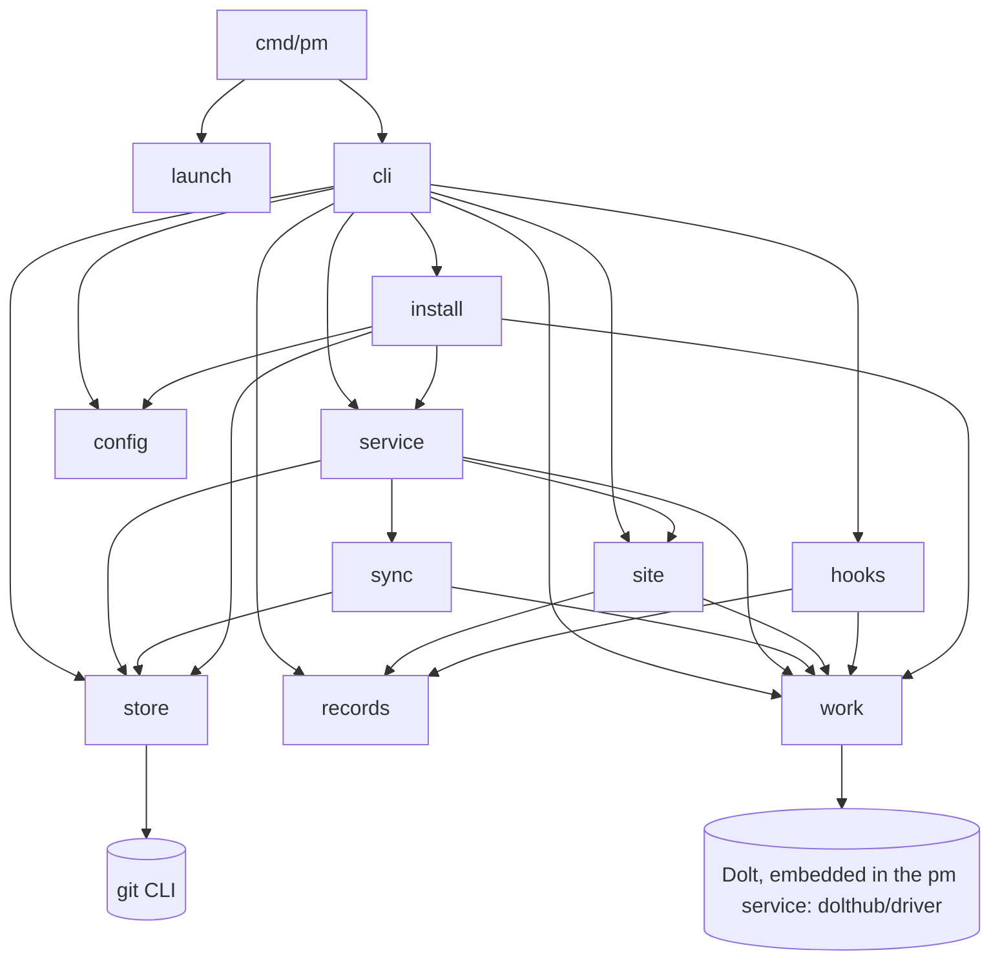
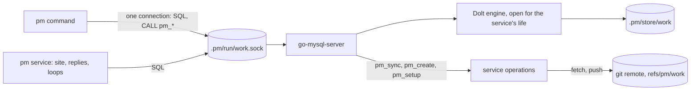
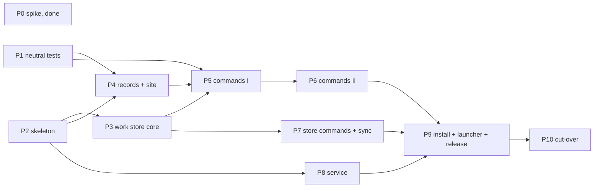

## Problem

> What are we solving, and why now?

The owner decided three things: pm replaces Beads with its own work store, the work store keeps its items in Dolt embedded in pm, and pm is rewritten from Python into Go. Dolt embeds only into Go programs, and a Go pm ships as one binary that starts faster than Python.

- Python pm pays 3–4 s in `bd` on each of 20 commands (`pm show`, `pm task add`, `pm task claim`, `pm finding add`, …) before its own work: `bd list --all --json` takes 1.16–2.09 s and `bd export` 1.69–2.28 s (load average 70 on 8 cores).
- This page designs the port: the Go architecture, the distribution that replaces the uv tool, the order of the port and how Python and Go coexist, and how the tests carry parity over.
- [Work store](work-store.md) holds the data model, ids, ready, commands and migration; only its Storage section changes, to embedded Dolt. [pm as an installable product](pm-product.md) holds the version pin and the launcher, which this page changes. Part of the [Project management harness](pm-harness.md) design.

| Term | Meaning |
|---|---|
| Python pm | The released package under `pm/src/pm`, 0.1.2, installed as a uv tool |
| Go pm | The Go binary this page designs; first release G (Open questions: 0.2.0) |
| Work store | pm's store of items; the Dolt database inside Go pm, at `<main checkout>/.pm/store/work` |
| Parity | Go pm and Python pm, given the same repo and the same work data, give the same stdout, stderr, exit code and record files, and pages equal after HTML normalisation (Design, Site) |
| Cut-over | One repo's pin moving from a Python version to G, with its bd data imported into the work store |
| Port sprint Pn | The n-th step of the port in this page's plan; not a sprint number. Each becomes a sprint when opened |

## Goals and non-goals

> What must the design achieve, and what does it deliberately leave out?

**Goals**

- One Go binary is all of pm: CLI, hooks, site, service and launcher. Runtime needs drop to `git` (plus `gh` and `claude` as today); `bd`, `uv` and Python go, except `uv` to launch an old Python pin.
- A command that loads every item finishes in ≤ 300 ms in a fresh process (the work-store goal).
- Parity with Python pm on every command, refusal text, record file and help text, checked by the existing suite run against both implementations.
- Each repo switches from Python to Go in one step, by its pin, and moves back by moving the pin.
- Each port sprint is shippable: merged to `main` with CI green and Go pm building on both targets.

**Non-goals**

- Changing the work store's data model, ids, ready rules or commands; the [Work store](work-store.md) page owns them.
- Byte-identical pages. Pages must match after normalisation, with an allow-list of reviewed differences.
- Running Go pm in any repo before parity, or running Python and Go on one repo at once.
- Porting `legacy.py`, the pre-package harness migration (Open questions).
- Targets other than darwin/arm64 and linux/amd64.

## Constraints and key facts

> Which facts, findings and constraints shaped the design? Only those that
> still hold; sprint records keep the findings as they happened.

**Embedded Dolt in Go, measured** by the spike in [sprint 77](../sprints/pm-harness-77.md) (`dolthub/driver`, as bd uses it; 8-core M1 at load average 20–50).

::: result {title="Embedded Dolt, pm's workload, 466 items"}
| Measure | Result |
|---|---|
| Open, load all items with labels, dependencies and comments, close; fresh process | 64 ms median, 68 ms p90 (open 21, queries 2.7, close 14; n ≥ 10); 68 ms after 3,000 more commits |
| One write with `DOLT_COMMIT`, fresh process | 70 ms |
| Engine lock | Exclusive on the store while open, readers included |
| 8 processes × 20 writes | 160 of 160, 7.7 s total, p90 wait 468 ms with the driver's open retry; a flock gate bounds the max wait to 524 ms |
| A process holding the store open | Blocks every other process |
| Load through a service that holds the store, over a Unix socket | 7.8 ms in the spike; 5.6–6.2 ms median in a fresh process on 590 items, connect and version handshake included (the service-held store, measured) |
| Sync through a `git+file` remote, `refs/dolt/data` | push about 600 ms, no-op pull 180 ms |
| Merge | Different cells of one row merge; a same-cell edit lands in `dolt_conflicts_items` with base, ours and theirs |
| Build | needs cgo and `-tags gms_pure_go`; stripped darwin/arm64 spike binary 107 MB; linux/amd64 via `zig cc` 132 MB, not yet run |
:::
Reading: opening once per process meets the 300 ms goal about 5 times over, but every reader then waits on the engine's exclusive lock; a service that holds the store and serves it over a Unix socket loads in 7.8 ms (5.6 ms measured on 590 items) and makes no command wait, which is how pm runs (Store access).

- bd's own `bd list --all --json` profiles at 567 ms: about 410 ms in 9 engine opens and closes (one per transaction), 117 ms cleaning a git remote cache on close, about 105 ms more process start than a plain Go binary; the query is about 36 ms. pm opens once per process and avoids all of it.
- The released pm 0.2.2 (darwin/arm64) is 111,396,658 bytes and already links `go-mysql-server/server`, `vitess/go/mysql` and `go-sql-driver/mysql` through `dolthub/driver`, so serving the store adds little; Dolt's `commands/sqlserver` would add about 41 packages (MCP, Prometheus, gopsutil). Neither size is measured.
- Store size after about 380 commits on 466 items: 14 MB, 3.0 MB after `dolt gc`. bd's store here is 123 MB for 596 KB of exported data, 47 MB after `dolt gc` on a copy.
- bd 1.3.1 (darwin/arm64, go1.26.7) builds with `CGO_ENABLED=1` and `-tags gms_pure_go,netgo`; it links `dolthub/gozstd`, a cgo binding, through `dolthub/dolt/go`. Its binary is 144,181,568 bytes.

**Python pm, inventory.** Counts are from `main` when this page was written: `wc -l`, `grep -c "^def test_"`, and the argparse tree from `pm.cli.parser()`.

- 7,787 lines in 15 modules, plus `prime.md` (138 lines, 15,177 characters, 15,219 bytes) and `style.css` (115 lines).
- Tests: 4,026 lines; 100 test functions (13 parametrized) in 11 files, plus 4 fakes, `conftest.py` and `render_pages.py`.
- Parser: 25 nouns, 40 leaf commands; 33 for agents, 7 machinery (`push`, `prime`, `hook stop|owner-request|git-post-checkout|git-pre-commit`, `service run`). 165 `Refuse(` sites.

| Module | Lines | What it does | External calls | Go package |
|---|---|---|---|---|
| `cli.py` | 3,739 | Every command, the argparse tree and help texts, the site's HTTP server, reply spool and inbox delivery, `pm show`, clone setup | `git` (19 sites), `bd` (30 calls through `beads.bd`), `gh pr view`, `claude -p` (day summary), `uv` | split, see the next table |
| `site.py` | 751 | Page builders: record pages, index, day pages, need cards, TOC; markdown-it-py `commonmark` with html, `table`, front_matter, anchors h2–h3, containers `note` `decision` `result`, a `mermaid` fence rule | none | `internal/site` |
| `service.py` | 445 | Service unit: launchd plist or systemd unit, ports, install lock, drift and stale-build checks, `status`, `logs` | `launchctl`, `systemctl`, `git`, `bd`, `uv` | `internal/service` |
| `install.py` | 483 | Managed pieces (`present`/`apply`/`remove`): `.pm/`, hook entries in `.claude/settings.json` and `.codex/hooks.json`, `.gitignore` block, `.beads/hooks/*` sections; new-repo `records` bootstrap | `git`, `git ls-remote` | `internal/install` |
| `legacy.py` | 438 | Pre-package harness pieces that `pm init` migrates and `pm doctor` reports | `git`, `launchctl`, `systemctl`, `crontab` | dropped (Open questions) |
| `hooks.py` | 352 | `pm prime` (chunks under the 10,000-character cap, `--state`, `--subagent`), `pm hook stop`, session-start `pm init` with timeout | `git`, `bd config get agent.profile`, `pm init` | `internal/hooks` |
| `records.py` | 340 | Record parsing (YAML front matter, sections, blocks and attributes, decisions, delivery report), record checks | none | `internal/records` |
| `owner_request.py` | 203 | `pm hook owner-request`: the Haiku judge, its prompt and arguments | `claude -p`, `bd list --label human …` | `internal/hooks` |
| `launch.py` | 201 | Launcher: run the pin in process, or `exec uv tool run --from git+…@<commit>` | `git ls-remote`, `uv tool run` | `internal/launch` |
| `push.py` | 199 | `pm push`: `bd dolt push`, day summary, `records` fetch/rebase/push, push state under `.pm/run/` | `bd dolt push`, `git fetch/rev-list/rebase/push` | `internal/sync` |
| `beads.py` | 198 | `bd` calls and status derived from bd JSON | `bd list --all --json`, `bd export`, `bd show`, `bd context` | replaced by `internal/work` |
| `tool.py` | 180 | Installs and inspects the pm uv tool (PEP 610 `direct_url.json`) | `uv tool install/list`, `git` | removed; `internal/launch` installs the binary |
| `store.py` | 149 | The `records` store: find, lock, commits, `git status` of record paths, design-page dates | `git` | `internal/store` |
| `config.py` | 104 | `.pm/config.toml`: read, check the pin, fail hard | `git rev-parse` | `internal/config` |
| `__init__.py` | 5 | `__version__` from package metadata | none | `-ldflags -X` into `internal/buildinfo` |

| `cli.py` lines | Section | Size | Go package |
|---|---|---|---|
| 1–141 | constants, refusal patterns, `Refuse` | 141 | `internal/cli` |
| 142–307 | context and atomic writes (`Repo`, `apply_writes`, `restore`, lock) | 166 | `internal/store` |
| 308–354 | record templates | 47 | `internal/records` |
| 355–1404 | write commands (finding, decision, need, action, task, doc, design, postmortem, project, sprint, check, day summarize) | 1,050 | `internal/cli` |
| 1405–1857 | reply spool, snapshot, `pm service run` (HTTP server, 3 background threads) | 453 | `internal/service` |
| 1858–2028 | reply delivery (inbox Unix socket), `pm reply read` | 171 | `internal/service`, `internal/cli` |
| 2029–2207 | `pm show` | 179 | `internal/cli` |
| 2208–2248 | `pm record link` | 41 | `internal/cli` |
| 2249–2992 | `init`, `doctor`, `upgrade`, `uninstall`, clone and worktree setup, Codex roots | 744 | `internal/install` |
| 2993–3158 | `push`, `service *`, `where`, `commit` | 166 | `internal/cli` |
| 3159–3739 | argparse tree, help texts, `main` | 581 | `internal/cli` |

**What the port must carry exactly.**

| Item | Count | Port concern |
|---|---|---|
| Regex call sites | 76 (`cli` 31, `records` 17, `site` 15, others 13) | Go `regexp` is RE2: no lookarounds, no backreferences, and `\w` is ASCII only. 9 sites use them: section splits in `records.py` (`(?=^## \|\Z)`), sentence and word splitting in `cli.py` (`` (`+).+?\1 ``), the id match in `site.py` (`(?<![\w.-])`). Each becomes scanning code with its own table test, not `regexp2` |
| Character counts | `hooks.CAP`, sentence and word limits | Python `len` counts code points; Go must use `utf8.RuneCountInString`, because `prime.md` is 15,177 characters but 15,219 bytes |
| HTML escaping | every page | Python `html.escape` writes `&quot;` and `&#x27;`; Go writes `&#34;` and `&#39;`. Normalisation absorbs the difference (Design, Site) |
| YAML | front matter; `yaml_str` decides quoting by a pyyaml round trip | pyyaml is YAML 1.1 (`yes`, `on` and dates are typed); Go YAML libraries are 1.2. Quoting must follow the 1.1 rules, or new headers change |
| Refusal texts | 165 sites | `prime.md` and `test_pm.py` cite them word for word |

## Design

> What is it, in its final state? Free `###` subsections. Decisions and plans
> live in the project and sprint records.

### Architecture

Go pm lives in `pm/` beside Python pm until the cut-over, then replaces it: `pm/go.mod` (module `github.com/Yeeef/yeeef-agents/pm`), `pm/cmd/pm`, `pm/internal/…`. Release tags stay `pm-v<X>`. Old Python tags still build with `#subdirectory=pm`, because each tag keeps its own tree.

Reading: only `work` touches Dolt: in the service it opens the engine and serves it on a Unix socket, everywhere else it is a SQL client of that socket. Only `store`, `sync` and `install` run `git`; everything else sees typed items and record structs.

| Package | Holds | Python source |
|---|---|---|
| `cmd/pm` | `main`: `launch.Maybe()` first, then `cli.Execute()` | `launch.main`, `cli.main` |
| `internal/cli` | Command tree, help texts, command bodies, `Refuse` error type and exit codes | `cli.py` |
| `internal/config` | `.pm/config.toml` read, pin check, `PORT` | `config.py` |
| `internal/launch` | Pins, downloading release binaries, `exec`, Python pins through `uv tool run` | `launch.py`, `tool.py` |
| `internal/work` | The `Item` type and the store interface; Dolt schema and migrations, validation, ids and minting, ready and blocked, merge rules on conflict rows, the host (the engine and its socket server) and the client (one connection per command), `--import-bd`, `export` | `beads.py`, [Work store](work-store.md) |
| `internal/records` | Record parse, sections, blocks, templates, checks | `records.py`, templates in `cli.py` |
| `internal/store` | The `records` store: find it, flock, atomic multi-file writes, commit | `store.py`, context and writes in `cli.py` |
| `internal/site` | Page templates, the Markdown renderer, `style.css` (embedded) | `site.py`, `style.css` |
| `internal/service` | `service run` (the work store held open and served on its socket, the operations commands ask for, HTTP, snapshot, reply spool, merge poll, inbox push, sync and gc loops), unit files | `service.py`, serve and delivery in `cli.py` |
| `internal/sync` | Records push and work-store sync, run by the service and `pm sync` | `push.py` |
| `internal/hooks` | `prime` (`prime.md` from `pm/assets.go`, chunks), `hook stop`, `hook owner-request`, git hooks | `hooks.py`, `owner_request.py`, `prime.md` |
| `internal/install` | Managed pieces, `init`, `doctor`, `upgrade`, `uninstall`, `where` | `install.py`, setup in `cli.py` |
| `internal/gitx` | The one `git` subprocess helper: argv, cwd, timeout, stderr in the error | `git()` helpers in 5 modules |

- **Embedded files.** `//go:embed` reads only files at or below the package directory, so `pm/assets.go`, at the module root, embeds `src/pm/prime.md` and `src/pm/style.css` where they are: one copy serves Python and Go pm until the cut-over. The test that checks the noun list against `prime.md` reads the cobra tree.
- **Libraries.** `BurntSushi/toml` reads `config.toml`; pm writes it from a template, as today. `go.yaml.in/yaml/v3` (the maintained yaml.v3) for front matter, with a quoting function that follows YAML 1.1, tested on every header in the corpus. The launchd plist comes from a text template, byte-identical to `plistlib`'s output so `pm doctor` sees no drift.
- **External tools stay external.** `git`, `gh`, `claude` and `launchctl`/`systemctl` run through `exec.LookPath` on `PATH`, never an absolute path, so the test fakes keep working. `bd` disappears; `uv` is needed only to launch a Python pin.

### CLI framework

`spf13/cobra` (pflag inside). It gives nested commands, flags interspersed with positionals (`pm task close <id> --reason …`, `pm finding add --sprint ID "<text>"`), `MarkFlagRequired`, `MarkFlagsMutuallyExclusive` (`--bead`|`--project`), per-command help and hidden commands for machinery. bd 1.3.1 uses it (v1.10.2), and the binary already links about 214 modules through Dolt, so 2 more change nothing measurable.

- Each help text moves verbatim from `parser()` into the command's `Long`.
- Parity holds the help text with whitespace normalised; cobra's default layout replaces argparse's (Open questions).

### Store access: the service holds the store

The pm service is the only process that opens the work store. It starts the Dolt engine on `<main checkout>/.pm/store/work` when it starts, keeps it open for its whole life, and serves it with go-mysql-server's MySQL-protocol server on a Unix socket. Every pm command that reads or writes items is a SQL client of that socket behind `work.Store`; the service reaches its own store through the same socket. There is one access path: no command opens the store itself, and nothing falls back to a direct open.

Reading: commands and the service's own loops are all clients of one server in the service process; only the service touches the store directory and the remote.

| Who | Reaches the store | Holds it |
|---|---|---|
| A `pm` command that reads or writes items | One connection to the socket, on first use | Until it exits |
| A `pm` command with no work data (`prime` without `--state`, `hook stop`, `record link`) | Never | — |
| `pm service run` | Opens the engine at start; its site, reply writer and loops use connections to its own socket | Its whole life |
| Any MySQL client (`mysql -S <main>/.pm/run/work.sock work`) | The socket | Its connection; a write outside pm skips pm's checks, so ad hoc use is for reading |

**The host** (`internal/work`, `host.go`): `work.NewHost(o HostOptions) (*Host, error)`, run only by `pm service run`.

- The engine is built as `dolthub/driver` builds it, since the driver's `Connector` keeps its engine unexported: `embedded.LoadMultiEnvFromDir(ctx, config.NewMapConfig({user.name: pm, user.email: pm@localhost}), filesys.LocalFS.WithWorkingDir(dir), dir, version, {dbfactory.DisableSingletonCacheParam: {}, dbfactory.FailOnJournalLockTimeoutParam: {}})`, then `engine.NewSqlEngine(ctx, mrEnv, &engine.SqlEngineConfig{ServerUser: "root", Autocommit: true, ...})`. No `embedded.Connector` is opened beside it: that would be a second engine on one journal.
- The server: `server.NewServer(server.Config{Listener: ln, Version: ..., MaxConnections: 0}, se.GetUnderlyingEngine(), se.ContextFactory, sb, nil)` from `github.com/dolthub/go-mysql-server/server`, with the session builder `sb = func(ctx, c, addr) { bs, err := sql.BaseSessionFromConnection(ctx, c, addr); return se.NewDoltSession(ctx, bs) }`; then `sqlserver.SetRunningServer(srv)` (`dolt/go/libraries/doltcore/sqlserver`), as Dolt's own server does, and `srv.Start()`. Dolt's `cmd/dolt/commands/sqlserver.Serve` is not used: it always opens TCP, writes `privileges.db` and creds files, starts metrics, and links about 41 more packages. The server package and `go-sql-driver/mysql` are already in the binary through the driver.
- At start, in order: load the engine (another process holding the store fails hard: "work store <dir>: another process holds it (a second pm service?): <err>"; a database the engine would open read-only, its lock taken, counts as held); remove a socket file left by a crash, which is safe once the engine is held; listen; register `pm_version()` and the operations below; serve; migrate an older schema through a connection of the host's own (only the service migrates). `pm_version()` answers only once the schema is current, so a command that connects meanwhile waits in its handshake and never sees the old schema. The server's own log stays at error level: a refusal is the command's to report.
- `Host.Close()` stops the server (Go's listener unlinks the socket), then closes the engine.

**The socket.**

| Part | Design |
|---|---|
| Path | `<main checkout>/.pm/run/work.sock`, one per clone, beside the service log. A path of 104 bytes or more (macOS's `sun_path`; 108 on Linux) fails the service's start hard: "the pm service's socket <path> is N bytes, over this system's limit of 103; move the clone to a shorter path". Worktrees do not lengthen it: the socket is under the main checkout |
| Listener | `net.Listen("unix", path)` by the host, passed as `server.Config.Listener`, so go-mysql-server opens no TCP listener and does no socket handling of its own (it neither removes a stale file nor sets a mode). No TCP port serves SQL; the site keeps its HTTP port |
| Mode | 0600: the host sets the umask to 0177 around `Listen`, so the file is never wider. The file mode is the access control |
| Auth | none in the engine: built this way, Dolt's `MySQLDb` stays disabled and accepts any user. Clients connect as `pm` with no password |

**One connection per command** (`work.Dial(main string) (*Dolt, error)`).

- The client is `go-sql-driver/mysql` through `mysql.NewConnector(&mysql.Config{User: "pm", Net: "unix", Addr: sock, ParseTime: true, Loc: time.UTC})`: a built config, never a DSN string, which a path with `@` or `)` would break. `sql.OpenDB`, `SetMaxOpenConns(1)`, one `*sql.Conn` held until the command exits (`Shutdown` closes it). A connect waits at most 2 s.
- On connect: `SELECT pm_version()` (the handshake below), then `USE work`.
- A read is one read-only transaction (`START TRANSACTION READ ONLY` … `COMMIT`), so the five queries of a load see one commit while others write. A write is one transaction ending in `CALL DOLT_COMMIT('-Am', msg)`, which commits the SQL transaction too.
- Nothing is held across slow work: an open connection blocks no one, so a command keeps it while it calls `gh`, the owner-request judge or a records push. The rule against holding the store across slow work, the gate (`.pm/run/work.lock`) and its wait log (`work-gate.log`) are gone.
- A command that writes both stores takes only the `records` store's lock; there is no second lock to order it with.
- `pm export --store DIR` reads through the service of the clone that `DIR` belongs to (`DIR/../../run/work.sock`).
- A connection that breaks mid-command (the service restarted or died) fails the command hard; it does not reconnect, since a write cut off in `DOLT_COMMIT` has an unknown outcome.

**Version handshake.** The host registers `pm_version()` on its engine's catalog (`Analyzer.Catalog.RegisterFunction`), returning the service's `buildinfo.Version`; per engine, not process-global, so a test can host another version. The command compares it with its own version right after it connects, on the connection it then uses, so no restart can come between check and use.

| Service's version | The main checkout's pin | The command |
|---|---|---|
| Equal to the command's | any | proceeds |
| Differs | equals the command's: the service is stale (a pin move it has not acted on yet, or pm replaced under it) | fails hard: "the pm service runs pm S, not pm V: run pm service restart". The service already stops itself within a second of a pin move (`pinMoved`) and its supervisor starts it on the new pin through the launcher, so this lasts only that long |
| Differs | differs from the command's: this checkout pins another version than the main checkout (a pin-moving branch) | fails hard: "this checkout pins pm V, but the clone's pm service runs pm S, which <main>/.pm/config.toml pins: run it from a checkout that pins pm S" |

A command never restarts the service: parallel commands would restart it many times over, and a restart from a mismatched checkout would bring up the wrong version.

**The write lock.** Every write transaction (an ordinary write, a pull's merge, the compare-and-swap's merge) runs under the store's write lock, taken with `CALL pm_lock(ms, pid, write)` on its connection before its first read (the wait's bound in milliseconds, rounded up, and the client's pid and write, which a timeout names) and released with `CALL pm_unlock()` after its commit or rollback. The host keeps it (`lock.go`): FIFO, so writers get it in the order they asked; a waiter that finds the holder's session gone from the server's session manager (its connection dropped) takes it over. go-mysql-server's own `GET_LOCK` is not used: it polls a compare-and-swap every 100 µs and keeps no order, so a writer could wait behind a stream of later ones. Writes one at a time are serializable and none starves; reads take no lock and never wait. A write waits for the writes queued before it, a few to tens of ms each: in the 8 × 20 benchmark, 88–90 ms on average, at most 109 ms, against the gate's exclusive wait for any reader or writer. Every write still sets `write_stamp.txn`, so one that raced a write outside the lock fails hard on Dolt's serialization failure (MySQL error 1213, SQLSTATE 40001) or `ErrMergeNeeded`, both of which land nothing; there is no retry. [Work store](work-store.md), Data model, "Concurrent writers", gives the rules and the failure texts.

**What runs in the service.** The operations that move `main` against the remote, or that a session must not race, run in the service, one at a time in its operation slot; reads and ordinary writes never wait on it. Each runs within its bound, the wait for the slot included: a sync `SyncTimeout` (120 s, the service's loop's and `pm_sync()`'s), a create `CreateTimeout` (180 s), a setup `SetupTimeout` (300 s). What the bound stops is the operation's statements that reach the remote, fetch, push and clone, each on a connection of its own: the client drops it, the operation fails and frees the slot, and the server may still finish the dropped statement, until Dolt kills its git, overlapping the next operation's; a local merge runs to its end. Setup's and the sync's `git ls-remote` run within the bound too. So an operation that outlasts its bound frees the slot; a caller still waiting at its own bound fails hard, naming the operation in the slot, with nothing written. A command asks for one with a stored procedure on its one connection; the host registers each as `sql.ExternalStoredProcedureDetails` on the engine's provider (`Catalog.DbProvider.(*sqle.DoltDatabaseProvider).Register`), and its body runs the operation through the service's own connections.

| Operation | When | A command asks with | Returns |
|---|---|---|---|
| Sync: fetch, pull with conflict resolution by the merge rules, push | every 600 s; `pm sync`; `pm push`'s work step | `CALL pm_sync()` | one row per line: what it did, then a warning per claim a merge overrode |
| Child id compare-and-swap | `work.Store.Create` of a child in a store with a remote (`pm task add`, `pm sprint open`, a need) | `CALL pm_create(?)`, the `work.New` as JSON | the created item as JSON |
| Setup: clone from the remote, or create and push, or attach a remote | `pm init` | `CALL pm_setup()`, on a connection with no database | one row per line of what it did; its refusals, `install.SetupWork`'s texts, as the error |
| Garbage collection: `CALL DOLT_GC()` | every 24 h (`GCInterval`), `GCTimeout` 10 min | none | logged; `.pm/run/gc.json` for `pm service status` |

- **Pull.** Fetch outside any transaction, once per pull. When behind, check the remote's head before merging: its schema version (refused when newer: "run pm upgrade") and every invariant, read on the revision database `work/<hash>`. Then merge in one write transaction under the write lock: `DOLT_MERGE('--no-commit', 'origin/main')`, resolve `dolt_conflicts_items` by the merge rules, keep this side's `write_stamp`, clear the holder of every closed item, check, set a fresh `write_stamp` as every write does, `DOLT_COMMIT`. A fast-forward moves `main` at once (under the lock no session commits meanwhile); a 3-way merge lands at its `DOLT_COMMIT` or rolls back. The merge runs on a background context, to its end, past the operation's bound: Dolt's SQL fast-forward is two root updates (the branch head, then the working set), and a merge cut between them would leave the working set behind the head. A failure says whether `main` had fast-forwarded to the checked head, read on a live connection, or that this is unknown. The checked head makes a failure after a fast-forward impossible, so the service never runs `DOLT_RESET --hard` on `main`, which would set the head with no check and drop other sessions' commits.
- **Push.** `DOLT_PUSH` of `main` outside any transaction, within `PushTimeout`; rejected as non-fast-forward, the sync pulls again, up to 3 attempts.
- **Compare-and-swap** on the scratch branch `pm-cas`: [Work store](work-store.md), Ids.
- **gc** runs online: Dolt's session-aware safepoints (the default; `dprocedures.UseSessionAwareSafepointController`) let open connections go on. It takes no operation slot, one collection at a time: `DOLT_GC` waits for every session in the middle of a statement, and a command in `CALL pm_sync()` or `pm_create()` is in the middle of one while it waits for the slot, so a collection holding the slot would wait for it until `GCTimeout`.
- The site's change mark is `HASHOF('main')`, read each look; the file fingerprint goes.
- Dolt skips a fetch within 1 s of the service's last read of the same remote (its git blobstore's read dedup), so a sync right after another reads nothing new; a push always fetches first, so a compare-and-swap still sees a moved remote and retries.

**Startup.** The service must run for any store command, so pm makes sure it is up.

| Who | Does |
|---|---|
| `pm init` | sets the clone and worktree up (records store, link, hooks), installs and starts the service (`service.Install`, waiting until its site answers), then asks it to attach the store (`CALL pm_setup()`). The service starts on a missing store: the engine runs on the empty directory, the socket answers, and the site serves the error "this clone has no work store yet: run pm init". The post-checkout hook sets a worktree up and leaves the store alone |
| `pm init --import-bd FILE` | through the service: on a clone with no store, makes an empty one first (`CREATE DATABASE` and the schema, on a connection with no database), then imports into it as one write |
| Session start (`pm init --session-start`) | when the service is installed but not answering, starts it (`service.Restart`, under the clone's install lock, so parallel session starts start it once); a running service, a stale one included, is left as it is and reported with `pm service restart`. A service that answers on this version is then asked to attach the store (`CALL pm_setup()`). A start waits at most `RestartWait` (15 s) of the hook's 18 s |
| `pm service restart`, `install` | as today; the unit runs the bin-dir pm, which runs the main checkout's pin |
| A pin move in the main checkout | the service stops itself within `ServeCheck` (1 s) and its supervisor starts it on the new pin |

**What fails hard**, with nothing written:

| Condition | Message (stderr, exit 1) |
|---|---|
| No socket, or nothing answers on it | "error: the pm service does not answer on <main>/.pm/run/work.sock; pm reaches the work store only through it: run pm service restart" |
| The service runs another version | as under Version handshake |
| No `work` database (setup never ran) | "error: this clone has no work store yet: run pm init" |
| A write waited `WriteLockWait` (60 s) for the write lock | "work store: <the write> waited 60s for the store's write lock, which a live pm process holds (connection <n>, pid 
, <its write>, for <d>); nothing was written. If that process hangs (stopped, or in a debugger), stop it; then run the command again" (the lock has no lease: [Work store](work-store.md), Concurrent writers) |
| A create's push timed out or failed but by a non-fast-forward rejection, and its commit is not on the remote | "work store: create <id>: …: the outcome is unknown, and the push may still land as <id>. Nothing was merged here: run pm sync, then check with pm show <id> before you create it again" |
| A write raced one outside the write lock | "work store: <the write> conflicted with a write that did not take the store's write lock (a SQL client past pm?); nothing was written: run the command again" |
| The working set differs from `main`'s head at a write's start | "work store: <the write> found the store's working set differing from its head in <tables>, which no pm write leaves …; nothing was written", naming how to look and drop it |
| An operation waited for the slot to its bound, or outlasted it | "work store: the <operation> waited <bound> for the pm service's <operation>, running for <d>, and gave up; nothing was written: run the command again, and see pm service logs if it recurs"; "work store: the <operation> did not finish within <bound> and was stopped: <err>" |
| The connection broke mid-command | "error: the connection to the pm service broke (<err>); a write in flight may or may not have landed: check with pm show, then pm service status" |
| Service start: another process holds the store, or the socket path is too long | the host's texts above, in the service log; `pm service status` shows the service down |

**Tests.** A test that needs a store starts its own service.

- Go: `worktest.Serve(t testing.TB) (*work.Host, *work.Dolt)` makes a clone directory with `os.MkdirTemp("", "pm")` (short enough for the socket on macOS, where `t.TempDir()` paths may not be), starts `work.NewHost` on it, makes an empty store, dials one client, and stops both in `t.Cleanup`. Sync and compare-and-swap tests run two hosts against a bare remote: one clone creates through `CALL pm_create`, the other runs the compare-and-swap in process so the test can hold its push; a sync that must see the other clone's last push waits out Dolt's 1 s read dedup. A version test hosts `pm_version()` returning another version and checks both refusals.
- The concurrency test: 8 connections × 20 writes, 160 of 160 correct, invariants checked after; two opposite `pm dep add` at once: exactly one lands, the other refuses the cycle; a long write behind 3 tight-loop writers gets the lock in its turn; a write racing one outside the lock fails hard. The race tests (a pull and `pm_create` racing tight-loop local writers, zero failures asserted; gc racing `pm_sync` and `pm_create`) also run under `-race` in `make test-go`. The benchmarks (`bench_test.go`, with `PM_BENCH_STORE` naming a copy of a store) run 10 fresh-process loads and 8 processes × 20 writes.
- pytest, `PM_IMPL=go`: the `repo` fixture starts `pm service run` for the clone (a free port, its socket under a short `--basetemp`), waits for the socket, seeds through it (a re-import restarts it on a removed store), and stops it at teardown. This per-test service does not make a test `integration`; `integration_only` keeps naming the service lifecycle tests. A test that runs the clone's own `pm service run` stops it first and starts it after, and the fake supervisor stops it when it starts the clone's installed service. While the repo pins another pm, a transcript records a fixed line in place of the store, for both implementations: that pm's service would hold it.
- The access-path test: with the service stopped, every store command fails with the message naming `pm service restart` and writes nothing (pytest, 39 commands); and only `host.go` calls into `dolthub/driver` or Dolt's engine package (`LoadMultiEnvFromDir`, `NewSqlEngine`), and only `pm service run` and `worktest` call `work.NewHost`: a Go test over every non-test file's calls, resolved by import path with `go/parser`, so a new direct open fails CI.

### Site

| Part | Choice |
|---|---|
| HTTP | `net/http` on `127.0.0.1:$PORT`; GET, HEAD and POST as `cli.Handler` does today. Goroutines replace the 3 threads (snapshot, reply writer, merge poll) |
| Page assembly | `html/template`: one template per page kind, with the Markdown body passed in as `template.HTML` from goldmark's renderer. No hand-written escaper |
| Markdown | `github.com/yuin/goldmark` (CommonMark 0.31.2; bd links v1.8.5) with `extension.Table` and `WithTableCellAlignMethod(TableCellAlignStyle)` (writes `style="text-align:…"` as markdown-it does); `html.WithUnsafe()` for records, a second renderer without it for comments and replies (`COMMENT_MD`); no linkify, no typographer, no auto heading ids |
| Custom goldmark parts | front matter skip; heading ids for h2–h3 with the mdit-py-plugins `anchors` slug and duplicate suffixes; a `:::` container parser for `note`, `decision` and `result`, with the attribute parser from `records.attrs` and the required attributes (`BLOCK_ATTRS`); a `mermaid` fence renderer (`<pre class="mermaid">`); the link rewrite `.md(#…)` → `.html(#…)`; the TOC from the heading nodes |

**Parity check.** A test renders every record page with Python pm and with Go pm from the same records and the same items, normalises both, and diffs them.

| Normalised | How |
|---|---|
| Entity form | Parse with `golang.org/x/net/html`, which decodes every entity; serialise text and attributes with one escaper |
| Attribute order | Sorted by name |
| Whitespace | Runs in text nodes collapsed to one space, and whitespace-only nodes between block elements dropped; `<pre>` content kept as is |
| Everything else | Compared as is: elements, nesting, attribute values, text |

- The corpus is every record in this repo's store (126 when written: 5 projects, 84 sprints, 19 designs, 9 docs, 2 postmortems, 7 days; 163 `::: decision`, 1 `::: result`, 11 files with Mermaid), plus a fixture for each construct the corpus lacks.
- A remaining difference is fixed by a renderer override, or goes on the allow-list `internal/site/testdata/parity-allow.txt`: page, the normalised hunk, and the reason. The list is reviewed in the PR that adds each entry, and a difference not on it fails the test.
- The test runs until the cut-over; after it, Python pm is gone and the Go pages are the reference.

### Distribution

| Today (Python) | Go |
|---|---|
| `uvx --from "git+…@pm-v<X>#subdirectory=pm" pm init` | `curl -fsSL https://github.com/Yeeef/yeeef-agents/releases/download/pm-v<X>/install.sh \| sh && pm init`. `install.sh` picks the asset for `uname -s`/`-m`, checks it against `SHA256SUMS`, installs to `${PM_BIN_DIR:-$HOME/.local/bin}/pm` |
| The pm uv tool is the launcher | The installed binary is the launcher |
| A pin's code: `uv tool run --from git+…@<commit>`, built by uv on first use (300 s timeout) | A pin's binary: `$XDG_DATA_HOME/pm/pins/<pin>/pm`, downloaded once from release `pm-v<pin>`, checked against `SHA256SUMS`, written atomically; its sha256 is kept in `pins/<pin>/sha256`, and a later download that differs fails hard |
| Runtime needs: uv, python (by uv), git, bd | git; `gh` and `claude` as today; uv only for Python pins |
| `pm init` installs the uv tool | `pm init` copies the running binary (`os.Executable()`) into the bin dir when it is not there, and runs `uv tool uninstall pm` when the uv tool is present: both put `pm` in `~/.local/bin` |

**The Go launcher.**

| Case | What `pm` does |
|---|---|
| No readable pin, or the pin is this binary's version | Runs in process |
| Pin ≥ G and not this version | `syscall.Exec` of `pins/<pin>/pm`, downloading it first if missing (10 s connect timeout, 300 s download); a missing release or asset, a checksum mismatch or a timeout is a hard error that names `pm-v<pin>` |
| Pin < G (Python) | `launch.py`'s path, ported: tag → commit with `git ls-remote`, kept in `pins/<pin>/commit`, then `exec uv tool run --from git+<repo>@<commit>#subdirectory=pm pm <args>` |
| `PM_LAUNCHED=<pin>` set | Runs in process, then the config check; removes `PM_LAUNCHED`/`PM_LAUNCHER` from its children's environment |
| `pm upgrade [--to X]` | As today: moves the pin up to the running version, or launches X to move it |

**The bridge release.** A machine whose `pm` is still the Python uv tool must run a repo pinned to G. The last Python release, 0.1.N, learns the "pin ≥ G" row: it downloads and execs the Go binary the same way. It ships before the cut-over; without it, a Python launcher would run `uv tool run` on a Go tag and fail.

**A release is a tag.** Releasing Go pm is `git tag pm-v<X> <any commit on main> && git push origin pm-v<X>`: no bump commit, no release PR and no rule on how a PR is merged. No version is written in Go source or in any file a release edits: the release workflow takes `<X>` from the tag name and stamps it with `-ldflags -X …/buildinfo.Version=<X>`; an untagged build reports `dev`, which no repo pins. Moving a repo's pin is a separate, ordinary PR after the release exists (`pm upgrade --to X`, merged any way); its hooks pass because the release's assets already exist. Until the cut-over, Python releases, the bridge release 0.1.N included, keep the Python procedure in `pm/AGENTS.md` ("Releasing pm"): tag the bump commit before the pin moves, and merge the release PR with a merge commit.

**Release builds.** `.github/workflows/pm-release.yml` runs on a `pm-v*` tag push, on native runners, because the build needs cgo (`gozstd`).

| Target | Runner | Build |
|---|---|---|
| darwin/arm64 | `macos-14` | `CGO_ENABLED=1 go build -trimpath -tags gms_pure_go -ldflags "-s -w -X …/buildinfo.Version=<X>"` |
| linux/amd64 | `ubuntu-22.04` (glibc 2.35, the oldest it links against) | same |

- Assets: `pm-<X>-darwin-arm64.tar.gz`, `pm-<X>-linux-amd64.tar.gz`, `SHA256SUMS`, `install.sh`.
- Size: about 107 MB stripped on darwin/arm64, from the spike binary (the Dolt driver plus the spike's code); pm's own code adds little beside Dolt, but the release size is not measured yet.

**What `pm init` installs.**

| Scope | Piece | Change from Python |
|---|---|---|
| Machine | `pm` in the bin dir; the `pins/` cache; the service unit running `<abs path of the bin-dir pm> service run`; Codex `writable_roots` including `.pm/store/work` | The unit no longer runs `<tool python> -m pm.cli`; `pm service install` rewrites a Python-era unit, because its command drifts |
| Repo (tracked) | `.pm/config.toml`, `README.md`, `.gitignore`; pm's hook entries; `.gitignore` block; pm's git hooks | The `bd prime` and `bd codex-hook` entries, the Beads `CLAUDE.md` block and the `.beads/hooks` sections go; pm points `core.hooksPath` at its own hooks |
| Clone | `records` store; the work store at `<main>/.pm/store/work`, cloned from the remote, or created and pushed when the remote has none; the `records/` link | Replaces `bd bootstrap` and the Beads profile |

`pm init` keeps its shape: a repo half on first install, and a clone and worktree half on every run, including `--session-start`.

### Port order and coexistence

**Switch at parity, per repo, by the pin.** Go pm is built and tested on `main` sprint by sprint, but no repo runs it until parity. Each repo then switches in one step: its pin moves to G and its bd data is imported. Python pm stays the released pm until then, so only one work store is authoritative at a time, and moving the pin back undoes the code half.

A port sprint is shippable when merged to `main` with CI green, its parity subset green, and Go pm building on both targets; it is not released. Each takes a few days of agent work at most.

| # | Port sprint | Goal | Depends on | Check at its end |
|---|---|---|---|---|
| P0 | Embedded Dolt spike | Measure Dolt in Go for pm's workload; settle store sharing, cgo, ref and size | — | Done in [sprint 77](../sprints/pm-harness-77.md): Constraints and key facts |
| P1 | Implementation-neutral tests | `PM_IMPL=python\|go` picks the binary; work data seeded and read through a store-neutral layer that maps fake-bd JSON to `pm export` items; a recorder logs every `pm` call | — | All 100 tests pass on Python unchanged; one transcript per test |
| P2 | Go skeleton | Module, cobra tree with all 40 commands and their help, `config`, `buildinfo`, `prime` and its chunks, `hook stop`, the `work.Item` type and store interface, CI build on both targets with cgo | — | `pm prime` (all modes) byte-identical; every `--help` text identical after whitespace normalisation; binary size recorded |
| P3 | Work store core | Dolt schema, typed items, validation, ids and minting, ready and blocked, the store gate, `--import-bd`, `export` | P2 | Round trip on this repo's real `bd export` with every check of the [Work store](work-store.md) migration; the importer agrees with P1's Python mapper |
| P4 | Records and site | `records`, `store`, the goldmark renderer and its extensions, page templates, `pm check` | P2; P1 for the item fixture | Every record page of this repo and of the fixtures equal after normalisation, items from P1's mapper for both; the allow-list reviewed |
| P5 | Agent commands I | `show`, `record link`, `commit`, `task add/close/claim/move`, `finding add`, `feedback add`, `doc/design/postmortem new`, `project/sprint open/close` | P1, P3, P4 | Their `test_pm.py` scenarios pass with `PM_IMPL=go`; transcripts identical; live-data parity |
| P6 | Agent commands II | `decision add/need/close`, `action need/done` (with `--pr`), `reply read`, `day summarize`, `hook owner-request` | P5 | `test_pm.py` and `test_owner_request_hook.py` pass on Go; transcripts identical |
| P7 | Work-store commands and sync | The commands with no Python counterpart (`task ready/edit/release`, `dep add/rm`, `comment add`, `need dismiss`, `reply add`, `export`, `sync`); Dolt sync through the git remote; merge rules on conflict rows; the child-id compare-and-swap | P3 | Tests derived from the [Work store](work-store.md) page (merge table, ids, ready), plus a 2-clone sync test against a bare remote |
| P8 | Service | `service run` (HTTP, snapshot, spool, merge poll, inbox push, sync and gc loops, open per poll), `install/status/restart/logs` on launchd and systemd | P2 | Go unit tests in `internal/service` with fake site and store; unit files equal to Python's for the same inputs |
| P9 | Install, launcher, release | `init/doctor/upgrade/uninstall/where` on the work store; the Go launcher; `install.sh`; the release workflow; the Python bridge release 0.1.N; the service wired end to end | P6, P7, P8 | `test_service`, `test_init`, `test_lifecycle` and the rewritten `test_launch` pass on Go; a release candidate tag builds both assets; a machine with the Python tool runs a G-pinned scratch repo; live-data parity |
| P10 | Cut-over of yeeef-agents | Migrate the bd data; move the pin to G; switch `prime.md` from bd to pm commands; `pm upgrade` removes the Beads pieces; after a soak, delete Python pm and update `pm/AGENTS.md`, [pm as an installable product](pm-product.md) and the [Work store](work-store.md) Storage section | P9 | Every clone on G, `pm doctor` clean, the site equal before and after, `pm export` equal to the final bd export |

Reading: P1 and P2 start at once. After P2, P3, P4 and P8 run in parallel: each builds against the `work.Item` type and store interface that P2 fixes, so P4 and P8 need no Dolt. After P3, P5 (once P4 lands) and P7 run in parallel. The critical path is P2 → P3 → P5 → P6 → P9 → P10.

**Where the bd → Dolt migration fits.** The importer comes in P3 and runs in every later parity run, because the parity harness seeds Go from the same bd JSON through it. The real migration runs once, in P10, in one clone: stop the service in every clone, `bd dolt push`, `bd export`, `pm init --import-bd`, push. The other clones then attach with `pm init`. The final bd export and `.beads/` stay untouched until the owner removes them.

### Tests

**How the pytest suite's guarantees carry over.**

| Guarantee today | Where | After the port |
|---|---|---|
| Each command against a temp repo: every refusal changes nothing, every happy path writes what it says | `test_pm.py` (29 tests, 40 `repo.pm` calls) | Unchanged, run with `PM_IMPL=go`. The 18 `repo.issues()` reads and 8 `bd_calls()` assertions move to the store-neutral layer: `repo.items()` gives work-store items, mapped from fake-bd JSON for Python and from `pm export` for Go |
| Refusal texts word for word | asserted in `test_pm.py`; cited by `prime.md` | Same assertions, plus a static check: the constant part of each of the 165 Python refusal strings appears in Go's source (P5–P6) |
| Hooks as the runtimes run them (JSON on stdin) | `test_hooks.py` (14) | Unchanged; reads the noun list from `pm --help` output, not from `pm.cli.parser` |
| Owner-request judge | `test_owner_request_hook.py` (5, fake judge); live eval (1) | Unchanged: `fake_claude.py` on `PATH`; `owner_request_cases.json` and `make test-live` stay |
| Service end to end | `test_service.py` (13; 3 import `pm.service`/`pm.push`) | The end-to-end tests run on Go; the in-process tests become Go unit tests in `internal/service` |
| Setup lifecycle | `test_init` (6), `test_lifecycle` (7) | Run on Go; `bd init`/`bootstrap` expectations become work-store creation and attach |
| Launcher | `test_launch.py` (16), fake `uv` and `git ls-remote` | The Python-pin path keeps its tests; the Go-pin path runs against a local HTTP server that serves release assets |
| uv tool | `test_tool.py` (4) | Retired with `tool.py`; replaced by tests of copying the binary and removing the uv tool |
| Legacy migration | `test_migrate.py` (1) | Retired with `legacy.py` |
| Config check | `test_config.py` (4) | Same behaviour; the internal import goes |
| Light vs integration | the `integration` marker; `integration_only` in `conftest.py` fails an unmarked heavy test | Kept; `integration_only` also recognises the Go binary's `service run`, `init` and `sync` |
| Fakes | `fake_bd`, `fake_gh`, `fake_claude`, `fake_sched` (launchctl, systemctl, crontab) | `fake_gh`, `fake_claude`, `fake_sched` stay: Go finds them on `PATH`. `fake_bd` serves Python only and goes at the cut-over |

**Go-native tests** (`go test ./...`), for what is cheaper to check in process:

| Package | Tests |
|---|---|
| `work` | The merge rules table from the [Work store](work-store.md) page, one case per row; ids and minting; `ready`, `blocked` and cycle detection, from that page's definitions, not from the code |
| `site` | The normalised-HTML parity corpus and its allow-list; the normaliser itself on a table of known-equal and known-different pairs |
| `records` | Section and block parsing; YAML 1.1 quoting on every corpus header; the 9 regexes replaced by scanning code, each against the Python regex's results on a table of inputs |
| `hooks` | Each chunk under `CAP` in runes; the chunks add up to the rules; the noun list matches the cobra tree |

**Parity layers during the port.**

| Layer | Check | Normalised before the diff |
|---|---|---|
| 1. Shared suite | Each of the 100 tests runs on both implementations; a test for one only is marked with it and the reason | none |
| 2. Differential transcripts | `Repo.pm` records argv, stdin, stdout, stderr, exit code, changed record files and the store export after each call; Go's transcript must equal Python's | temp paths, timestamps, random root ids (mapped in order of appearance), durations |
| 3. Live data | On a copy of this clone: every record page, `pm show`, `pm where`, `pm check`, from bd (Python) and from the import (Go) | timestamps, the as-of line; pages as in Site |
| 4. Help and rules | `pm prime` byte-identical; each `--help` text identical | whitespace in help |

CI runs layers 1 and 2 on every PR from P2 on, as a job with a list of expected failures that only shrinks. Layer 3 runs at the end of P5, P9 and P10.

## Alternatives considered

> What else was considered and not adopted, and why not?

| Alternative | Why not |
|---|---|
| Each command opens the embedded store itself, under a gate | See "Each command opens the store" below the table |
| Byte-identical pages: string building with an `esc()` port of Python `html.escape`, no `html/template` | Byte identity binds the Go renderer to markdown-it-py's incidental output (entity forms, whitespace) and needs a custom escaper; normalised comparison checks the same structure and text and keeps contextual escaping |
| `gitlab.com/golang-commonmark/markdown`, a Go port of markdown-it with the same token stream | Last release years ago; targets an older CommonMark |
| stdlib `flag` with a hand-written tree | `flag` stops at the first positional, and pm puts positionals before flags; no `--x=v`/`-x` split, no nested help. pm would need its own parser about the size of pflag |
| `spf13/pflag` with a hand-written tree | Still needs a hand-written tree, help, required and exclusive flags, which cobra has |
| `dlclark/regexp2` for the 9 lookaround and backreference regexes | A second regex engine with backtracking for 9 sites; scanning code is short and testable against Python's results |
| A pure-Go build (`CGO_ENABLED=0`) | Dolt links `gozstd`, a cgo binding; the spike's build needs cgo |
| Go takes over command groups early; Python dispatches to it | During the port, Go would have to drive `bd` (a throwaway adapter) or Python would have to read Dolt, which it cannot embed. Two stores or a throwaway adapter for weeks, and the groups share state (`show`, needs and the site read everything) |
| Go first takes only commands without work data (`prime`, `hook stop`) | Saves nothing: these are the cheapest parts, and the dispatch layer costs more than it earns |

### Each command opens the store

The alternative to the service-held store: each pm command opens the embedded store itself and closes it at exit, and the service opens it per poll. pm ran this way until the owner chose the service-held store.

| | Store opened per command | Store held by the service (chosen) |
|---|---|---|
| Full load in a fresh process | 64 ms on 466 items in the spike; 35.8 ms on 590 items, 68.3 ms with process start | 5.6 ms on 590 items, 36.4 ms with process start |
| One write with its commit | 70 ms | 17 ms |
| 8 processes x 20 writes | 7.7–10.9 s in the spike, 6.9 s on 590 items; p90 wait about 0.5 s on the exclusive lock | 2.11–2.17 s on 590 items; a write waits 88–90 ms on average for the write lock, readers never |
| Readers | wait for any open store, writers included | never wait |
| Slow work inside a command | the command must close the store first, or every other command waits | no rule needed |
| Writes at once | serialised by the gate, which readers wait on too | one at a time under the write lock, in order; reads never wait: 160 writes in 2.11–2.17 s, each waiting 88–90 ms on average |
| Site and sync | the service opens the store per poll and competes for the gate | the service holds the store; the site rereads when `HEAD` moves |
| Ad hoc SQL | through pm only | any SQL client on the socket |
| A command when the service is down | works | fails hard |
| Pinned versions | each command runs its own pin | a command must match the service's version |
| Tests | a temporary store per test | a running server per test |

**How it worked.** Opening the store starts the engine on the store's directory and takes its exclusive lock, readers included (open about 21 ms, close about 14 ms, against about 3 ms for the queries). Concurrent pm processes queued on a gate, an exclusive `flock` on `.pm/run/work.lock` taken before every open, with a timeout and a log of every wait; under 8 contending writers the max wait was 524 ms. A command closed the store before slow work that was not the store's (`gh`, the owner-request judge, a records push), and the store's own Dolt push (about 600 ms) was the one long hold.

**Why not.** It needs no running service and met the 300 ms load goal at 64 ms, but every reader waits for any writer, every command pays the open and close, the slow-work rule is easy to break, and the site's polling, several agent sessions and their hooks all queue on one lock. The service-held store removes the lock from every command at the cost of a running service and a version match between command and service.

## Prior art

> Optional. What existing work did we learn from, and what did we take?

| Source | What we took |
|---|---|
| bd 1.3.1 | Embedded Dolt through `dolthub/driver`; cobra; the build flags (`CGO_ENABLED=1`, `-tags gms_pure_go`); Not taken: one engine open per transaction, about 410 ms of its 567 ms list, and one process per command behind a gate lock |
| markdown-it-py and mdit-py-plugins | The rendering that goldmark reproduces: tables with style alignment, h2–h3 anchors and their slug, containers, the mermaid fence |
| goldmark | The CommonMark 0.31.2 parser and its extension points for the custom parts |
| `golang.org/x/net/html` | The HTML5 parser behind the parity normaliser |

## Open questions

> What is still unresolved?

| # | Question | Options | Default |
|---|---|---|---|
| 1 | bd already uses `refs/dolt/data` on `origin`; the spike synced through that ref only | a. a pm-specific ref (`refs/pm/work`), if Dolt accepts it; b. a separate remote; c. pm takes `refs/dolt/data` over at the cut-over, after the final bd export | a, if P7 shows Dolt accepts the ref; else c, with the bd export kept as the rollback copy |
| 2 | Which page differences the parity allow-list may hold | a. fix each in a renderer override; b. accept it with a reason | a, until only differences that an override cannot fix remain; each entry is reviewed in its PR |
| 3 | cgo release builds | a. native runners per target; b. `zig cc` cross-builds from one runner (linux/amd64 built at 132 MB, not run) | a |
| 4 | Binary size per pin (107 MB measured for the spike, darwin/arm64) | a. accept; b. keep the N most recent pins and let `pm doctor` list the others; c. `upx` | a, with `-s -w`; b once a machine holds more than 3 pins |
| 5 | Rollback after the cut-over | a. fix forward; b. a `pm export --bd` reverse exporter; c. keep bd read-only | a. The code half rolls back by moving the pin; data written to Dolt after the cut-over does not go back to bd |
| 6 | Machines that still have the Python launcher | a. the bridge release 0.1.N, before the cut-over; b. the owner reinstalls by hand | a; P9 checks it |
| 7 | Release base URL for the Go launcher's tests | a. `net/http` with a documented `PM_RELEASE_URL` setting (mirrors, tests); b. `curl` on `PATH`, faked in tests; c. `gh release download` | a |
| 8 | `legacy.py` (438 lines) | a. drop it: Go `pm init` refuses a legacy clone and names the Python release to run first; b. port it | a; whether any clone still has legacy pieces is not recorded, and `pm doctor` on each clone shows it before P9 |
| 9 | Language of the black-box suite after the cut-over | a. keep pytest (neutral by then); b. port it to Go `testscript` | a; revisit if Python in a Go project costs CI time or confuses contributors |
| 10 | First Go version | 0.2.0; 1.0.0 | 0.2.0: the work store is new and its schema may still change |
| 11 | `--help` layout | a. a cobra template that mimics argparse; b. cobra's default layout, with only the text held | b. Agents read the text, and tests assert the text, not the layout |
| 12 | Codex sandbox | A command in a Codex session must connect to the service's socket `.pm/run/work.sock`; whether the sandbox allows a connect to a Unix socket inside `writable_roots` is not recorded | `pm init` keeps `.pm/store/work` and `.pm/run` in `writable_roots`; the implementation checks the connect in a Codex session |
| 13 | Go version | go.mod `go 1.26` (bd builds with go1.26.7; this Mac has go1.27.1) | 1.26, raised when Dolt requires it |
| 14 | Dolt APIs the host reaches past the driver: `embedded.LoadMultiEnvFromDir`, `engine.NewSqlEngine`, `DoltDatabaseProvider.Register`, `sqlserver.SetRunningServer` | a. use them, pinned with Dolt in `go.mod`; b. an HTTP API on a second socket for the operations | a; a Dolt bump runs the host's tests first |
| 15 | A clone whose main checkout path makes the socket path 104 bytes or more | a. fail hard, naming the limit; b. a socket under a short per-user directory | a; no clone near the limit is recorded |
| 16 | A worktree that pins another version (a pin-moving PR) cannot touch work items | a. refuse, as designed; b. allow versions with the same schema version | a, until it costs a sprint measurable time |
