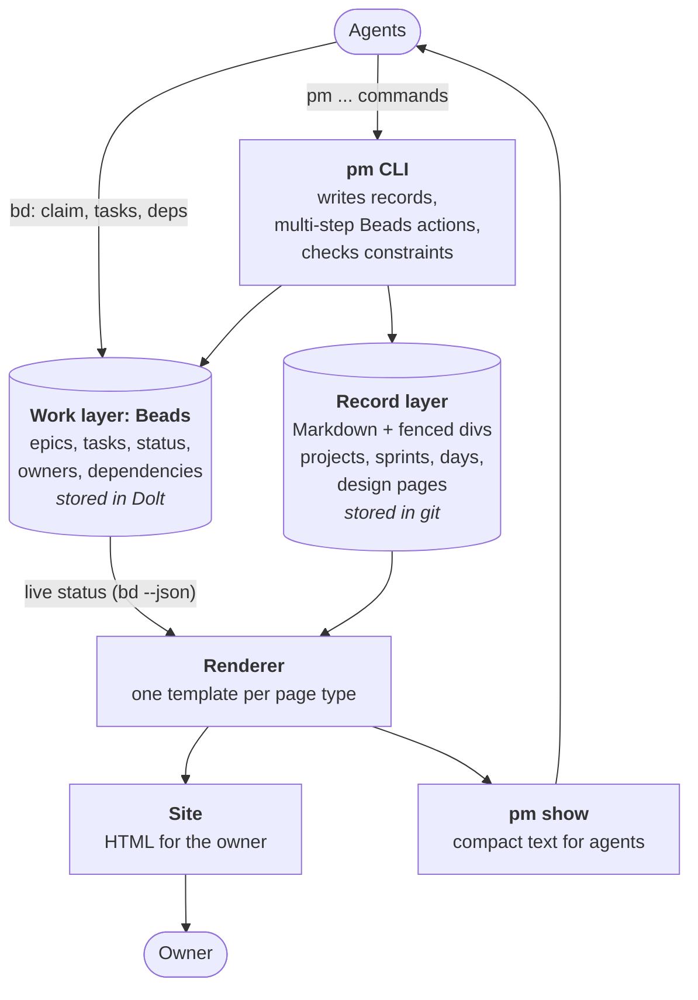

How projects keep a shared record that people read as a site and agents read as compact text. Beads tracks the work; a Markdown record layer holds the context; one CLI writes both; one renderer produces both views. The daily page is the first page built on it. Poker-ai is the reference user.

## Problem

> What are we solving, and why now?

Four problems. Evidence from poker-ai at commit `197516a` (OpenAI's tokenizer as a stand-in for Claude's).

| Problem | Consequence | Evidence | Solved by |
|---|---|---|---|
| **Work tracking is free-form** | Each agent writes status its own way; the format drifts until neither people nor tools can rely on it | Status wording such as "RUNNING — …" and "ENGINEERING QUEUE" invented page by page; Anthropic moved agent tracking from Markdown to JSON because agents reshaped the Markdown | Beads: fixed fields and statuses |
| **Dependencies live in prose** | Every session rereads the plan to work out what is blocked and what is ready, spending tokens and possibly getting a different answer each time | Queues written as prose, for example "Board: 8 open in #poker …" | Beads: a dependency graph and `bd ready`. Agents still declare dependencies; they no longer recompute them |
| **Tracking and context are mixed** | Why and how far are buried in the same prose as who and what | Goal, queue and owner items share the same cards on the daily page | The record layer |
| **Status pages are hand-edited HTML** | High read cost per update; the look drifts | 52 daily pages at 7.2k tokens on average, 28% of it CSS and markup; 36 different CSS blocks across 104 pages; no generator | Records, the CLI and the renderer |

## Goals and non-goals

> What must the design achieve, and what does it deliberately leave out?

**Goals**

- One shared record per project: the owner reads it as a site, agents read it
  as compact text, and both come from the same source.
- Fixed formats that do not drift: work in Beads fields, context in records
  whose headers, sections and blocks are checked.
- Agents read project state in a few hundred tokens (`pm show`) and write
  through commands that check every write.
- Success: an agent resumes a project from `pm show` alone, and the owner
  reads status on the site without asking.

**Non-goals**

- Our own task model: Beads is used as is.
- Wrapping all of `bd`: `pm` wraps only actions that touch both layers or need
  a check Beads cannot do.
- Hand-edited or committed HTML: every page is rendered from records.
- Holding decisions and plans in the design: they live in the project and
  sprint records and in Beads.
- Rendering on every write: `pm serve` renders when a page is loaded instead.

## Constraints and key facts

> Which facts, findings and constraints shaped the design? Only those that
> still hold; sprint records keep the findings as they happened.

Facts about the tools and the setting that the design depends on:

- A repo holds many projects, each with several sprints that can be open at
  once, so nothing can be inferred from "the only project" or "the open sprint".
- Agents run under the owner's git identity, so git and Beads cannot tell an
  agent's change from the owner's.

The rules records must follow are few, and each is traced to a failure that
has happened:

| Rule | Failure it prevents |
|---|---|
| A day states its aim in `## Today` | Work drifting through the day with no stated aim |
| A sprint cannot open without Goal, Scope and Done when | Sprints that run until someone notices, and scope that creeps |
| A decision has a source and a date, and its body states the reason | Stale rulings followed after their reason died, because nobody could tell why they were made |
| An answered decision need (a closed `human` issue inside a project, not an action, not dismissed) is cited by id in some decision's body or labelled `no-decision`; `make render` fails otherwise | The owner's answer living only in a Beads comment, where no record or page shows it |
| Work outside any sprint becomes a small sprint, so it shows up in Beads | Work that no page can see |

- Background jobs run in the main checkout (worktree.bgIsolation is none), so they write .records directly; Codex gets the same through the writable roots pm setup adds.

## Design

> What is it, in its final state? Free `###` subsections. Decisions and plans
> live in the project and sprint records.

### The layers
Four pieces. Agents write records through `pm` and ordinary tasks through `bd`; nothing reads or writes the HTML directly.

*Reading:* both layers feed one renderer, so the owner's site and the agent's summary always show the same facts.

| Layer | Answers | Like | Built by |
|---|---|---|---|
| **Work layer** | What exists, who owns it, what is blocked, what is next | Jira | Beads, used as is |
| **Record layer** | Why we are doing it, how far we are, what changed, what the owner must decide | Confluence with enforced templates | Us: a file format and its rules |
| **CLI** | The write path for records and multi-step project actions; checks every write |  | Us |
| **Views** | The same state for two readers | Confluence pages embedding live Jira lists | Us: renderer and templates |

**What goes where:** if a view or a rule needs to find something on its own, it is a field in the record. If it is only read as part of one item, Beads's own text fields (`description`, `design`, `notes`) are fine.

### Work layer
Beads, used as is. It owns what exists, who owns it, its status, and what blocks what. Records never store any of these; they point at Beads ids. How our concepts map to Beads, which layer decides each fact, and which tool agents use for each action: [Work layer: Beads](work-layer.md). How sessions claim tasks without taking each other's work: [Session claims](session-claims.md). Which profile lets agents commit and push, and how Beads data reaches the remote: [Agent git authority and Beads sync](agent-sync.md).

### Record layer
Markdown records with a checked header, fixed sections and a small fenced-block vocabulary: project, sprint, day, design page and doc. The record types and their templates, how records relate to Beads, decision levels and the block vocabulary: [Record layer](record-layer.md). Where records live across branches and worktrees: [Shared records store](records-store.md).

### Sprint lifecycle
A sprint is opened with its Goal, Scope and Done when, planned as tasks, worked under session claims, reported in full, reviewed through a PR review action, and closed once the PR is on main. `pm sprint close` requires the review closed as merged, appends "Merged as <sha> (PR #N)." to the report and closes the epic; `pm` never asks GitHub. Each stage and its command: [Sprint lifecycle](sprint-lifecycle.md).

### Agent lifecycle
A session starts with the global and project rules and a `pm show` snapshot in its context, claims a task through `pm task claim`, writes findings and decisions through `pm`, raises needs for the owner and is woken by the reply, closes its task with its commit, and hands back past Stop hooks that block uncommitted records and requests asked only in chat. Each step and the hook behind it: [Agent lifecycle](agent-lifecycle.md).

### CLI
`pm` is the write path for records and for project actions that touch both Beads and a record. Finding, claiming and linking tasks stay plain `bd`. Every `pm` write validates the whole record set before and after, and writes nothing if the result would not render. The commands, how records are edited, the code structure, how a repo runs it and what `pm show` prints: [pm CLI](pm-cli.md).

### Views and the site
Every view is rendered from records plus live status from Beads; nothing in a view is edited by hand. The views and their readers, the daily page, the renderer's implementation, how `make docs` serves a site at most 10 s behind that states its age, and where the files live: [Views and the site](views-and-site.md). How the owner replies to a decision or action on its card, and how the reply reaches the session that asked: [Replies on the site](site-replies.md).

## Alternatives considered

> What else was considered and not adopted, and why not?

Each area's alternatives are on its page: smaller ones sit beside the choice
they lost to, marked "Not chosen", and HTML design pages behind a subagent
protocol are under the [Record layer](record-layer.md). None spans areas yet.

## Prior art

> Optional. What existing work did we learn from, and what did we take?

Beads, the chosen work layer, is described under [Work layer: Beads](work-layer.md);
Obsidian, a reference for the record layer, under [Record layer](record-layer.md).

### Other prior art

| Practice | What we take from it |
|---|---|
| Anthropic's long-running agent harness | Structured tracking beats Markdown for state agents must not overwrite; a fresh session reads a small summary first |
| Content collections (Astro, Hugo), Backstage catalogs | Markdown or YAML records validated against a schema at build time |
| `llms.txt` and `.md` doc pages | One source, served as HTML to people and as text to agents |
| Changesets | Small appended entries assembled into a log |

## Open questions

> What is still unresolved?

None yet.
