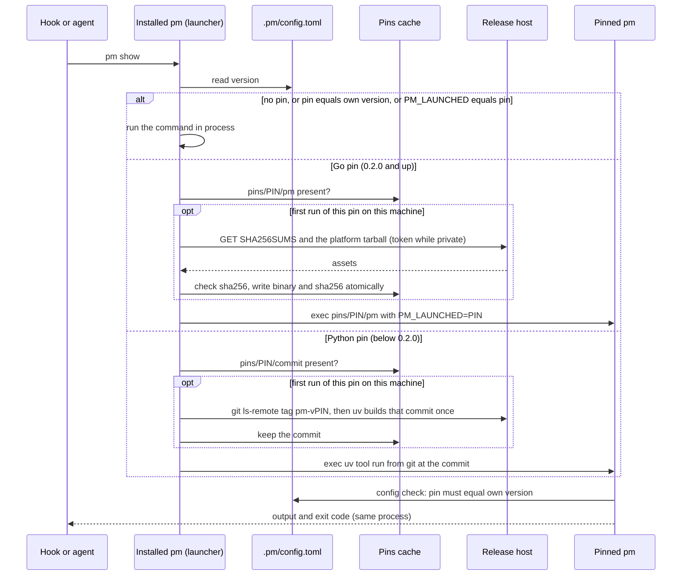

## Problem

> What are we solving, and why now?

- pm writes two kinds of shared data in a repo: the records (Markdown on the `records` branch) and the work store (Dolt, synced through the remote). A pm that does not understand a repo's data must never write to it.
- Today each repo pins one exact pm version in `.pm/config.toml`, and the installed `pm` is a **launcher**: it reads the pin and runs that exact version, fetching it on first use. The launcher exists because one machine holds several repos (three when the owner chose it) on different pins; with one installed pm and an exact pin, every switch between repos meant a reinstall, and every release meant an upgrade commit in every repo.
- The launcher has cost more than it was expected to: a release stall, a release URL compiled into every installed copy, token downloads from a private repo, and two releases whose only job was to teach old launchers about new pins (Constraints).
- Go pm is not live in any repo yet (main pins 0.1.6), so the model can change now for the price of one sprint; after the cut-over, changing it needs another transition release.
- This page answers the owner's question: why pm needs a launcher, what the alternatives are, and what each looks like for the user. It supports the open decision on keeping the launcher and exact pin or moving to a minimum version and self-update. Builds on [pm as an installable product](pm-product.md) (Version pin, Distribution) and [pm in Go](pm-go.md) (Distribution).

## Goals and non-goals

> What must the design achieve, and what does it deliberately leave out?

**Goals**

- **No incompatible writer.** A pm that cannot read a repo's records format or work-store schema refuses to run there, with a message that names the fix.
- **Several repos on one machine**, each moving to a new pm when it chooses, not when another repo does.
- **Fast hooks.** No network and no build on the hook path once a machine is set up; hooks run pm several times per session.
- **One command** installs pm on a machine; joining a repo that already uses pm needs nothing more than `pm init`.
- **Cheap releases.** A release is a tag; nothing about a release requires a commit in the repos that use pm.

**Non-goals**

- Platforms beyond darwin-arm64 and linux-amd64, the two a Go release builds.
- Downgrading a work store's schema.
- pm's move to the public repo `Yeeef/pm` itself; this page only takes it as given.

## Constraints and key facts

> Which facts, findings and constraints shaped the design? Only those that
> still hold; sprint records keep the findings as they happened.

**What compatibility means.** The real requirement is data compatibility, not a version string.

| Data | Version marker | What pm does on a mismatch |
|---|---|---|
| Work store (Dolt) | `schema_version` table, one row ([Work store](work-store.md)) | Go pm migrates a lower schema on open with its own SQL migrations, and refuses a higher one: "an older pm does not write a newer schema" |
| Records (Markdown) | None; `pm check` validates sections and blocks against the running pm's rules | A newer block or section that an older pm does not know fails that pm's `pm check`, the gate of every `pm commit` |
| `.pm/config.toml` | Its keys; unknown keys fail hard | Today the `version` key must equal the running pm's version, else a hard error |

**What the launcher has cost.**

| Fact | Number | Source |
|---|---|---|
| Release stall: the bump commit pinned a version whose tag did not exist yet; the pre-commit hook runs pm, which launched the new pin and failed on the missing tag; only `--no-verify` passed, which agent permissions deny | about 28 h between the 0.1.2 and 0.1.3 tags, the span that held the stall | the tags' dates; the pm-harness feedback doc |
| Fix for Python releases: tag the bump commit, then move the pin in a second commit, merged with a merge commit | 4 steps | `pm/AGENTS.md`, "Releasing pm" |
| Release URL compiled into every launcher (`API` in `launch.py`, `APIURL` in the Go launcher, both `Yeeef/yeeef-agents`) | every installed copy | the launcher sources on main |
| So the first Go release must come from the repo pm keeps, `Yeeef/pm`; a Go release from yeeef-agents would leave each installed 0.2.0 launcher pointing at a repo pm leaves | one more bridge avoided | sprint decision, Go cut-over |
| Private repo: anonymous release downloads get HTTP 404; launchers and `install.sh` need a token from `$GH_TOKEN` or `gh auth token` | every machine | bridge 0.1.6 |
| Bridge releases shipped only so the Python launcher can run Go pins: 0.1.5 (download and exec a Go release binary), 0.1.6 (download through the GitHub API with a token) | 2 releases, each by the 4-step procedure | sprint findings |
| A tag makes uv fetch on every run; a commit runs from uv's cache | 6 s vs 0.2 s per run | `launch.py` docstring |
| Go release size | tarballs 38.6 MB (darwin-arm64), 41.5 MB (linux-amd64); binary 111,380,098 bytes unpacked, kept once per pin per machine | release candidates |
| First launch of a Go pin | 6.0 s through the GitHub API with a token; 2 s from a local mirror | live checks |

**Other facts.**

- A worktree reads its own branch's `.pm/config.toml`, so a pin moves with the code; a stale branch's worktree pins an old version but shares the clone's one work store.
- No workflow in a repo that uses pm runs pm today; only pm's own CI and release workflows build it.
- bd 1.3.1 refuses to migrate a remote-backed database in place: migrating two clones independently forks the Dolt schema so `bd dolt pull` can no longer merge, "silent and unrecoverable" (`bd migrate --help`).
- Releases move to the public `Yeeef/pm` (owner decision), so anonymous downloads will work; the token path stays as a fallback until then.

## Design

> What is it, in its final state? Free `###` subsections. Decisions and plans
> live in the project and sprint records.

The chosen design is A: each repo pins an exact pm version, and the launcher, one `pm` on PATH per machine, runs that version. It lives in the public `Yeeef/pm` repo, whose releases are tags, so a pin downloads anonymously.

This section describes today's design (option A below). The decision on whether it stays is open.

### The launcher

Every `pm` invocation, from an agent, a Claude Code or Codex hook, a git hook or the service unit, starts in the installed `pm`: the pm uv tool (Python, 0.1.2 and later) or the Go binary in `~/.local/bin`. Before any command, the launcher reads only `version` in the checkout's `.pm/config.toml` and decides where the command runs.

Reading: the launcher either runs the command itself or replaces itself with the pinned pm, fetching that version once per machine; the pinned pm then checks the pin again, so a wrong build fails hard instead of launching twice.

| Case | What `pm` does |
|---|---|
| No readable pin, or the pin is this pm's version | Runs in process |
| Go pin, not this version | `exec` of `pins/<pin>/pm` under `$XDG_DATA_HOME/pm/` (default `~/.local/share`), downloaded once from release `pm-v<pin>`, checked against `SHA256SUMS` and any sha256 kept from an earlier download; 10 s connect, 300 s in all |
| Python pin, not this version | `git ls-remote` resolves tag `pm-v<pin>` once, uv builds it once (300 s limit), the commit is kept in `pins/<pin>/commit`; then `exec uv tool run --from git+<repo>@<commit>#subdirectory=pm pm …` |
| `PM_LAUNCHED=<pin>` set | Runs in process; the config check fails hard if this build is not the pin; the markers are removed from children's environment |
| `pm upgrade [--to X]` | Moves the pin up to the running version, or launches X to move it |
| Any failure: missing tag or release, checksum mismatch, timeout, no token | Hard error naming the release and the URL; nothing falls back |

### What the user sees today

| Flow | Today (exact pin + launcher) |
|---|---|
| First install on a machine | Python: `uvx --from "git+https://github.com/Yeeef/yeeef-agents@pm-v<X>#subdirectory=pm" pm init`, which installs the uv tool. Go: `install.sh` from release `pm-v<X>`, then `pm init`; while the repo is private, `gh release download pm-v<X> -R Yeeef/yeeef-agents -p install.sh -O - \| sh` with a GitHub token |
| Joining a repo that already uses pm | Clone, then `pm init` (session start runs it). The first command fetches the repo's pin if the machine lacks it: a 38–42 MB download, 6.0 s measured, or a uv build for a Python pin |
| A hook or agent running pm | The launcher reads the pin and execs the kept build: no network; a Python pin adds about 0.2 s for `uv tool run` from cache |
| Upgrading one repo | Go: once release X exists, `pm upgrade --to X` in an ordinary PR; each machine fetches X on its next run. Python: the 4-step tag-before-pin procedure |
| Two repos on different versions on one machine | Works: each repo runs its own pin; each pin keeps its own build (111 MB per Go pin) |
| A worktree that pins another version than its main checkout (a pin-moving PR) | Its commands that touch work items refuse: they reach the work store only through the clone's pm service, which runs the main checkout's pin, and a command and the service must be one version ([pm in Go](pm-go.md), Store access). Commands without work data run. The pin takes effect once the main checkout has it; the service then restarts on it by itself |
| A teammate whose machine is behind | Works without action while the machine's launcher knows the pin's kind and release URL; when it does not (first Go pin, a new host or download method), every such machine needs a bridge release or a reinstall |
| CI | Not used today. A workflow would run `install.sh`, then the launcher downloads the pin; a token while the repo is private |
| Releasing pm | Go: `git tag pm-v<X> <commit on main> && git push origin pm-v<X>`; the workflow builds and publishes the assets; pin PRs follow per repo. Python bridge: the 4-step procedure, never `--no-verify` |

## Alternatives considered

> What else was considered and not adopted, and why not?

**The crux.** Two wants together force a machine-level dispatcher: different repos on one machine run different pm versions, and every caller (agents, hooks, the service) types plain `pm`. Then something installed once per machine must read the repo and run its version, as Go toolchain switching, rustup and mise shims do. Drop the second want and the dispatch moves into the repo (D, callers type `.pm/pmw`); drop the first and one pm per machine suffices (B, a minimum version and the schema check). The choice is whether pm needs per-repo versions, or only "never older than this repo's data". Most of the launcher's cost this week came from its circumstances (a version written in source, a private repo, the Python-to-Go move); in a public repo with tag-only releases, A's remaining cost is the launcher code, a 6 s download and about 111 MB per pin per machine, and a bridge only if the release host changes again.

Five models, A being today's. Each has the same user-flow rows. The release URL compiled into the launcher, the bridges and the per-pin cache belong to A and D; the tag-before-pin stall belonged to Python releases and is gone for Go under every option, since a Go release is a tag with no bump commit.

### A. Exact pin + launcher (today)

The flows are in Design, "What the user sees today".

- **Guarantees:** every session on a branch runs exactly the pinned build, so records and schema writes come from one version per repo. A stale branch's worktree still runs its old pin against the clone's shared work store, so the schema refusal is needed here too.
- **Costs:** launcher code in two languages until Python pm is deleted; a pins cache (111 MB per Go pin per machine); one first-run download per pin per machine; the release host and asset layout frozen into every installed launcher, so any change to them needs a bridge release first; a pin PR in every repo for every release it wants.
- **Changes in pm:** none.

### B. Minimum version + schema version, one installed pm, `pm self-update`

The model of git, gh and bd: one pm per machine, always the newest the machine has; each repo states the oldest pm that may write to it.

| Flow | What the user does and sees |
|---|---|
| First install on a machine | `curl -fsSL https://github.com/Yeeef/pm/releases/latest/download/install.sh \| sh`, no token, then `pm init` |
| Joining a repo that already uses pm | Clone, `pm init`. If the installed pm is older than the repo's `min_version` or the store's schema, it refuses with `pm self-update` |
| A hook or agent running pm | Runs the installed binary directly: the config read it already does compares `min_version`, and opening the store compares `schema_version`. No exec, no network |
| Upgrading one repo | `pm self-update` on the machine. The repo changes only when it needs a newer format: `pm upgrade` raises `min_version` and migrates the store in one PR |
| Two repos on different versions on one machine | One pm serves both; it must keep reading and writing every older format still in use, or refuse with a clear message |
| A teammate whose machine is behind | Refused at the first command, naming `pm self-update`; one command fixes it, on any repo |
| CI | `install.sh` of the latest release, or of a named version for a reproducible run |
| Releasing pm | `git tag pm-v<X> && git push`; no repo changes unless it raises `min_version` |

- **Guarantees:** no pm writes a store whose schema it does not know, and no pm older than the repo's `min_version` runs. It holds only if every records-format or schema change raises `min_version`, so `pm upgrade` must raise it whenever it migrates.
- **Costs:** pm must stay backward compatible with every format a live repo still has: readers for old records forms, migrations for old schemas. Repos on one machine move together whenever that machine self-updates, so a regression reaches every repo at once (rollback: `pm self-update --to <X>`). About one sprint now.
- **Changes in pm:** `version` becomes `min_version` (any pm at or above it runs); remove the launcher, the pins cache and the Python-pin path; add `pm self-update [--to X]` (download from `Yeeef/pm`, check `SHA256SUMS`, replace the binary atomically, restart the service); migrate the store only from `pm upgrade`, never on open; `pm doctor` reports a pm below the newest release. Machines that still have the Python tool run `install.sh` once; whether a final bridge is still worth shipping is open.

### C. Exact pin, no launcher

One installed pm; a repo whose pin differs refuses to run, like npm with `engine-strict` on an exact version. It was pm's first design, reversed by the owner because it forced a reinstall at every switch between repos.

| Flow | What the user does and sees |
|---|---|
| First install on a machine | `install.sh` for the repo's pinned version, then `pm init` |
| Joining a repo that already uses pm | Refused unless the installed pm equals the pin; the message prints the install command for that version |
| A hook or agent running pm | Runs the installed binary; an exact-equality check; no network |
| Upgrading one repo | Pin PR, then every machine reinstalls that version |
| Two repos on different versions on one machine | Does not work: a reinstall at every switch, or every repo must move together |
| A teammate whose machine is behind | Refused until they reinstall the exact version |
| CI | `install.sh` of the pinned version: reproducible |
| Releasing pm | Tag; then a pin PR per repo and a reinstall on every machine |

- **Guarantees:** as A: one exact version per repo.
- **Costs:** the worst multi-repo story; every release is a coordinated move across repos and machines.
- **Changes in pm:** remove the launcher; keep today's config check; print the install command on refusal.

### D. Repo-local wrapper

A small script committed in the repo, `.pm/pmw`, holds the pinned version, the release URL and each platform's sha256, downloads that build into a cache once, and execs it, as `./gradlew` and `./mvnw` do.

| Flow | What the user does and sees |
|---|---|
| First install on a machine | Nothing machine-wide for repo use; a bootstrap (`install.sh` once, or `curl … \| sh -s init`) still writes the wrapper into a new repo |
| Joining a repo that already uses pm | Clone; the first `.pm/pmw` call downloads the pinned build |
| A hook or agent running pm | Hooks call `.pm/pmw` by path; agents must type `.pm/pmw …`, or a global `pm` shim finds the wrapper, which is a launcher again |
| Upgrading one repo | `pm upgrade --to X` rewrites the pin, the URL and the checksums in one PR |
| Two repos on different versions on one machine | Works; one cached build per version, as A |
| A teammate whose machine is behind | Works: the wrapper travels with the repo, so a new release host or asset layout needs no bridge |
| CI | `.pm/pmw …`: reproducible, checksum-verified |
| Releasing pm | Tag; pin PRs per repo |

- **Guarantees:** as A, plus the checksum pinned in the repo, not just the version.
- **Costs:** every hook entry, every line of `pm prime` and every `--help` example says `.pm/pmw`, or a shim brings back a global launcher; a shell script that must work on every platform; a tracked file per repo that `pm upgrade` rewrites; per-pin downloads and cache as A.
- **Changes in pm:** the wrapper and its generator; hook entries and the rules call it; the installed launcher goes; the service unit calls the main checkout's wrapper.

### E. Package-manager installs plus B's checks

B's checks, but the binary comes from a package manager: a Homebrew tap (`brew install yeeef/pm/pm`), or the Go binary inside a Python wheel so `uv tool install` works, as ruff and uv ship Rust binaries.

| Flow | What the user does and sees |
|---|---|
| First install on a machine | `brew install yeeef/pm/pm` or `uv tool install <name>`, then `pm init` |
| Joining a repo that already uses pm | As B; the refusal names `brew upgrade pm` or `uv tool upgrade` |
| A hook or agent running pm | As B |
| Upgrading one repo | `brew upgrade pm`; `pm upgrade` raises `min_version` when needed |
| Two repos on different versions on one machine | As B |
| A teammate whose machine is behind | Refused, naming the package manager's upgrade command |
| CI | Slow with brew; `install.sh` in practice, so B's path stays anyway |
| Releasing pm | Tag, then publish the formula or the wheel (automatable in the release workflow) |

- **Guarantees:** as B.
- **Costs:** B's costs plus a tap repo or PyPI publishing, two install channels to keep equal, and package-manager lag between the tag and the formula.
- **Changes in pm:** B's changes, minus `self-update`, plus a formula or wheel job in the release workflow.

### Comparison

| | A. Pin + launcher | B. Minimum + self-update | C. Pin, no launcher | D. Repo wrapper | E. Package manager + B |
|---|---|---|---|---|---|
| Guarantee against an incompatible writer | Exact version per branch; schema check still needed for stale branches | `min_version` + `schema_version` refusal; holds if every format change raises `min_version` | Exact version per repo | Exact version and checksum per branch | As B |
| Moving parts | Launcher (Go + Python paths), pins cache, compiled-in URL, bridges | One binary, two checks, `self-update` | One binary, one check | Wrapper per repo, cache, path-based hooks | B + tap or wheel pipeline |
| Release steps | Tag; pin PR per repo | Tag | Tag; pin PR per repo; reinstall on every machine | Tag; pin PR per repo | Tag; formula or wheel publish |
| First-run cost | One download per pin per machine (6.0 s, 111 MB kept each) | One download per install or update | One download per install | One download per pin per machine | Package-manager install |
| Multi-repo on one machine | Yes, independent | Yes, shared pm, needs backward compatibility | No | Yes, independent | As B |
| Failure mode | Hard error at a pin's first run if the release or URL is unreachable; old launchers need a bridge | Hard refusal naming `pm self-update` | Hard refusal naming the install command | Wrapper download error; agents calling `pm` miss the wrapper | Hard refusal naming the package manager |
| Verdict | Works; the most parts, and each new host or format needs a bridge | Fewest parts that still fail hard on data mismatch | Rejected before: breaks multi-repo | Sound, but agents and hooks stop saying `pm` | No gain over B for its extra channel |

Reading: A, C and D guarantee one exact version per repo; B and E guarantee the property that matters, no writer below the data's version, with the fewest moving parts in B.

### Recommendation and choice

**The owner chose A, the launcher with exact per-repo pins** (project decision in [pm-harness](../projects/pm-harness.md)). The agent had recommended B; its reasoning stays below for the record.

- It enforces the real requirement, data compatibility, directly (schema and `min_version`), where A enforces it through version identity and still needs the schema check for stale branches.
- It removes the launcher, the pins cache, the compiled-in URL and the class of bridge releases; with `Yeeef/pm` public, `install.sh` and `self-update` need no token.
- Releases become a tag with no per-repo follow-up; repos change only when they adopt a new format.
- The cost, backward compatibility across live repos, is small at today's scale (three repos, one owner) and is the same discipline the schema migrations already require.
- Go pm is live nowhere, so the switch costs one sprint now; after the cut-over it needs another transition release.
- Keep from A: hard failure, never a fallback; and migration as an explicit `pm upgrade`, not a side effect of opening the store.

## Prior art

> Optional. What existing work did we learn from, and what did we take?

| Source | How it works | What pm takes |
|---|---|---|
| Go toolchain (`go` and `toolchain` lines in go.mod, `GOTOOLCHAIN`) | The `go` line is a minimum; the local toolchain runs when new enough, else `GOTOOLCHAIN=auto` downloads the named one, checksum-verified | Minimum version as the default rule; auto-download only as a possible later addition to B |
| rustup + `rust-toolchain.toml` | Proxies for `cargo`/`rustc` run the toolchain a directory names, installed per version | The launcher shape of A |
| mise / asdf `.tool-versions` | Shims or PATH activation select an exact version per directory | Same as A, for any tool; confirms A's cost: a per-version install cache |
| Gradle wrapper (`gradlew`, `distributionUrl`, `distributionSha256Sum`) | A committed script downloads the pinned distribution once per machine | D, including the checksum committed in the repo |
| npm `engines` | A version range per package; advisory unless `engine-strict` | B's `min_version` must be enforced, never advisory |
| git (`core.repositoryformatversion`, `extensions.*`), gh | One installed version; git refuses a repo with an extension it does not know | B: a data version marker that an older binary refuses |
| bd | Refuses an in-place migration of a remote-backed database: independent migrations fork the schema | Migrate only through an explicit upgrade, in one clone, then push |
| Terraform `required_version` + state version | Configuration states a version constraint; state records the format and writer version, and an older Terraform has refused newer state | B's pair: a repo constraint plus a data version check |

## Open questions

> What is still unresolved?

| # | Question | Options | Default |
|---|---|---|---|
| 2 | Under B, a pm on another machine migrates the work store to a newer schema and pushes it; this machine's older pm pulls it | a. refuse with `pm self-update` (B's rule); b. refuse to pull a newer schema, keeping the old one locally | a; plus migrations only from `pm upgrade`, which raises `min_version` in the same PR |
| 3 | Can two clones that each migrate the same Dolt store still merge, given bd's documented fork? | a. migrate in one clone only, then push; b. test that pm's migrations merge | a until b is measured |
| 4 | Does the records format need its own version marker, or is `min_version` enough? | a. `min_version` only; b. a `records_format` key | a; b if a change can land without raising `min_version` |
| 5 | Under B, the transition for machines with only the Python launcher (0.1.6) | a. one last bridge; b. run `install.sh` once by hand | b, if the owner's machines are few (count not recorded) |
| 6 | Under B, should a refusal update pm itself (Go's `GOTOOLCHAIN=auto`)? | a. refuse and print `pm self-update`; b. self-update automatically | a: no network on the hook path |
