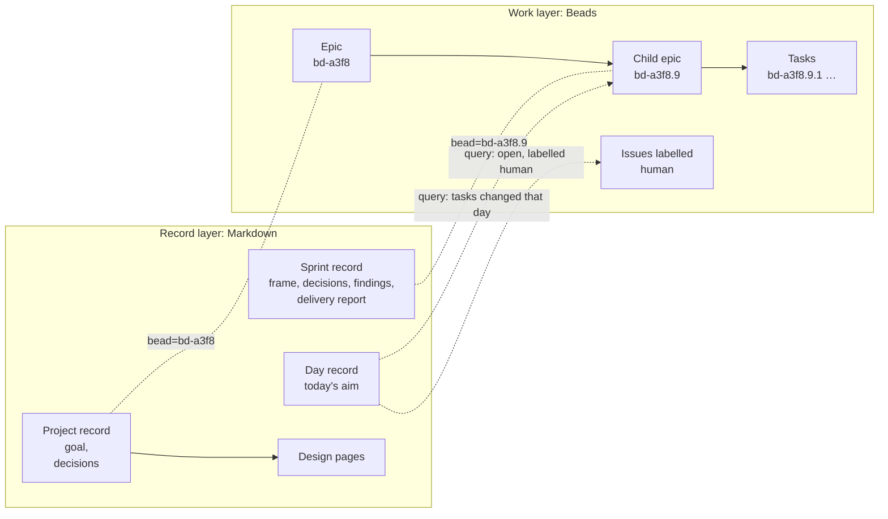

## Problem

> What are we solving, and why now?

Part of the [Project management harness](pm-harness.md) design. One of its four problems is that **tracking and context are mixed**:
why and how far are buried in the same prose as who and what. On poker-ai's
daily page, goal, queue and owner items share the same cards.

## Goals and non-goals

> What must the design achieve, and what does it deliberately leave out?

**Goals**

- Context lives in a few record types (project, sprint, day, design page,
  doc, postmortem), each with a checked header, fixed sections and a small block
  vocabulary, so the format does not drift.
- Records point at Beads ids; the renderer looks status up.
- Every record carries all of its sections from the start, so the file shows
  its full schema.

**Non-goals**

- Status, owners or dependencies in records: those are Beads fields.
- Decisions and plans in design pages: they live in project and sprint
  records.

## Constraints and key facts

> Which facts, findings and constraints shaped the design? Only those that
> still hold; sprint records keep the findings as they happened.

- A raw HTML block in Markdown ends at the first blank line.
- Git blame dates are commit dates, which differ from the decision date for 4
  of 16 project decisions.

## Design

> What is it, in its final state? Free `###` subsections. Decisions and plans
> live in the project and sprint records.

Records live in one store per clone, independent of branch and worktree: the `records` branch, checked out at `<main checkout>/.records`. `pm` finds it from any worktree through the clone's common git dir, as `bd` finds its database, and fails if it is missing; each worktree reads it through `records/`, a git-ignored link made by `pm setup`. Every `pm` write commits on the `records` branch; code branches never commit `records/`; `main` gets a copy from a GitHub Action. The detail is its own design page: [Shared records store](records-store.md).

### How records relate to Beads



*Reading:* records point at Beads ids and never copy status; the renderer looks status up when it builds a page.

### Record types
"Points to" is the id a record stores. The renderer follows it to pull live status from Beads, or to place the record under its project. Records never copy status.

| Record | File | Points to | Checked fields | Free body |
|---|---|---|---|---|
| Project | `records/projects/learned-leaf.md` | Its Beads epic, via `bead:` in the header | Header: `type`, `title`, `bead` only. Sections: Goal (required), Decisions (required, may be empty); Outcome at close | Goal text, decisions, design-page links. Progress is generated, never written |
| Decision | `::: decision` inside the project record or a sprint record; where it lives sets its level | Nothing: it lives inside the record it governs | `source` and `date`; `until` only when there is a known condition to revisit | The decision and its reason |
| Sprint | `records/sprints/learned-leaf-9.md` | Its Beads child epic, via `bead:` in the header | Header: `type`, `title`, `bead`. Sections: Goal, Scope, Done when, Design pages, Decisions, Findings; Delivery report at close | Findings, delivery report |
| Day | `records/days/2026-09-29.md` | Nothing stored; the renderer finds the sprints and needs of that date in Beads | Header: `type`, `date` (repo-wide: one per day, across all projects). Sections: Today only | Today's aim |
| Design page | `records/design/<slug>.md` | Its project record, via `project:` in the header | Header: `type`, `title`, `project`. Sections: Problem, Goals and non-goals, Design (required); Constraints and key facts, Alternatives considered, Open questions (required, may be empty); Prior art (optional) | Each section's text; free `###` subsections under Design |
| Doc | `records/docs/<YYYY-MM-DD>-<slug>.md`, dated because a doc describes a moment | A sprint or task via `bead:`, or a project via `project:` (exactly one) | Header: `type`, `title`, `date` (matching the file name), and `bead` or `project`; the bead must exist inside a project with a record | Everything: a result, analysis, comparison or explainer. Written once, never a design's final state |
| Postmortem | `records/postmortems/<YYYY-MM-DD>-<slug>.md`, dated by when it was written | A sprint via `sprint:` (its Beads id, which must have a sprint record), or a project via `project:` (exactly one) | Header: `type`, `title`, `date` (matching the file name), and `sprint` or `project`. Sections, each with a prompt line: Summary, Timeline, Cost, Root cause, What changed, What would have caught it earlier | Each section's text. Listed on its sprint's page, its project's page and the overview. Due for an incident that cost more than a day, or broke other sessions or the owner's view |

### The project record
Minimal by design: a three-field header and four sections, each opened by a prompt line that tells agents what belongs there.

| Section | Prompt line | Written by | Required |
|---|---|---|---|
| Goal | Why do we do it? What is it? What outcome do we expect? | Hand | Yes |
| Progress | Where are we now, and what's next? | Generated: a graph of sprints and their tasks, coloured by status, with dependency arrows from Beads; then a table of sprints with dates, question and outcome | Yes, never hand-written |
| Decisions | What constrains every future sprint? | Hand | Yes, may be empty |
| Design pages | Where is the detail? | Hand: links | Yes, may be empty |
| Outcome | What was achieved against the goal, what was learned, what was retired; links to the sprint delivery reports | Hand, when the project closes | Yes: "Not closed yet." until then |

### The sprint record

High level by design: implementation detail goes in a design page. Shaped by
what poker-ai's sprint specs and delivery reports actually contain (goal,
requirements, success criteria, non-goals; then fit to spec, work trunks,
evidence, trade-offs, next steps).

| Section | Prompt line | When | Required |
|---|---|---|---|
| Goal | What should be true when this sprint ends, and why now? | Before | Yes |
| Scope | What's in, and what's explicitly out? Keep this high level; implementation details go in a design page | Before | Yes; **In** and **Out** lists |
| Done when | What evidence will show the goal is met? | Before | Yes; checkable items |
| Progress | Where is the sprint now? | During | Generated from Beads |
| Decisions | What did we choose inside this sprint, and why? | During | Yes, may be empty |
| Findings | What did we learn that changes the design, the plan, or how we work? Add results with their numbers | During | Yes, may be "None yet." |
| Delivery report | Written in full before the PR review; `pm sprint close` stamps the merge commit. First line is the outcome | Before review | Yes: "Not closed yet." until then; fixed parts below |

The header is `type`, `title`, `bead`; project and dates come from Beads.
Findings go in the sprint record's Findings as they happen; an agent edits
the section with `pm finding add`. The delivery report has two `###`
subsections, each holding "Not closed yet." until the agent writes it in full,
by hand, before raising the sprint's PR review:

1. **Outcome:** done, partial or voided, plus one sentence, optionally
   followed by bullets of what shipped. The renderer rejects an Outcome that
   does not start with done, partial or voided, and shows it in the project
   page's sprint table. `pm sprint close` appends "Merged as <sha> (PR #N)." from the
   review's close reason.
2. **Against "Done when":** each item, met or not, with its evidence (a page,
   a command, a number).

The report holds no draft state: while the review is open, the sprint page
shows it in its generated "Decisions await you" and "Actions await you"
sections, and that card says the sprint awaits a merge. `pm sprint close`
requires every task closed and each review closed as merged (a dismissed one skipped), stamps the
Outcome, commits the record and closes the epic. The full flow, and the draft
paragraph it replaced: [Sprint lifecycle](sprint-lifecycle.md).

Findings are a plain list and stay in the sprint record; no structure yet.

Every record carries all of its sections from the start, including the ones
written at close, so the file shows the record's full schema. A close-time
section holds "Not closed yet." until it is written.

### The design page

A design page describes the **final state** of a design: what it is, and the
key facts, findings and constraints that led to it. It is not a trail of
every small finding or intermediate step; git keeps the history, and each
sprint record keeps its own findings. When the design changes, the page is
edited to the new state rather than appended to. A project is not required
to have one.

A design page covers one area. When a page grows to several areas, each
becomes a sub design page, and the main page keeps a short summary per area
that links it; a sprint's Design pages section links the specific sub pages
its work changed, not the whole main page. A reader or an agent then reads
the one focused page it needs instead of hunting through a long one.

Every design page has the same sections, in this order, so every design reads
the same way and agents know where things go. `pm design new` creates a page
with all of them, each holding its prompt line and "None yet.".

| Section | Prompt line | Required |
|---|---|---|
| Problem | What are we solving, and why now? | Yes |
| Goals and non-goals | What must the design achieve, and what does it deliberately leave out? | Yes |
| Constraints and key facts | Which facts, findings and constraints shaped the design? Only those that still hold; sprint records keep the findings as they happened | Yes, may be empty |
| Design | What is it, in its final state? Free `###` subsections. Decisions and plans live in the project and sprint records | Yes |
| Alternatives considered | What else was considered and not adopted, and why not? | Yes, may be empty |
| Prior art | Optional. What existing work did we learn from, and what did we take? | No |
| Open questions | What is still unresolved? | Yes, may be empty |

The renderer checks only that each required section's heading is present:
not their order, extra sections, or what they hold, because free-form detail
is what makes a design page useful. Headings carry no numbers; the table of
contents lists each section and the `###` subsections under it. Decisions and
plans are not sections: they live in the project and sprint records.

### Decision levels
A decision is recorded at the level it governs. Both kinds stay in their
record permanently; nothing is closed or moved.

| Level | What it records | Examples | Revisited |
|---|---|---|---|
| Project | Rules that constrain every future sprint: architecture, formats, conventions, scope boundaries | Beads is the work layer; records are Markdown with fenced divs | When its `until` condition is met, if it has one |
| Sprint | Choices inside one bet: approach, scope cut, what to try first | Dogfood on yeeef-agents; no CLI in sprint 1 | Not needed: it describes that sprint's own work |

- **A decision later sprints must follow is a project decision.** Record it in the project record when it is made, or as soon as it turns out to apply beyond one sprint.
- **Skip the cheap ones.** A choice that is cheap to reverse and nobody will ask about is not recorded; its commit message is enough.
`pm decision add` requires `--level` and prints the rule (see [pm CLI](pm-cli.md)).

### The fenced-div vocabulary
A fixed list. The renderer and CLI reject any other name or a missing required attribute.
Attribute values with spaces are quoted: `until="Beads fails the mapping check"`. A raw HTML
block (such as a mock-up) ends at the first blank line, so it must contain
none; an empty line inside a `<pre>` is written as `&#8203;`.

| Block | Used in | Required attributes | Renders as |
|---|---|---|---|
| `::: decision` | Project, sprint | `source`, `date`; optional `until` | Row in the decisions table of its project or sprint; the project page also lists the decisions of its open sprints |
| `::: result` | Any | `title` | Titled table with a reading line |
| `` ```mermaid `` | Any | A one-line reading after it | Rendered diagram |

Not chosen for decisions: Beads' `decision` issue type (alias `adr`). It has no level, source or `until` fields, open decision issues show up in `bd ready` as work, and its only extra, `bd supersede`, is not needed yet. `date` stays an attribute because git blame dates are commit dates, not decision dates. See [the evaluation](../docs/2026-10-03-beads-decision-type.md).

## Alternatives considered

> What else was considered and not adopted, and why not?

Smaller alternatives sit beside the choice they lost to in Design, marked
"Not chosen".

### HTML design pages behind a subagent protocol

Not adopted, because the Markdown design pages already render well.

**The idea.** Design pages stay free-form HTML, so they can carry rich detail
for people. To keep the main agent token-efficient, it never reads or edits
that HTML itself:

- **Read:** a helper turns the page into a lossless, compact form for the main
  agent.
- **Write:** the main agent sends instructions or compact content to a
  subagent, which edits the HTML.

**Refinements discussed:**

| Point | Detail |
|---|---|
| Lossless reads should be deterministic | Convert HTML to Markdown with a tool, not an LLM; a model condensing a page drops or invents details. Use a subagent only for summaries or questions about a page |
| Read by section | The read tool returns an outline with heading ids first; the agent then asks for the sections it needs |
| Writes need a check | The subagent reports a diff summary; the page is rendered and looked at |
| Total cost rises | Subagents still read the full HTML. Worth it for rarely edited design pages, not for records updated every hour, which stay Markdown through the CLI |

**How it could be enforced:**

| Stage | Mechanism | Strength |
|---|---|---|
| First | An instruction in `CLAUDE.md` / `AGENTS.md`: never read or edit design HTML directly | Advisory |
| Cheap upgrade | A `PreToolUse` hook that blocks the main agent's `Read` and `Edit` on design HTML and points to the right tool. Not yet checked whether a hook can tell the main agent from a subagent | Enforced |
| Later | `pm page read <page> [--section id]` (deterministic) and `pm page edit <page> --section id` (spawns the subagent) | The convenient path the hook points to |

**If adopted**, it would replace the decision that design pages are Markdown
records.

## Prior art

> Optional. What existing work did we learn from, and what did we take?

### Obsidian as a record-layer reference
Obsidian is a folder of Markdown files with typed metadata, links and queries on top. We will not use it, but it has already solved problems the record layer will hit.

| Obsidian feature | What it does | What it suggests for us |
|---|---|---|
| Properties | YAML front matter with types (text, list, number, checkbox, date, date and time) | Our checked header fields, but validated on every write |
| Wikilinks and backlinks | `[[note]]` stores a link once; the target shows every note that links to it | Store a link once and get the reverse for free: a sprint stores its project, and the project page lists its sprints |
| Dataview and Bases | Queries over properties, rendered as tables (Dataview is a community plugin; Bases is a core plugin) | Every list on a page is computed, as the overview and needs already are |
| Embeds | `![[note#heading]]` shows a section of another note inline | The day page shows each sprint's frame without copying it |
| Block ids | `^id` gives a paragraph or list item a stable address | Stable ids that the CLI and links can address |
| Callouts | `> [!note]` makes a typed box in plain Markdown; GitHub renders a few types natively | An alternative syntax to fenced divs |
| Templates | Insert a skeleton note | `pm sprint open` produces skeletons |
| Plugins | Anyone can add syntax and views | We keep a small fixed block vocabulary instead |

**Borrow:**
- Backlinks: store each link on one side only.
- Views as queries over records.
- Embeds instead of copied text.
- Stable block ids.
**Avoid:**
- Loose typing. Records must be validated.
- Views that render in only one app. Ours render to static HTML and to `pm show` text.
- Open plugin syntax that agents could misuse.
Sources: [Properties](https://help.obsidian.md/properties), [Bases](https://help.obsidian.md/bases), [Core plugins](https://obsidian.md/help/Plugins/Core+plugins), [Internal links](https://help.obsidian.md/links), [Embeds](https://help.obsidian.md/embeds), [Callouts](https://help.obsidian.md/callouts), [Dataview](https://blacksmithgu.github.io/obsidian-dataview/), [GitHub alerts](https://docs.github.com/en/get-started/writing-on-github/getting-started-with-writing-and-formatting-on-github/basic-writing-and-formatting-syntax#alerts).

## Open questions

> What is still unresolved?

None yet.
