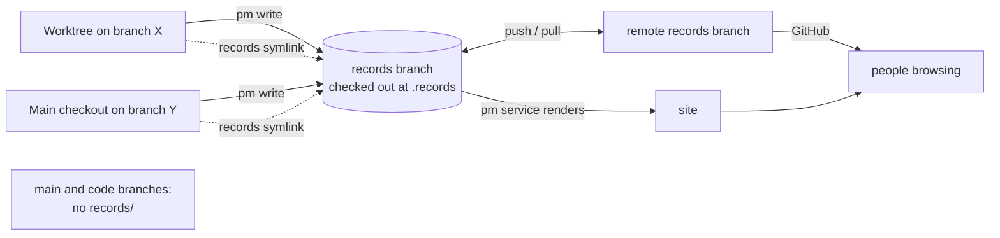

## Problem

> What are we solving, and why now?

Beads issues live in one git-ignored database per clone, so every worktree
and branch sees a write the moment it happens. Records (`records/**/*.md`)
are tracked files, so every branch has its own copy. When an agent works in a
worktree on a code branch, its `pm` writes land on that branch only, and the
two layers disagree.

Observed on 2026-10-03: a context-efficiency finding was committed on branch
`context-efficiency-1`, so the owner's checkout showed that sprint's Findings
as "None yet.", while the need citing the finding was visible everywhere.

## Goals and non-goals

> What must the design achieve, and what does it deliberately leave out?

**Goals:**

- One live records store per clone, independent of branch and worktree:
  every `pm` write is immediately visible to `pm show`, `make render` and the
  owner, wherever the writer is.
- Records keep full per-file git history.
- Code branches, `main` included, track nothing under `records/`; people
  read records on the site or on the `records` branch on GitHub.
- Agents keep reading records at `records/...` with ordinary file tools.

**Non-goals:**

- Moving records into Dolt or Beads.
- A copy of the records on `main`.

## Constraints and key facts

> Which facts, findings and constraints shaped the design? Only those that
> still hold; sprint records keep the findings as they happened.

- Beads finds its database from any worktree; records must be found the same
  way, without configuration.
- Agents may run sandboxed to their worktree: reads outside it are fine, but
  writes must go through `pm`, which commits them itself.
- Codex's workspace-write sandbox (codex-cli 0.131.0) keeps every git dir
  read-only, even inside a writable root, unless that git dir is itself a
  writable root; a root's own git dir stays read-only even when its parent
  is listed, so the store's `.git/worktrees/-records` must be listed on its
  own. From a worktree, the store and `.beads` (which `pm` reads through
  `bd`) are outside the workspace, and `bin/pm` needs uv's cache. `codex
  sandbox` and Codex sessions read the extra roots from
  `[sandbox_workspace_write] writable_roots` in `$CODEX_HOME/config.toml`.
- Claude Code resolves `records/` to the store, which is outside the
  worktree, so without more it asks before each write through the link (in
  auto mode a headless session is refused: "resolves through a symlink …
  outside the allowed working directories"). Listing the store in
  `permissions.additionalDirectories` lets it write, and a running session
  picks the setting up without a restart. A session started with `claude -w`
  is still refused, with "a different worktree": its isolation blocks every
  other git worktree, and the store is one, whatever the settings say.
- Concurrent `pm` writes from different worktrees must not lose or garble each
  other's changes.
- Hand-edited sections (Goal, Scope, Done when, the delivery report, design
  pages) are edited directly, not through a `pm` command.
- Task closes still name a code commit on any branch.
- A branch whose tree tracks `records/` (cut from a `main` that tracked a
  copy) replaces the link with that copy when it is checked out in a
  worktree without sparse checkout: git treats the ignored link as
  expendable. Merging `main` removes the tracked copy.
- Turning sparse checkout off in a worktree whose `HEAD` or index tracks
  anything under `records/` writes that copy over the link.
- Nothing pulls the store at session start, so a fresh clone with `bin/pm setup` works for one machine at a time.

## Design

> What is it, in its final state? Free `###` subsections. Decisions and plans
> live in the project and sprint records.

*Reading:* every worktree reads and writes one store; people read it on the
site or on the remote `records` branch; no code branch carries records.

### The store

A `records` branch holds all records, design pages included. It is checked out once per clone, as a
fixed worktree at `<main checkout>/.records`, and it is the only place records
are written. It is built from the existing history with
`git subtree split --prefix=records -b records`, so every file keeps its past
commits.

### Finding the store

`pm` and `make render` locate the main checkout from any worktree with
`git rev-parse --git-common-dir`, the way `bd` finds its database, and use
its `.records`. They fail when it is missing or not a worktree on the
`records` branch; nothing falls back to a local `records/`.
`pm where records` prints the path; bare `pm where` lists every location
setup touches (the store and its ahead/behind against `origin/records`, this
checkout and its link, Beads, the hooks, the site) with its state.

### Reading

Each worktree has a git-ignored symlink `records -> <main checkout>/.records`,
so agents read `records/...` as before. `/records` is in the repo's
`.gitignore`, so no code-branch commit can pick up the link or the store's
files, and no hook or CI check guards `records/`.

Claude Code reaches the store through `permissions.additionalDirectories`
and Codex through `writable_roots` (Setup and sync, below).

| Worktree state | What setup and the checks do |
|---|---|
| `HEAD` and index track nothing under `records/`, sparse pattern `/*` `!/records/` from an earlier pm | `pm init` turns sparse checkout off and unsets `sparse.expectFilesOutsideOfPatterns`; `pm doctor` reports the pattern until then |
| `HEAD` or index tracks `records/` (a branch cut from a `main` that tracked a copy) | The sparse pattern stays, so the link survives; checked out without it, the tracked copy replaces the link. Merging `main` fixes it; `pm init`, `pm doctor` and `pm where` report it |
| No sparse checkout, nothing tracked under `records/` | Nothing to do |

### Writing

Every `pm` write edits the file in `.records` and commits exactly the files
it wrote on the `records` branch, under a lock on the store directory held
across the edit and the commit, so no write is left uncommitted and
concurrent writes land as separate commits. Hand edits are made in
`.records` and committed there with `pm commit -m "…" <path>…`, which first checks
that the whole record set renders and commits only the named records, so
another session's edit in progress is never swept into the commit. A `pm`
write whose commit fails restores the files it wrote and says so, so it
leaves nothing behind either. Store commits skip git hooks: `pm` has
already validated them, and code-branch hooks do not apply to records.

### Retired pieces

`pm doctor` reports these where a repo still has them; `pm upgrade` (and
`pm uninstall`) removes the tracked files, and `pm init` the sparse checkout:

| Piece | What it did |
|---|---|
| `.github/workflows/pm-records-copy.yml` | `git subtree merge --prefix=records` of the store into `main` on each push to `main` |
| `.github/workflows/pm-records-guard.yml` | Failed a pull request that edited `records/` |
| pm's section in `.pm/hooks/pre-commit` (`.beads/hooks/pre-commit` under Python pm) | Refused a code-branch commit that staged `records/`; `pm hook git-pre-commit`, which it runs, does nothing now, so a worktree on the new pin commits until the upgrade reaches the main checkout's hook file |
| Per-worktree sparse checkout `/*` `!/records/` | Kept `main`'s tracked copy from replacing the link; `pm init` turns it off once the worktree tracks no `records/` |
| `records/` tracked on a branch | The copy itself; `pm doctor` names it, and the commit `pm upgrade` prints untracks it (`git rm -r -q --cached --sparse records`), leaving the link |

### Setup and sync

A fresh clone runs one command, `bin/pm setup`. It first connects Beads:
`bd bootstrap` clones the issue database from `refs/dolt/data` on the remote
(`bd init` would mint a new database instead), the clone gets
`beads.role=maintainer`, and `bd hooks install --beads` sets
`core.hooksPath` to the tracked `.beads/hooks`. It then creates the local
`records` branch from `origin/records`, checks it out at `.records`, and
makes the link. Each step runs only
when it is missing, so re-running the command changes nothing. Last, if
`$CODEX_HOME` (default `~/.codex`) exists, it adds the clone's `.git`, the
store, the store's git dir, `.beads` and uv's cache to `writable_roots` in
`$CODEX_HOME/config.toml`, so a Codex session in any worktree can write and
commit records. Those paths are absolute and differ per machine, so they go
in the user's config rather than the repo, and the owner chose no manual
step over keeping that config untouched by repo tools. Setup reads the file
with `tomllib`, refuses one it cannot parse, adds only the missing paths by
a minimal text edit (creating the table if absent) and checks that the
result parses to the old data plus those paths, so every other line and
comment stays byte for byte. Without `$CODEX_HOME` it says so and leaves
Codex alone. If Claude Code's config dir (`$CLAUDE_CONFIG_DIR`, default
`~/.claude`) exists, it also adds the store to
`permissions.additionalDirectories` in the worktree's
`.claude/settings.local.json`, keeping the file's other settings: that
file is per worktree and git-ignored, so the absolute path stays out of
the repo, and it refuses a file it cannot parse. After that,
the session-start hook runs it at every session start, so every worktree
an agent works in is set up whatever tool created it. Git's `post-checkout` hook used to run
it in new worktrees and was dropped: git runs it only for a checkout, so it missed a worktree
created without one and then reset (as Claude Code makes its bridge worktrees), and session
start covers every case it did. A worktree used without an agent session needs `bin/pm setup`
by hand. Setup makes every check itself and changes
nothing in a set-up worktree (0.4 to 1.6 s measured), so the hook runs it unconditionally
rather than guessing from the link whether it is needed; it gets 6 s, under the runtimes' 30 s
hook limit, and a fresh clone's Beads bootstrap that needs longer is run by hand. A git
`post-index-change` hook was tried and dropped: it fires on every index write, so it needed a
once-per-worktree marker and a time limit (owner decision, superseding the answer to need
yeeef-agents-9va.61.7). A link tracked on main cannot replace setup: a symlink's target is
fixed text, and the store sits at a different relative path from each worktree. `pm` itself
works even without the link, so `pm show` never notices one missing; session start therefore
also injects `pm where`, which states the link and every other location. The `records` branch is pushed
and pulled on its own, separate from code branches, as Beads syncs
`refs/dolt/data`; who pushes it is under Push.

### Push

`pm` stays local: it commits records but never pushes them. The `records` branch is pushed by the same per-machine scheduled job that pushes Beads data ([Agent git authority and Beads sync](http://localhost:8000/design/agent-sync.html); owner decision, need yeeef-agents-9va.30.8.1; built in task yeeef-agents-9va.30.8). When the store is ahead of `origin/records`, the job fetches, rebases onto `origin/records` and pushes; a rebase conflict or failed push is logged and flagged. A failed or overdue push shows in `pm show` and on the site. The rebase holds the store lock every `pm` write takes and is aborted if it stops, leaving the store as it was; with uncommitted tracked edits in the store it is skipped until the next run.

### Costs accepted

- A clone of `main` alone holds no records: reading them takes the site, the
  `records` branch on GitHub, or `pm init`.
- One setup command per clone.
- A record reaches `origin/records` up to one job interval (about 10 minutes)
  after its commit, so the `records` branch on GitHub and sessions on other
  devices see it that much later.
- A branch that still tracks `records/` loses the link when checked out in
  a worktree without sparse checkout, until it merges `main`.
- Setup edits the user's Codex config, and every Codex workspace-write
  session on the machine may then write the clone's `.git`, `.beads` and
  uv's cache, not only sessions in this repo.

## Alternatives considered

> What else was considered and not adopted, and why not?

| Alternative | Why not |
|---|---|
| Always write to the main checkout's `records/` | Collides with the owner's uncommitted work, and with whatever branch that checkout is on |
| Move records into Dolt or Beads | Loses hand-editable Markdown and git tooling |
| A full copy of the store on `main`'s `records/`, merged in by a GitHub Action (`git subtree merge`) | No machine reads it: `pm`, the site and agents all read the store. Keeping it took four mechanisms (the copy Action, a PR guard, a pre-commit guard, a sparse checkout per worktree) to stop it drifting or replacing the link |
| Copy each PR's own record changes to `main` | The store mixes record writes from every worktree, so it cannot attribute them to a PR cleanly; this means cherry-picks, conflicts and drift |
| An empty orphan `records` branch with the files copied in | Loses each file's history |
| `pm` pushes after every write and `pm commit` (the earlier decision on need yeeef-agents-9va.30.2) | The owner kept `pm` light and local: no network step, timeout or retry in every write; the scheduled job already pushes Beads data and bounds the delay |

## Prior art

> Optional. What existing work did we learn from, and what did we take?

None yet.

## Open questions

> What is still unresolved?

- Two machines at once: nothing pulls the store at session start; an auto-pull would be needed.
- A `pm task add` hung 2:16 (state SN, no child) on 2026-10-05; unproven, likely its `LOCK_EX` on the store (`pm.py:232`) waiting on `pm serve`'s `LOCK_SH` during a render that runs `bd` (`pm.py:1038`). If so, the store lock should not be held across `bd` calls in a render.
