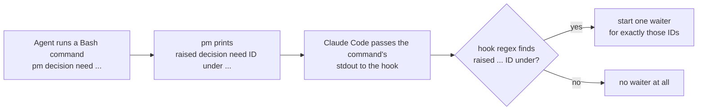
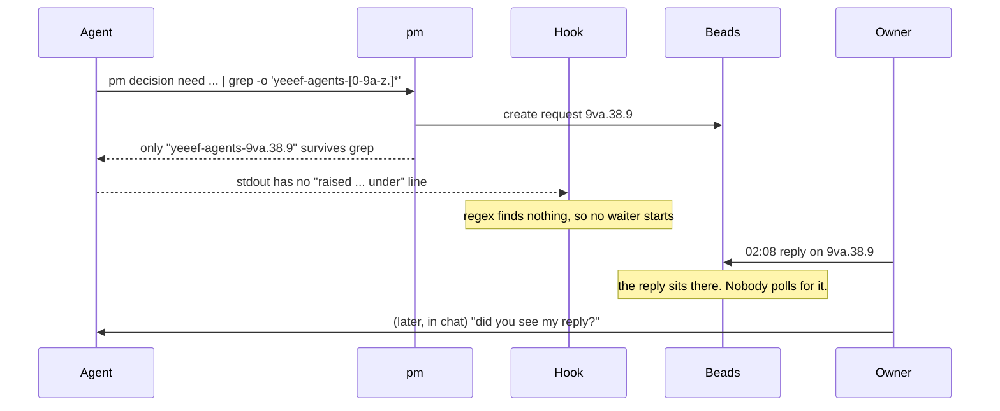
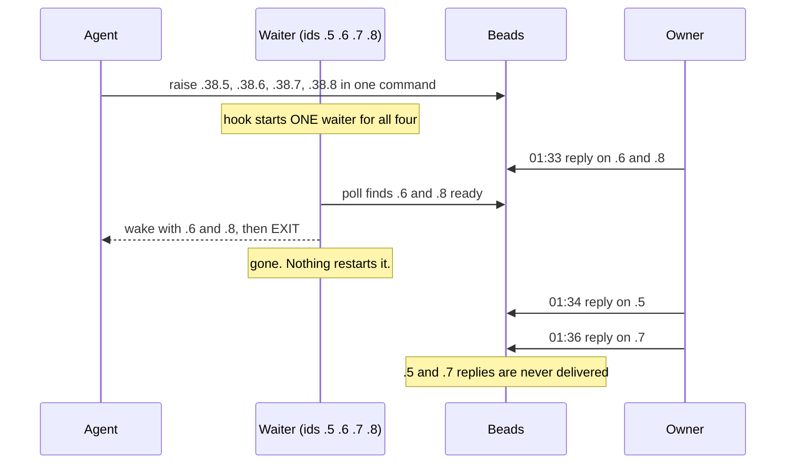
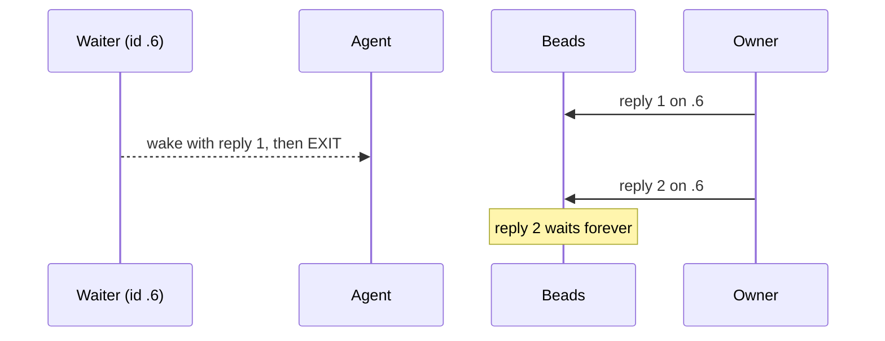
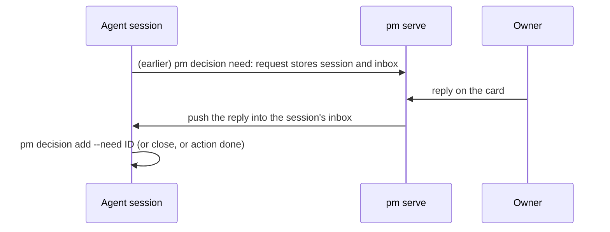
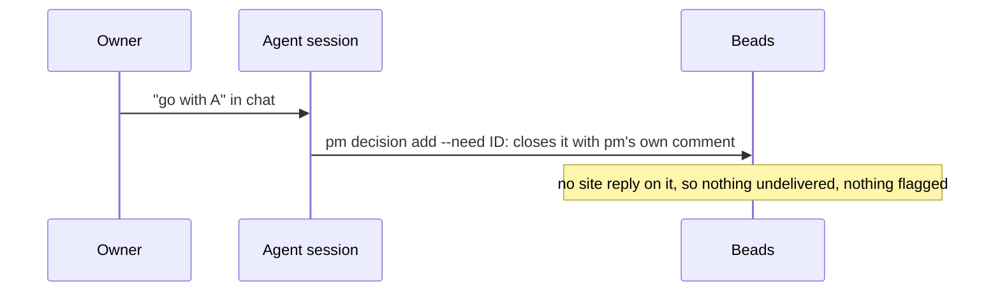
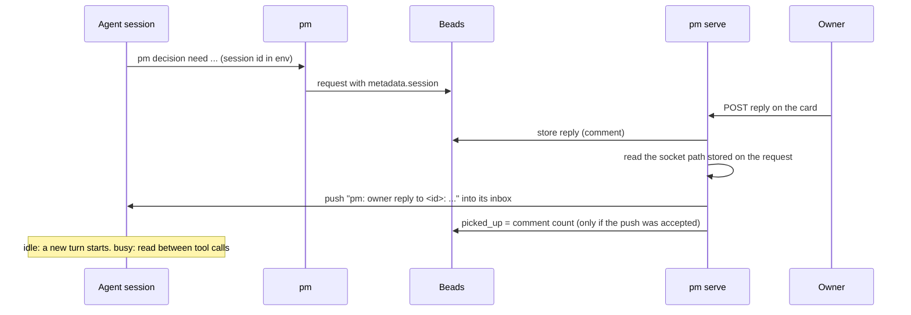
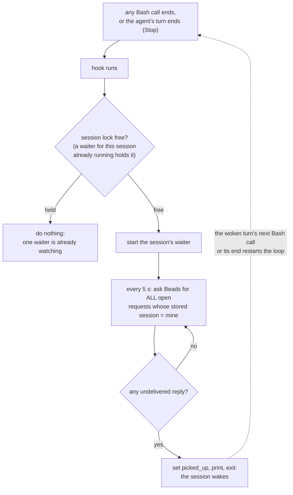

## Problem

> What are we solving, and why now?

An owner reply posted on the site must reach the agent session that raised the request. Today a consumer-side poller (`pm reply wait`, started by a Claude Code `asyncRewake` hook) watches Beads and wakes the session by exiting. On 2026-10-06 it lost replies three times (sprint 40 findings; the failure pattern is below). The fix on branch `reply-wait-rearm` keeps the poller but restarts it on every Bash call and at every turn end. That stops the losses, but it ties delivery to Claude Code's hook lifecycle, including an undocumented use of `asyncRewake` on a Stop hook. Proposed here: the moment a reply is posted, the site pushes it into the session.

### The pieces

- **Request**: a decision need or action, a Beads issue labelled `human`. Raising it (`pm decision need`, `pm action need`) stores the raising session's id on it.
- **Reply**: your comment on the request's card on the site. A request has an undelivered reply while its comment count is higher than its `picked_up` count.
- **Waiter**: a background `pm reply wait` process. Every 5 s it polls Beads. When it finds an undelivered reply, it sets `picked_up`, prints the reply and **exits**.
- **Hook**: Claude Code runs `reply_wait_hook.py` after a tool call. The hook starts the waiter and waits for it. It is an `asyncRewake` hook, so when it exits with output, that output **wakes the session**, idle or busy.

The key constraint: a waiter can wake the session only by exiting. So every delivery ends the waiter, and something must start a new one.

### The old design: the waiter learns ids from printed output

Reading: the hook learned which requests to watch only from the text the command printed, and it started a waiter only after a raising command.

Three ways that loses a reply follow. All three happened on 2026-10-06.

#### Failure 1: the output was filtered, so no waiter started

Session af7821c4 raised `9va.38.9` with its output piped through `grep -o`, keeping only the id. The line `raised decision need 9va.38.9 under ...` never reached the hook, so the regex matched nothing.

Reading: the request existed in Beads, but the hook never knew, because it looked at printed text instead of Beads.

#### Failure 2: one waiter for several requests exits on the first reply

Four needs (`.38.5`–`.38.8`) were raised in one Bash command, so one waiter watched all four. It exited on the first poll that found any reply.

Reading: the wake delivered what was ready at that moment, then nothing watched the two requests that were still open.

#### Failure 3: a second reply to the same request has no waiter

Even with one request per command, a waiter dies on its first delivery. A follow-up reply ("actually, one more thing") has nobody waiting for it.

Reading: a new waiter started only when a request was raised, never after a delivery.

All three have one root: **the set of watched requests was fixed at raise time, from printed text, and a waiter never came back after it exited.**

## Goals and non-goals

> What must the design achieve, and what does it deliberately leave out?

- **Goal:** both ways the owner answers keep working: a reply on the site, and an answer given in chat that the agent records and closes (see The two workflows it supports).
- **Goal:** every reply reaches the session that asked at least once while that session runs, with no long-lived per-session process and no dependence on which tool the agent calls next.
- **Goal:** a reply whose session is gone is never silently dropped. The next session sees it.
- **Goal:** the core (what is undelivered, what counts as delivered) is runtime-agnostic. Waking the session is a small Claude Code adapter beside it.
- **Non-goal:** Codex. This design covers Claude Code sessions only.
- **Non-goal:** de-duplicating a reply the form stored twice. At-least-once tolerates it.
- **Non-goal:** delivering into a session on another machine. Such a session finds the reply at its next start.

## Constraints and key facts

> Which facts, findings and constraints shaped the design? Only those that
> still hold; sprint records keep the findings as they happened.

- **The producer knows the target.** `pm serve`'s reply POST handler stores the reply on a request, and the request stores the raising session's id (`metadata.session`). So the place where the event happens can address the session directly.
- **Claude Code has a per-session inbox.** Since v2.1.224 (GA, on by default on macOS and Linux), every session binds a Unix-socket inbox for cross-session messaging, named in `$CLAUDE_CODE_MESSAGING_SOCKET`. The docs (code.claude.com/docs/en/cross-session-messaging) name "a script or hook to post into a session" as a use. An idle session starts a new turn with the message; a busy one reads it between tool calls.
  - Verified on 2026-10-06 with Claude Code 2.1.290: a separate process wrote one JSON line `{"type":"user","message":{"role":"user","content":"…"}}` to an idle session's socket, and the session took a new turn with it.
  - Documented (code.claude.com/docs/en/cross-session-messaging, "The session's inbox socket"): the socket's path is exported to hooks and Bash commands as `CLAUDE_CODE_MESSAGING_SOCKET`, "a script or hook to post into a session" is a named use, the optional first line `{"type":"auth","token":…}`, and the 30 s rule. Not documented: the message line itself, `{"type":"user","message":{"role":"user","content":"…"}}`. It was observed in a live test and in the binary's own log hint. The socket's directory and file name are not a contract either; the design reads the path from the variable, never builds it.
  - The socket closes a connection that sends no complete line within 30 s, so a writer connects only once its line is ready.
  - A session in bypassPermissions mode holds a message from an unverified sender until someone approves it. The setting `crossSessionInbound: "accept"`, or a first line `{"type":"auth","token":$CLAUDE_CODE_MESSAGING_TOKEN}`, avoids that. The token must never go into Beads, which syncs to the remote.
  - The session shows the message as coming from "another Claude session", so the text must say it is the owner's reply relayed by `pm serve`.
- **`asyncRewake` on a Stop hook is not documented.** The hook timeout still applies, so a poller has to be killed and restarted at least weekly.
- **A PR merge has no producer in pm.** GitHub is the source, so something must look. `pm serve` already has to run for the owner to reply at all, so it is the natural one to look.

## Design

> What is it, in its final state? Free `###` subsections. Decisions and plans
> live in the project and sprint records.

### The two workflows it supports

The owner answers a request in one of two ways. Both must work, and the design treats them differently because only one needs delivering.

**1. The owner replies on the site.** The agent raised a need and carried on, or went idle. The owner answers on the request's card. The reply has to travel to the session, and this design is about that path.

Reading: the reply is a site reply (tagged with its reply id), so it counts as undelivered until the push is accepted or the agent runs `pm reply read`. Closing the request is refused while it is undelivered.

**2. The owner answers in chat.** The owner is talking to the session and gives the answer there. The agent already has it, so nothing is delivered: the agent records it and closes the request.

Reading: pm's closing comment is not a site reply, so it never counts as undelivered, and the close is never refused.

What makes both work: "undelivered" counts only site replies (comments carrying the site's reply id) against `picked_up`. It never counts the raw comment count, so pm's own comments and any agent comment are not mistaken for an owner reply.

### Site replies, step by step

Reading: the reply is delivered by the request that stores it, with no process waiting in the agent's session.

### Raising
`pm decision need` / `pm action need` store `metadata.session` as today, plus `metadata.inbox`: the value of `CLAUDE_CODE_MESSAGING_SOCKET` in the raising command's environment (the documented way to learn a session's socket). Nothing else is started. The token is never stored; Beads syncs to the remote, and on Linux and macOS the auth line is optional.

### Delivery: push at the moment of the reply
After storing a reply, `pm serve` looks up the request's session:
Connect to the socket path in `metadata.inbox` and write one line. A connection refused or a missing socket means the session has ended; a resumed session binds a new socket, so the reply then falls to the safety net. The line reads "pm: owner reply to `<id>` (relayed from the site): …" and ends with the next step.

If the push is accepted, `pm serve` sets `picked_up`, and the card shows "delivered". If there is no live session, or the push fails, the reply stays undelivered and the card says which ("the session is not running, the next one will see it", or "the push failed; pm serve tries again"). Both outcomes are defined; neither is a fallback that changes what "delivered" means. The inbox is stored with its machine's hostname, and `pm serve` pushes only on that machine, so Beads synced elsewhere or a socket path reused later never receive it.

### Retry: the sweep
A push can fail while the session runs (a timeout, a socket briefly missing), and `pm serve` can stop between storing a reply and pushing it. So at start and every 60 s, `pm serve`'s writer thread, which makes all its Beads writes, sweeps the open requests that store an inbox and hold an undelivered reply or merge, and pushes them through the same delivery code. A request whose session it found not running is skipped until its socket path appears or changes, so a session that is gone costs a stat per sweep and one log line. A repeat delivery is possible and tolerated.

### A resumed session's inbox
A resumed session keeps its id but binds a new socket. The session-start hook runs `pm show --refresh-inbox`, which first points the session's open requests at its current `$CLAUDE_CODE_MESSAGING_SOCKET` (and host), from the Beads read `pm show` makes anyway; the sweep then delivers what the old socket missed.

### Safety net: the next session
Session start already injects `pm show`. `pm show` flags every open request with a reply not yet delivered, and every review whose merge was not pushed, so a reply whose session had ended reaches the next session working on that project. That session runs `pm reply read <id>`, which prints the reply and marks it delivered. Closing a request through pm (`pm decision add --need`, `pm decision close`, `pm action done`) refuses while it holds an undelivered reply, so pm never buries one under a close.

Only the site's replies count: `picked_up` is the number of a request's comments by `owner (site reply)` that reached its session. pm's own closing comment and an agent's `bd comments add` are no replies, so a need answered in chat closes without a refusal and leaves no flag.

Closed requests are not flagged. On 2026-10-06, 23 closed requests in this repo held site replies never marked delivered (answered in chat, or picked up before the count existed), so a flag would be noise on each; and reading closed requests' comments costs a `bd export` (about 3 s) on every `pm show`. A closed request can hold an undelivered reply only if it was closed with raw `bd close`, or if a reply landed in the moment between the closing command's check and its close.

### Merges of reviewed PRs
`pm serve` is the one place that delivers events to sessions, so it also watches merges. At start and every 60 s it checks each open review's PR (an issue with `metadata.review.pr`); once the merge is on main (`gh pr view`, then its merge commit is an ancestor of `origin/main`; each call has a 60 s timeout, and a failing look is logged and retried at the next tick), it stores `merged` and pushes "PR #N merged as `<sha>`" into the session in the review's `metadata.session` through the same delivery code as a reply, and stores `merge_reported`. A merge while `pm serve` is down is seen at its next check after it starts; a merge whose session is gone is flagged by `pm show`.

### What goes away
`reply_wait_hook.py`, its PostToolUse and Stop entries in `.claude/settings.json`, and the per-session lock. `pm reply wait` is replaced by `pm reply read [ID…]`: it prints undelivered replies and merges (by default, this session's) and marks them delivered, without waiting. The safety net and a manual check use it.

## Alternatives considered

> What else was considered and not adopted, and why not?

| Option | Cost | Why not |
|---|---|---|
| Per-request poller, ids parsed from the raising command's output (on main) | Lost replies on 2026-10-06 | Watches only ids it saw printed, and never restarts after its first wake |
| Per-session poller restarted on every Bash call and at turn end (branch `reply-wait-rearm`) | Ties delivery to hook events; relies on undocumented `asyncRewake` on Stop; background `uv`+`bd` start after every Bash call | Works, but couples the guarantee to Claude Code's hook lifecycle |
| Per-request poller started by `pm` with the id it created, pushing each reply into the inbox socket and living until the request closes | One background process per request, with lifecycle rules: stop when the session ends, restart after a reboot, never two per request, exit when a request closes outside pm. Polls Beads every 5 s to rediscover what `pm serve` already saw | Works, and avoids the old poller's two faults (ids from printed output, waking by exiting), but adds running parts without adding a guarantee: it uses the same socket and line format as push. Its only gain is delivering a reply written without `pm serve`, and the site always goes through it |
| Claude Code channels (an MCP server pushes `notifications/claude/channel`) | Research preview; every session needs a hidden dev flag with an interactive confirmation; ignored under `-p` | Too unstable and heavy to set up |
| Explicit acknowledgement (`pm reply read <id>` sets `picked_up`) | One more command the agent must remember to run | Instruction-following again. "Accepted into the session's inbox" is close enough, and `pm show` covers the rest |

### The restarted poller in detail (branch `reply-wait-rearm`)

Reading: the waiter's list comes from Beads on every poll, not from printed output, and every delivery is followed by a restart at the agent's next Bash call or turn end.

How each failure ends under the restarted poller:

| Failure | Old | Restarted poller |
|---|---|---|
| 1. output filtered through grep | no waiter | the waiter finds `.38.9` in Beads by its session id; what was printed doesn't matter |
| 2. several requests, one wakes | the others go unwatched | after the wake, the next Bash call or turn end restarts the waiter, and it sees `.5` and `.7` are still open |
| 3. second reply to one request | no waiter | same restart; `.6` has more comments than `picked_up`, so reply 2 is delivered |

Between a wake and the restart nothing is watching, but nothing is lost either: a reply counts as delivered only once a waiter prints it, so a reply posted in that gap is picked up by the restarted waiter.

#### Limits the poller keeps

- **A small window:** a waiter sets `picked_up` just before it prints. If the hook or session dies in between, that reply counts as delivered but nobody saw it.
- **Raw `bd close` bypasses the refusal:** `pm decision add --need`, `pm decision close` and `pm action done` refuse while a request has an undelivered reply, so the agent can't close a request over a reply it hasn't read. Closing with raw `bd close` skips that check.
- **Not yet seen live:** whether Claude Code honours `asyncRewake` on a Stop hook, which is what restarts the waiter when a turn ends without a Bash call. Live check: action yeeef-agents-9va.44.1.

## Prior art

> Optional. What existing work did we learn from, and what did we take?

Webhooks and push notifications: the producer delivers, and the consumer keeps a durable record of what it has seen. We took push on the event, plus a durable "undelivered" state in Beads as the catch-up path.

## Open questions

> What is still unresolved?

- The message line format is observed, not documented. A Claude Code change could break it; a push failure then shows on the card and in `pm show`, so the risk is visible, not silent. The documented alternative, channels (an MCP server pushes events), is a research preview that needs a hidden development flag in every session.
- Not yet tested: a push into a busy interactive session; a remote or bridge session such as this one.
