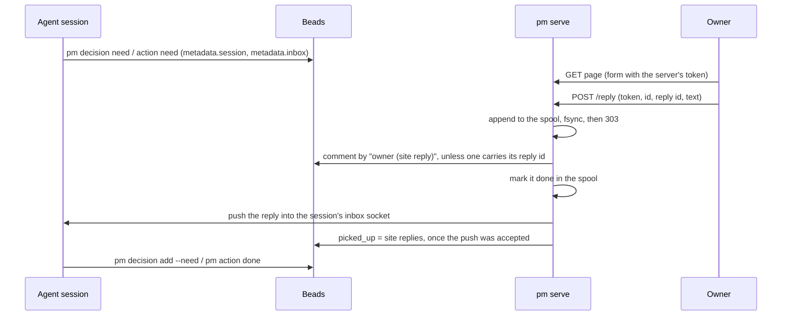

## Problem

> What are we solving, and why now?

Part of the [Project management harness](pm-harness.md) design, next to
[Views and the site](views-and-site.md). The owner reads what awaits them on
the site, but answers elsewhere: a decision with `bd human respond` in a
terminal, an action's evidence in a chat with the agent. The answer then
reaches the agent that asked only if the owner finds that session and tells
it. The owner should answer on the card itself, and the answer should reach
the session that raised the request on its own.

## Goals and non-goals

> What must the design achieve, and what does it deliberately leave out?

**Goals**

- A reply box on every decision and action card that `pm serve` serves.
- The reply lands in Beads on the right issue, before anyone acts on it.
- The session that raised the request learns of the reply without the owner
  telling it, whether it is busy or idle, and then acts on it: records a
  decision, or checks the evidence and closes the action.

**Non-goals**

- Authentication of its own: localhost relies on the machine's users, the
  public host on Cloudflare Access (see Security).
- The server acting on a reply. It stores the reply; the agent records the
  decision or closes the action, as the rules already say.

## Constraints and key facts

> Which facts, findings and constraints shaped the design? Only those that
> still hold; sprint records keep the findings as they happened.

- Closing a decision need without a decision that cites it fails every
  render (`check_needs_answered`), and so every page and every `pm` write,
  until the agent records it. A reply that closed the need (`bd human
  respond`) would break the site for as long as the agent takes to act.
- Claude Code exports `CLAUDE_CODE_SESSION_ID` to the commands a session
  runs, so `pm` can tell which session raises a request. Codex: not checked.
- Claude Code has no command that sends a message into another running
  session. `claude --bg --resume <id>` continues a stopped session, but
  starts a copy of one that is still running.
- A Claude Code session is re-invoked when a background command it started
  exits, idle or busy; that is how a waiting command wakes it.
- Hooks fire only on the session's own events (a prompt, a tool call, a
  stop). A command hook with `asyncRewake: true` runs in the background,
  and its exit code 2 wakes the session, idle or busy, with its stderr as a
  system reminder; checked live in a `claude --bg` session on 2026-10-05
  (Claude Code 2.1.289), idle at 15:48:30, woken at 15:48:50. Such a hook
  is killed silently at its `timeout` (5 s tried: no wake), and dies with
  the session.
- A process `pm` itself detaches wakes nobody: only a command or hook the
  session's runtime owns can.
- On 2026-10-05 the main session raised the PR #29 review and never started
  `pm reply wait`; a waiter the agent must remember gets forgotten.
- `pm` of older checkouts reads every issue: a new label or metadata key must
  not change what it shows or checks. It reads `metadata.review` only, and
  labels `human`, `action` and `no-decision` only.
- Another session is changing `pm serve`'s request handling for speed; the
  reply path stays a separate POST handler and one substitution on GET.
- A `bd show` call costs about as much as `bd list`: 0.47–0.81 s against
  0.48 s for `bd list --all --json`, because bd's startup dominates. Reading
  fewer issues shrinks the output, not the time per look.

## Design

> What is it, in its final state? Free `###` subsections. Decisions and plans
> live in the project and sprint records.

The server that stores the reply also delivers it, into the inbox of the
session that asked; nothing waits in the session.

### Raising: which session asked
`pm decision need` and `pm action need` (a PR review too) store the raising
session in the issue's metadata, `{"session": "<id>"}`, from
`CLAUDE_CODE_SESSION_ID`, and its inbox socket, `{"inbox": "<path>"}`, from
`CLAUDE_CODE_MESSAGING_SOCKET` (never the inbox's token); outside a Claude
Code session there is none and nothing is stored. The command's output says
whether a reply will be pushed or must be read with `pm reply read <id>`.

### Replying: the form and the POST
Every awaiting card carries an invisible slot, `<!--pm-reply ID-->`. On each
GET, `pm serve` replaces the slot with a form holding the issue id and the
server's token; the static site from `make render` keeps the slot, so it
shows no form that could not work. The form posts `token`, `id`, `rid` and
`text` to `/reply`. `rid`, the reply id, is a `crypto.randomUUID()` made on
submit and kept while the text is unchanged, so a double click sends one id;
a failed reply's card puts its id back with its text.

The POST handler checks, in order: the `Host` header names 127.0.0.1,
localhost or `site_url`'s host (against DNS rebinding), a request to
`site_url`'s host carries a Cloudflare Access token that verifies (both
checked on every request; see Security), the token matches (403 otherwise), the issue is an open issue labelled `human` in the server's last read of Beads
and the text is not empty (400 otherwise). It then appends the reply to the
spool on disk, unless the spool already holds that reply id, and answers 303
back to the card; a background thread stores it, retrying a failed write, and
a reply left pending by a crash or kill is stored at the next start; the
card shows "Saving your reply…", then "Reply saved;" and whether it was
delivered, or the error with the
text back in the box (see Read path in [Views and the site](views-and-site.md)).

### Storage
Both kinds store the reply the same way: a Beads comment with author
`owner (site reply)`, one Beads write. The comment ends in a marker line,
`<!-- pm-reply <reply id> -->`, which the server checks before writing so a
reply is stored once, and which delivery strips before printing. The issue stays open. A reply waits
for the agent while the request has more site replies (comments by
`owner (site reply)`; pm's and agents' own comments are no replies) than its
stored `picked_up` count, and the card then marks it not delivered. The agent
then does what the rules already say: for a decision, `pm decision add
--need` (which closes the need) or `pm decision close`; for an action, it
checks the evidence and runs `pm action done`.

### Delivery
`pm serve` pushes each stored reply into the inbox socket of the Claude Code
session that raised the request (`metadata.inbox`, its
`$CLAUDE_CODE_MESSAGING_SOCKET` when raised) and sets `picked_up`, a count of
the request's site replies, only once the push is accepted. Only the site's
replies (comments by `owner (site reply)`) count, never pm's own or an agent's
comments. A reply it cannot push waits: the card says the session is not
running, `pm show` flags it, and `pm reply read <id>` prints it and marks it
delivered. Closing a request through pm refuses while it holds one. The full
design, with the failures it replaced and the alternatives, is
[Reply delivery](../design/reply-delivery.md).

### Merge of a reviewed PR
Every 60 seconds `pm serve` checks each open review's PR (`gh pr view`, then
whether its merge commit is an ancestor of `origin/main`; a PR merged into a
stacked base is not), stores the merge as `metadata.merged` and pushes it into
the review's session through the same delivery path as a reply, storing
`merge_reported` once accepted, so each merge is pushed once; one not pushed is
flagged by `pm show` and read with `pm reply read`. See
[Reply delivery](../design/reply-delivery.md).

### Security
The server binds 127.0.0.1 only. A Cloudflare tunnel exposes it at the
repo's `site_url`, and a reply becomes an instruction in an agent session,
so a request is checked by the `Host` it names (port stripped):

| Host | Every request (GET, HEAD, POST, any path) | POST `/reply` |
|---|---|---|
| 127.0.0.1, localhost | Served | Token, then issue and text |
| `site_url`'s host | 403 unless the Access token verifies | Same, then token, issue and text |
| Any other, or none | 403 (a rebinding domain) | 403 |

Hosts compare without the port and without case. A request carrying
`Cf-Connecting-IP`, which Cloudflare's edge adds to every request it
forwards, is checked as the public host whatever its `Host`, so a tunnel
that rewrites `Host` to localhost does not skip Access. A 403 carries
neither the store-path nor the build header.

- **Localhost.** A per-server random token, embedded in the served pages,
  guards the POST against cross-site requests: another origin can post to
  localhost but cannot read the page to learn it. A rebinding domain names
  its own `Host`, so it can neither read a page nor post. No other
  authentication: anyone with a shell on the machine can already run `bd`.
- **Public host.** Each request must carry `Cf-Access-Jwt-Assertion`, a JWT
  that verifies: RS256 signature against the team's keys at
  `https://<access_team>/cdn-cgi/access/certs` (fetched by PyJWT and cached),
  `aud` holding `access_aud`, `iss` equal to `https://<access_team>`, not
  expired. `access_team` (the team domain, `<team>.cloudflareaccess.com`) and
  `access_aud` (the Access application's AUD tag) are set by hand in
  `.pm/config.toml`; `pm doctor` names a missing one.
- **Fails closed.** With `site_url` set and either key missing, every
  request to its host gets a 403 naming the key; certs that cannot be
  fetched or parsed, or any other failure to verify, refuse the request. A missing Access policy in Cloudflare therefore leaves
  the site unreachable, not open.
- **Out of scope.** A shell user can forge a reply with `bd comments add
  --author "owner (site reply)"`; the machine's users are trusted, as for
  every other Beads write.

## Alternatives considered

> What else was considered and not adopted, and why not?

| Choice | Option | Cost | Taken |
|---|---|---|---|
| Storage, decision | `bd human respond`: closes the need with the answer | Breaks every render until the agent records the decision | No |
| Storage, decision | One comment; a reply waits while its site replies outnumber `picked_up`; the agent closes | One write | Yes |
| Storage, action | Close it with the evidence as reason | The agent never checks the evidence | No |
| Delivery | A message into the session | No CLI for it; `claude --bg --resume` copies a running session | No |
| Delivery | SessionStart or UserPromptSubmit hook listing replies | Never wakes an idle session; a `bd` call on every prompt | No |
| Delivery | Stop hook that blocks while a reply waits | Only at the end of a turn; an idle session never stops again | No |
| Delivery | `pm reply wait` in the background, started by the agent, plus `pm show` | The agent must remember; on 2026-10-05 it did not | No |
| Delivery | The raising command blocks until the answer (or `--wait` by default), run in the background | The agent must still remember to background it; run in the foreground it blocks the turn | No |
| Delivery | A PostToolUse hook that tells the agent to start the waiter | Still relies on the agent acting on a hint | No |
| Delivery | A detached waiter process started by `pm` | Its exit wakes nobody; the runtime does not own it | No |
| Delivery | PostToolUse `asyncRewake` hook runs `pm reply wait`, plus `pm show` | Claude Code only; the wait dies with the session and at the 7-day timeout; lost replies on 2026-10-06 | No; replaced by push, see [Reply delivery](../design/reply-delivery.md) |
| Waiting | Wait on the change signal (the Dolt store fingerprint `pm serve` watches) instead of polling | Not chosen: the owner judged the polling design fine | No |
| Waiting | The server notifies the waiter when it stores a reply | Not chosen: the owner judged the polling design fine | No |
| Waiting | A cross-session message to the session that asked | Needs Claude Code's session inbox (2.1.224+) | Yes, see [Reply delivery](../design/reply-delivery.md) |
| Form | Rendered into every page, token filled later | The static site shows a form that cannot work | No |

## Open questions

> What is still unresolved?

- Codex sessions have no inbox to push into; a Codex agent finds replies in
  `pm show` and reads them with `pm reply read`.
- The card shows no earlier replies once delivered; `bd comments <id>` does.
