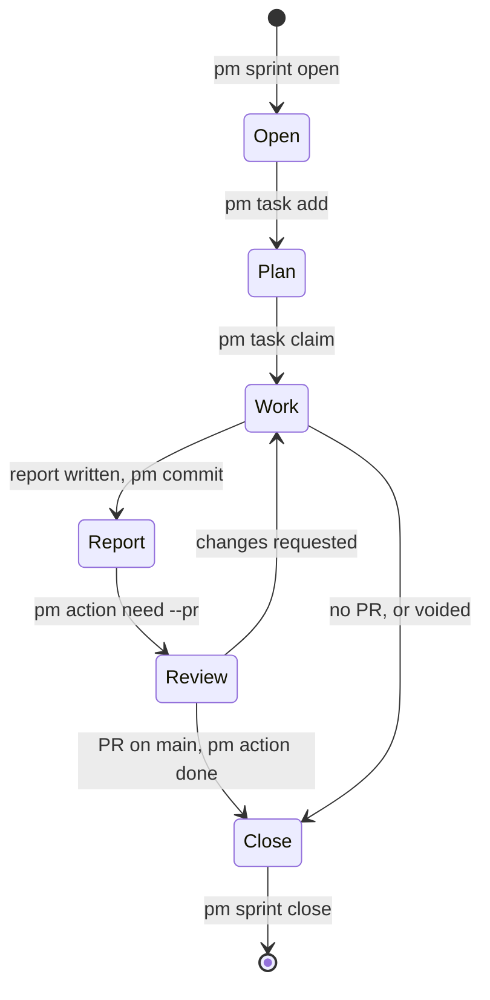

## Problem

> What are we solving, and why now?

Part of the [Project management harness](pm-harness.md) design. A sprint
passes through Beads, the records store, a code branch, a GitHub PR and the
owner's review before it closes. Each step needs one obvious command and one
place that shows where the sprint stands, or agents invent their own state
and the owner cannot tell which sprints wait on them. This page is the
end-to-end flow; the sprint record's sections are under
[Record layer](record-layer.md).

## Goals and non-goals

> What must the design achieve, and what does it deliberately leave out?

**Goals**

- One `pm` command per lifecycle step that touches both Beads and a record.
- Every state of a sprint is visible from Beads and the sprint page; no
  record holds hand-made status.
- A sprint closes only once its work is on main, with the merge commit in
  its report.
- Owner input never stops the work: needs are raised and work continues.

**Non-goals**

- `pm` talking to GitHub; the agent carries the merge evidence.
- Enforcing how code is branched or reviewed beyond the review action.

## Constraints and key facts

> Which facts, findings and constraints shaped the design? Only those that
> still hold; sprint records keep the findings as they happened.

- A sprint closes only once its PR is on main; a PR merged into a stacked
  base does not count.
- `pm` never asks GitHub at close: the review action's close reason
  ("merged as <sha>") is the merge evidence, chosen to avoid a `gh`
  dependency.
- Records live in the `records` branch store, shared by every worktree; each
  `pm` write commits there, never on a code branch.
- The scheduled `pm push` publishes Beads data and records every 10 minutes;
  sessions push neither.
- Hooks, rules and `~/.claude` links read the main checkout, so it must
  follow `origin/main` after a merge.

## Design

> What is it, in its final state? Free `###` subsections. Decisions and plans
> live in the project and sprint records.

A sprint moves through six stages; review can send it back to work, and a
sprint without a PR goes from work straight to close.

### Open

`pm sprint open --title … <project>` reads Goal, Scope (**In** and **Out**)
and Done when from its body (`--text-file - <<'EOF'`), creates the Beads epic and the sprint record, and
commits the record on the records branch.

### Plan

`pm task add` creates tasks under the epic. Sub-tasks (`bd create --parent`)
and dependencies (`bd dep add`) are plain `bd`. A scope change is a sprint
decision, not a renamed task or rewritten description.

### Work

`pm task claim` records the claiming session and refuses a task another live
session holds. Code goes on a branch off main. Findings go in with
`pm finding add`, decisions with `pm decision add`. Owner input is raised as
a need (`pm decision need` or `pm action need`), and work continues on other
ready tasks meanwhile. `pm task close` stamps the commit in its reason; a task
that will not be done closes with `pm task close --dropped` and its reason.

### Report

Before review, the agent writes the full delivery report by hand in the
store and commits it with `pm commit`: Outcome (done, partial or voided plus
one sentence, optional bullets) and Against "Done when" (each item met or
not, with evidence). The report carries no draft marker; the open review
action is what says the sprint is not closed.

### Review

The agent opens the PR and raises the review with
`pm action need --pr URL --sprint ID --focus …`, which refuses a sprint
whose report is not written. The review is an action under the sprint and
blocks its close. The sprint page renders the sprint's own open needs in the
generated "Decisions await you" and "Actions await you" sections; the review
card (PR link, focus, reply box) is what shows the sprint awaits a merge. In
Claude Code a PostToolUse hook runs `pm reply wait` in the background and
wakes the agent on an owner reply or when the PR merges to main; the wake for
a merged review tells the agent to fast-forward the main checkout with
`git -C <main checkout> pull --ff-only origin main`.

### Close

The agent confirms the merge commit is on `origin/main`, closes the review
with `pm action done <review> --reason "merged as <sha>"`, and edits the
report by hand only if review changed the work. Open tasks are closed or
moved (`pm task move`) first. `pm sprint close <id>` then requires every task
closed and each review closed as merged (a dismissed one, a replaced PR's or a [TEST] review, is skipped), appends "Merged as <sha> (PR #N)." to the
Outcome, commits the record on the records branch and closes the epic. A
sprint with no PR, or a voided one, closes without a review or a stamp.

## Alternatives considered

> What else was considered and not adopted, and why not?

- **A draft paragraph in the report** (`Draft until its PR merges.`, shown
  as a "Draft — closes when PR #N merges" banner): it duplicated the open
  review action's state and cost two hand steps per sprint (delete the line,
  commit), and the forced post-merge edit never made anyone re-check
  evidence.
- **A `Draft:` prefix before the verdict:** older `pm` rejects an Outcome
  that does not start with done, partial or voided.
- **`pm` checking GitHub at close:** adds a `gh` dependency to every close;
  the review's close reason already carries the evidence.
- **`pm` pulling the main checkout itself:** the agent runs a `--ff-only`
  pull instead, so a diverged checkout refuses visibly.

## Prior art

> Optional. What existing work did we learn from, and what did we take?

None yet.

## Open questions

> What is still unresolved?

None yet.
