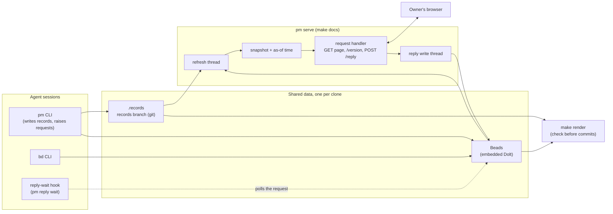
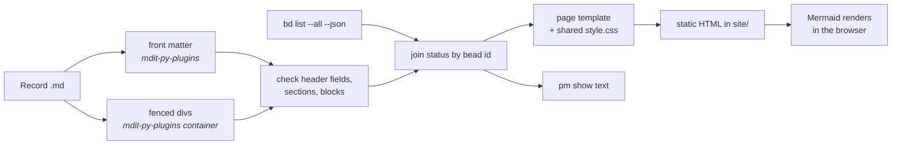
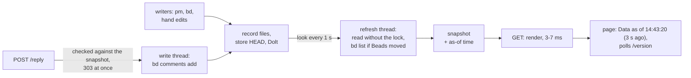
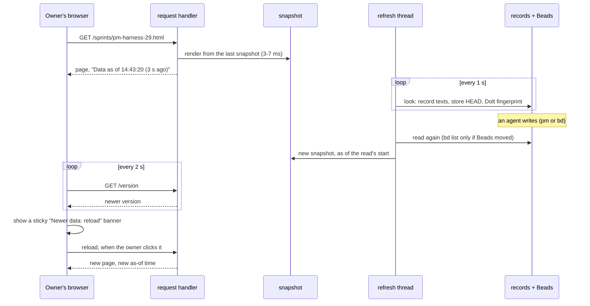
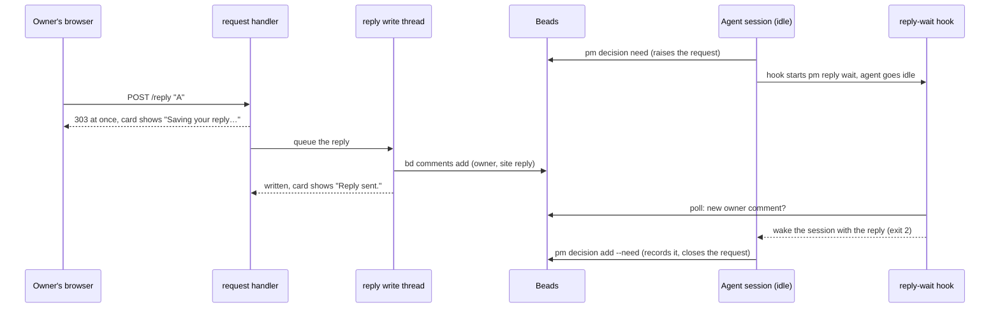
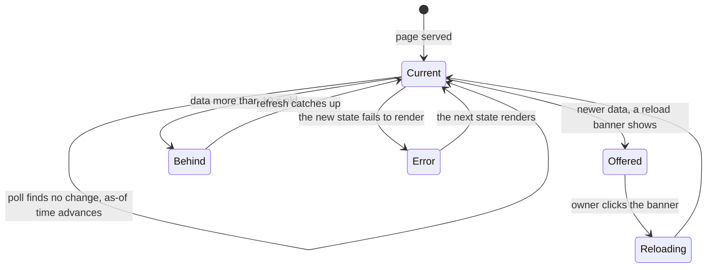

## Problem

> What are we solving, and why now?

Part of the [Project management harness](pm-harness.md) design. One of its four problems is that **status pages are hand-edited
HTML**: a high read cost per update, and a look that drifts. On poker-ai, 52
daily pages average 7.2k tokens, 28% of it CSS and markup, with 36 different
CSS blocks across 104 pages and no generator. A rendered site also has to stay
current: rendering by hand left the owner reading stale pages.

## Goals and non-goals

> What must the design achieve, and what does it deliberately leave out?

**Goals**

- One renderer builds both views from the same source: the owner's site and
  the agents' `pm show` text.
- A page loads at once, even while other sessions write, and states how old
  its data is: at most 10 s behind the records and Beads, or it says it is
  behind. Nothing to run.

**Non-goals**

- Hand-edited or committed HTML: every page is rendered from records.

## Constraints and key facts

> Which facts, findings and constraints shaped the design? Only those that
> still hold; sprint records keep the findings as they happened.

- A raw HTML block in Markdown ends at the first blank line, so a mock-up
  on a page must contain none.
- Some status changes are plain `bd` writes that `pm` never sees, so the
  site cannot rely on `pm` to tell it when to render.
- Writers make every part of a request slow, measured on 2026-10-05 with the
  per-request timing line of `pm serve` (sprint 29): `bd list --all --json`
  takes 0.5 s alone and up to 6.3 s while other `bd` processes write; `bd
  comments add` (a reply) 0.55 s alone and 6.4 s under a `bd update` loop; one
  `bd update` took 20.7 s. A `pm` write holds the store's exclusive lock across
  its own `bd list` and commit, 1.5 s on average and up to 7.3 s with both kinds
  of writer, so anything taking the shared lock waits that long.
- With several `bd` processes open, the Dolt fingerprint moves without any
  write: `journal.idx` flips between two sizes and transient
  `nbs_manifest_<n>` files appear in `noms/`, 50 moves in 30 s, each costing
  the next load a full `bd list`.
- `pm` writes each record file atomically (a temporary file renamed over
  it), so a reader without the lock sees whole files.

## Design

> What is it, in its final state? Free `###` subsections. Decisions and plans
> live in the project and sprint records.

### Architecture at a glance



*Reading:* agents write the records store and Beads; `pm serve` reads them only in its refresh thread, serves the owner from the snapshot, and hands replies to its own write thread, so the owner's requests never touch the shared data directly.

### Views
Every view is rendered from records plus live status from Beads. Nothing in a view is edited by hand.

| View | Reader | Built from |
|---|---|---|
| Daily page | Owner | Generated for every date with activity (no hand-written day record): sprint moves and owner tasks from Beads; docs dated that day; its Today summary from `days/<date>.summary.json` |
| Project page | Owner | Project record (goal, decisions, design pages); a generated Progress graph of sprints and tasks with dependencies from Beads; a generated Not in a sprint table of the project's open non-epic items filed directly under its epic (needs excluded: the await-you sections show them); decisions of its open sprints listed separately; every doc of the project, before Outcome |
| Sprint page | Owner | Sprint record: frame, decisions, outcome, delivery report; task status from Beads; docs whose bead is the sprint or one of its tasks, before the delivery report; generated "Decisions await you" and "Actions await you" sections for the sprint's own open needs, its PR review card (PR link, focus, reply box) included, which is what shows the sprint awaits a merge ([Sprint lifecycle](sprint-lifecycle.md)). Not chosen: a draft banner driven by a marker in the report, which duplicated the open review |
| Root page | Owner | Generated overview: needs across projects, each project's open sprints with progress, recent days, a Not in a sprint table of open non-epic items filed directly under a project epic or with no parent, design pages (last updated first, with created and updated dates) and docs. Replaces a hand-kept current-state file |
| Design pages | Owner | Design records, with their created and last-updated dates under the title |
| Docs | Owner | Doc records, linked to their project |
| `pm show` | Agents | The same data as the pages, as compact text with ids |

### Example: the daily page
Three parts, in reading order:

| # | Section | Prompt line | Comes from |
|---|---|---|---|
| 1 | Today | What moved today, and what waits on the owner? | Generated by `pm day summarize`, labelled "generated at HH:MM"; an older day record's hand paragraph stays below it as history |
| 2 | Decisions await you, Actions await you | What is waiting on the owner? | Generated: open Beads issues labelled `human`, split by the `action` label; options and cost, or what to do, live in each issue's description; each card names where the request sits, from its parent chain in Beads: its project and its sprint, each linked to its page, then its task when it sits under one (a request directly under a project shows only the project), and `pm show`'s request lines name the same as `(sprint N, task .N.M)`; each card served by `make docs` has a reply box ([Replies on the site](site-replies.md)) |
| 3 | Sprints | Which sprints moved today, and what changed? | Generated: per sprint, the Beads tasks opened, started or closed on that date |

A day is repo-wide: one page per day across all projects, grouped by project.
Nothing on it is written by hand: the facts come from Beads and the records, and
Today is a generated summary of them. Older dates may still have a day record
file; its paragraph renders as history. Results and findings go in the
sprint record's Findings, not on the daily page.

### The Today summary
Owner decision (2026-10-06): a day page is a fully rendered view, and its Today summary is generated through the day, not written once in the morning.

- `pm day summarize` builds a plain-text digest of today: what the day page shows (per project, sprint moves and requests waiting on the owner; docs dated today) plus the records committed today, leaving out the summary files themselves. With no activity, or a digest equal to the stored summary's, it exits.
- Otherwise it pipes the digest to `claude -p --model haiku --tools "" --setting-sources "" --no-session-persistence`, run in a temp dir so no project settings or hooks apply. The prompt asks for 2 to 4 sentences in ASD-STE100 Simplified Technical English (at most 20 words a sentence, active voice, one meaning per word, no idioms): what moved today and what waits on the owner, nothing invented.
- It commits `{date, generated_at, digest, model, text}` to `records/days/<date>.summary.json`, taking the store lock only after the model answers. A missing or failing `claude` fails the command and writes nothing; there is no fallback text.
- The scheduled job (`pm push`) runs it as its `summary` step between the Beads and records pushes, every 10 minutes: it regenerates the summary only when the digest changed and does nothing otherwise; it also regenerates yesterday's once when yesterday's digest changed, so the last minutes before midnight are summarized. The step logs its own line in `pm-push.log`; a failure is flagged in `pm show`, `pm where` and the site banner like a failed push, and does not stop the records push.
- Not chosen: a day record written each morning (stale by noon, one more chore); an hourly cap on regeneration (`--every`), dropped by the owner: the digest check already limits model calls to runs where something changed.

### The daily page: source and rendered result
Real content from the 29 Sep poker-ai page, shortened. Bead ids and numbers are placeholders. "Needs you" and "Sprints" on the right are not in the record: they are generated from Beads.

<div class="split">
<div>
<p class="cap">records/days/2026-09-29.md</p>
<pre>---
type: day
date: 2026-09-29
---
&#8203;
## Today
Decide which arm goes forward: arm B's
scored rows exist.</pre>
</div>
<div>
<p class="cap">Rendered page (mock)</p>
<div class="screen">
  <p class="m-h">poker-ai · 29 Sep 2026</p>
  <p class="m-sec">Today</p>
  <p class="m-sub">Decide which arm goes forward: arm B's scored rows exist.</p>
  <p class="m-sec">Needs you</p>
  <div class="card need"><h4><span class="pill queued">DECIDE</span>Drop five large files from history</h4>
    <p>Reclaims about 116 MB. Rewrites history for everyone.</p></div>
  <p class="m-sec">Sprints</p>
  <div class="card"><h4><span class="pill run">RUNNING</span>Sprint 9: learned leaf</h4>
    <p><span class="pill done">CLOSED</span> Producer consistency-check fix</p>
    <p><span class="pill run">STARTED</span> Score arm B rows</p></div>
</div>
</div>
</div>

### Implementation
Two uv scripts, `pm.py` (writes) and `render.py` (run by `make render`; `make docs` runs `pm serve`, which uses the same renderer), share the `harness/` package, so both apply the same checks. Only Beads and the diagram script are outside it.



*Reading:* records are parsed and checked once, joined with live Beads status, and written as static pages; diagrams are drawn by the browser.

| Concern | Choice | Why | Not chosen |
|---|---|---|---|
| Work layer | Beads `bd`, read with `bd list --all --json` | Task graph, claims, ready queue, JSON output | Our own task model |
| Markdown parsing | `markdown-it-py` with `mdit-py-plugins` (front matter, container, anchors) | Gives each block's line range, which a CLI needs for in-place edits | Pandoc |
| Validation | Plain checks in the script: header fields, required sections, block names and attributes, bead ids, the delivery report's outcome, answered needs cited by a decision, no hand-written text in a generated section (a non-prompt line in a project's or sprint's Progress; a heading the page generates, such as a day's Decisions await you, Actions await you, Sprints or Docs) | Clear errors; nothing else to install | `pydantic`, JSON Schema |
| Templates | One page template in the script; all styling in the shared `style.css` | Small; the look lives in one file | `Jinja2` |
| Diagrams | Mermaid, drawn in the browser from a CDN script | No Node toolchain | `mermaid-cli` at build time; Graphviz or D2 |
| Packaging | Two entry scripts (`pm.py`, `render.py`) with inline dependencies (PEP 723), run by `uv run`, sharing a small `harness/` package beside them | No install step; one parser for both | One large script; an installed package |
| Design page dates | Created and last updated are a design page's first and last commit dates (`%cs`) on the records branch, following renames within its directory as `git log --follow` does; a page with uncommitted changes counts as updated today, one never committed as created today too. One `git log -M --name-status` over the design pages' directories, parsed once, plus one `git status`: about 45 ms on the real store | The page's name holds its current state, so a date in it would go stale; git already records when it changed | A date in the file name or header (goes stale, or is hand-kept); one `git log --follow` per page (a git call per page); `--follow`'s copy detection (pairs a new page with a similar older one, giving it the older page's created date) |
| Running | `make docs` starts `pm serve` once. Requests render from a snapshot of the records and Beads that a background thread keeps current; see Read path. The design pages' dates are recomputed only when the record texts, the store's HEAD commit (the bytes of its HEAD, branch ref and `packed-refs` files, read without git) or the day changed, and a page is rendered once per snapshot. Replies carry `Cache-Control: no-store`. `make render` writes `site/` and is the check before commits | A page loads in milliseconds while others write and says how old it is. Dolt appends every write to its chunk journal, so a `bd` write always changes a size, while a lone `bd` read changes none; the fingerprint costs 0.2 ms | Reading records and Beads inline on each request under the store lock (pages waited up to 11 s and replies up to 45 s behind writers, measured 2026-10-05); rendering by hand with `make render` (left the owner reading stale pages); rendering after each `pm` write (misses plain `bd` changes); rendering every page on every request (0.75–0.86 s per reload with 41 pages); a `bd` call as the change signal (none costs under 0.1 s); mtimes as the signal (a `bd` read changes them); a file watcher (needs a dependency) |

### Read path

A request never waits on a writer: it renders from the last snapshot of the
records and Beads, which a background thread keeps current, and the page
says how old that snapshot is.



*Reading:* writers only delay the refresh thread; requests read the last
snapshot, and the page states its age.



*Reading:* a page load only renders from memory; a change made by an agent reaches the open page as a reload banner through the refresh thread and the page's own poll, within seconds; the page loads it only when the owner reloads.



*Reading:* the owner's click returns at once, the write happens behind it, and the waiting agent is woken by its own hook rather than by anything the site does.



*Reading:* a page is always in one of these states and says which; being behind is shown, never waited out, and a render failure is shown as the error, never as an old page.

- **Snapshot.** The refresh thread looks every second, and at once after a
  request or a reply write, at the record texts, the store's HEAD files, the
  day and the Dolt fingerprint. If nothing moved, the snapshot's as-of time
  becomes the time of the look. If something moved, it reads again, and the
  new snapshot is as of the time the read started, so its data is at least
  that current. Beads are reread with `bd list` only when the fingerprint
  moved; a reread equal to the last one (readers move the fingerprint too)
  keeps the rendered pages.
- **No lock.** The read takes no store lock, since `pm` writes each file
  atomically. Between a `pm` write's steps the records and Beads may not
  render together (a need closed before its decision is written), so a read
  that fails is repeated under the store's shared lock, which the write holds
  exclusively: an error page shows only a real error.
- **The page states its age.** Every page carries "Data as of HH:MM:SS (N s
  ago)", filled on each request into a slot the static site leaves empty.
  Its script polls `/version` every 2 s: an unchanged page takes the newer
  as-of time; a changed one never reloads itself (owner decision: auto reloads
  flashed the page) but shows a sticky "Newer data: reload" banner, whose
  reload keeps the scroll position. Over 10 s the line says other sessions are
  writing and the page is behind; it never blocks. A page that does not exist
  yet offers a reload once it does; a state that fails to render is served as
  the error, never as an old page.
- **Replies.** The POST checks the host (on `site_url`'s host, after the
  Cloudflare Access token every request there needs; see
  [Replies on the site](site-replies.md)), token and issue against the
  snapshot, appends the reply (its reply id, request id, text and time) to
  the spool, `pm-replies.jsonl` in the clone's git dir, fsyncs it and only
  then answers 303. One write thread delivers each spooled reply: unless a
  comment on the request already ends in the reply's id marker, it runs
  `bd comments add`, then appends a done line; the spool is emptied once no
  reply in it is pending. A failed write stays in the spool and is retried
  after 1, 2, 4 … up to 60 s. On start the server delivers every pending
  reply, so a reply answered with 303 is delivered at least once and, by its
  marker, written once, across a crash, a kill -9 or Ctrl-C. The card shows
  "Saving your reply…", then "Reply sent." until a snapshot shows it from
  Beads, or the error with the text back in the box.
- **Timing log.** One stderr line per request, per refresh that read, and per
  reply write: total, lock, git, render and each `bd` call.

Measured on 2026-10-05 against the real store, with one writer holding the
store lock across a `bd list` and a `bd update` in a loop (as a `pm` write
does) and another looping `bd update`, both on `[TEST]` issues:

| Read path | Page load, median / max | Reply POST | GET after a reply | Stated age, median / p90 / max |
|---|---|---|---|---|
| Inline, under the lock (before) | 2.7 s / 11.0 s | 4.8 s / 44.6 s | 4.9 s / 22.2 s | none stated |
| Snapshot, read under the lock | 2 ms / 9 ms | 2 ms / 6 ms | 1 ms / 7 ms | 7.3 s / 30.1 s / 35.1 s |
| Snapshot, read without the lock (built) | 2 ms / 30 ms | 2 ms / 5 ms | 1 ms / 6 ms | 2.6 s / 16.2 s / 19.1 s |

No page showed data older than it stated: in 60 checks, every `bd update`
finished before a page's as-of time was on that page. Under this load 20% of
loads stated more than 10 s, all of it `bd list` itself (up to 16.4 s under
Dolt contention); the page says so instead of waiting.

### Where it lives

```
skills/project-management/             ← the skill: generic, reusable
  SKILL.md
  harness/
    RULES.md         ← binding rules, loaded from a repo's AGENTS.md
    pm.py            ← the pm CLI (uv script): argument parsing, commands
    render.py        ← renderer entry point for make render (uv script); pm serve serves the same pages live
    style.css        ← the one shared stylesheet
    harness/
      records.py     ← parse, sections with line ranges, validate
      beads.py       ← bd subprocess calls and Beads JSON
      site.py        ← HTML pages, generated sections and lists
    tests/           ← make test: pm against a temp repo and a fake bd

<project repo>/                         ← each project using it
  bin/pm             ← wrapper: resolves the repo root, runs pm.py
  Makefile           ← make render, make docs (pm serve), make test
  .beads/            ← Beads data (Dolt)
  .records/          ← the store: the records branch, the only source (git-ignored here)
    projects/  sprints/  days/  design/  docs/
  records            ← git-ignored link to .records, made by pm setup
  site/              ← rendered HTML, not committed
```

## Alternatives considered

> What else was considered and not adopted, and why not?

Smaller alternatives sit beside the choice they lost to in Design, marked
"Not chosen".

- **Reading the committed records** at the store's HEAD (`git archive HEAD`,
  13 ms) to avoid the lock: reading the files without the lock avoids it too
  and still shows hand edits before they are committed.
- **A separate background thread for Beads**: the stated age is bounded by
  `bd list` itself, which a second thread does not shorten.
- **An in-memory reply queue, drained on Ctrl-C**: a crash or kill -9 lost
  any reply still queued, and a write cut off by a kill could not tell
  whether its comment had landed.

## Prior art

> Optional. What existing work did we learn from, and what did we take?

None yet.

## Open questions

> What is still unresolved?

- Under heavy Dolt contention `bd list` takes up to 16 s, so a page can state
  that it is more than 10 s behind. A cheaper Beads read, or a fingerprint
  that ignores the `journal.idx` and manifest churn other readers cause,
  would narrow it.
