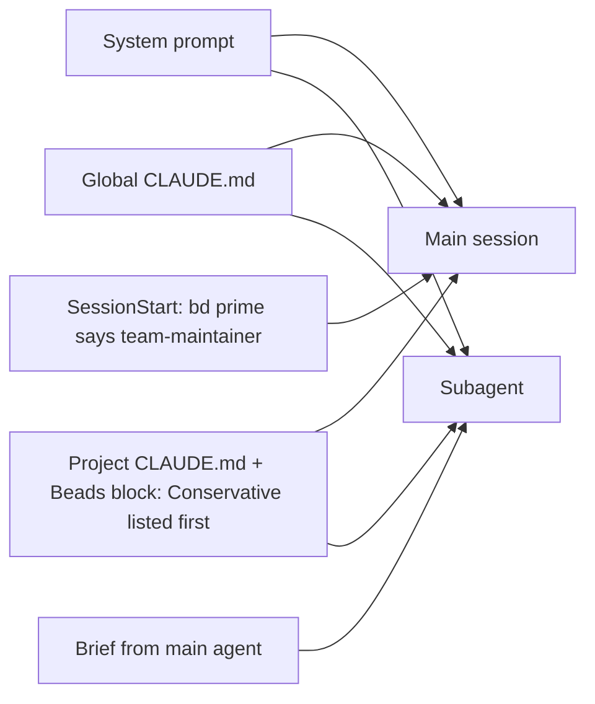

## Summary

Agents here get two kinds of guidance: generic guidance that ships with the tools (Claude Code's system prompt, the Beads block that `bd` manages inside CLAUDE.md, and the output of `bd prime`), and this harness's own rules (RULES.md, the global AGENTS.md, the owner's decisions). Sometimes they disagree, and when they do, agents tend to follow the generic one. The visible symptom: an agent hands the owner a step that was unneeded or was its own job, such as "run `git -C .records push`".

The study found **7 points of contact**. One is settled by an owner decision (records push), two agree in practice, one causes no trouble, and **three are open**: there is no rule saying which guidance wins, subagents cannot see the active Beads profile, and `bd prime`'s close protocol says `git add .` and push.

Need `yeeef-agents-9va.30.9` asks the owner which fix to apply to the three open conflicts. The default is option A: three one-line rules.

Evidence is from the Claude transcripts under `~/.claude/projects/-Users-yeeef-Desktop-workspace-yeeef-agents/` (15 main sessions, 80 subagent transcripts), Codex rollouts under `~/.codex/sessions`, and the records. The 2026-10-05 sprint-22 close incident is in sprint 25's Findings and is not repeated here.

## Where agents get their guidance

In the order an agent sees it:

1. **Claude Code system prompt.** Generic: "Commit or push only when the user asks", and ask the owner before outward-facing or unclear steps.
2. **Global `~/.claude/CLAUDE.md`** (this repo's AGENTS.global.md). Surgical commits, preserve work that is not yours, finish the task yourself and show evidence.
3. **Project CLAUDE.md**, which includes RULES.md and the bd-managed Beads block. The block's "Agent Context Profiles" lists Conservative first and calls it the default ("Do not run git commits, git pushes, or Dolt remote sync unless explicitly asked. At handoff, report changed files, validation, and suggested next commands"). It never says which profile is active here.
4. **SessionStart hooks** (`.claude/settings.json`): `bd prime --hook-json` and the harness's session context hook. `bd prime` says "agent.profile=team-maintainer is active. Commit, sync, and push as part of routine work". Main sessions only.
5. **Skills**, loaded on demand (project-management).

Reading: a main session hears "team-maintainer" from `bd prime`; a subagent never does, so the only profile it reads about is Conservative.

Subagents do not receive SessionStart output: 0 of 80 subagent transcripts carry a hook attachment, while main transcripts carry 14 `hook_additional_context` and 16 `hook_success` attachments. The 4 subagent transcripts that contain the `bd prime` text got it by running the command themselves.

## The conflicts

### 1. Who pushes records (settled)

The system prompt and the Conservative profile say push only when asked ("Do not run git commits, git pushes, or Dolt remote sync unless explicitly asked"). The harness says records are pushed on their own (CLAUDE.md), and the owner decided (need 9va.30.2, then 9va.30.8.1) that a per-machine scheduled job pushes both records and Beads, and pm itself never pushes.

What agents did: followed the generic rule. 2 sessions handed the records push to the owner, 0836868b and 1bdea93a, both 2026-10-05; e.g. "The records aren't pushed; to push them, run `git -C .records push`."

Status: settled by the decision answering 9va.30.8.1. Task 9va.30.8 is closed: `pm push` and its schedule were built (PR #34) and a manual push of both stores was verified, but the macOS launchd job is blocked by TCC on `~/Desktop`. Until the job runs, agents push by hand. Cost: up to one job interval of lag.

### 2. Which Beads profile is active (open)

The Beads block calls Conservative the default and lists it first. The owner chose team-maintainer (`.beads/config.yaml`, `agent.profile: team-maintainer`).

What agents did: mixed. Main sessions get `bd prime`, which names team-maintainer. CLAUDE.md never names the active profile, and subagents never see `bd prime` (above), so they see only Conservative plus their brief.

Status: open. Fix: state "Beads profile: team-maintainer" in project CLAUDE.md, outside the managed block. Cost: one line, which must change if the profile changes. Alternative: a SubagentStart hook running `bd prime`, about 2k tokens per subagent (`bd prime` output is 6,816 bytes now).

### 3. The team-maintainer close protocol (open)

`bd prime`'s session close says `git add . && git commit -m "..."`, `bd dolt push`, `git push`. The harness says commit surgically and preserve others' work (global AGENTS.md), never commit `records/` on a code branch (RULES.md), and leaves pushing records to the job.

What agents did: the harness so far. No transcript runs `git add .` together with a session-close push of a code branch; 11 transcripts ran `git add .` in some form, 7 ran `git push`. The risk is real: `git add .` would stage others' work, such as the currently modified `claude-settings.json`.

Status: open. Fix: a RULES.md line "commit only the task's files; push a code branch only to open or update its PR", or the general precedence line (conflict 4). Cost: one line.

### 4. Hand-offs to the owner (open)

The Conservative profile says at handoff "report … suggested next commands". The harness says a need for the owner is a `pm action need`, never chat, and agents do their own steps.

What agents did: the generic one. The 0836868b hand-off "to push them, run `git -C .records push`" is that template. Asked why after the sprint-22 close, the agent cited the Conservative profile and Claude Code's default, not RULES.md.

Status: open. Fix: one precedence line in RULES.md: the harness rules and the owner's decisions win over Claude Code defaults and the Beads block where they differ; before handing the owner any step, check it is needed and that the agent cannot do it itself. Cost: one line.

### 5. Memory (no trouble)

`bd prime` says use `bd remember`, not MEMORY.md; Claude Code has its own auto-memory. The harness has no rule; facts go in records. What agents did: `bd remember` ran in 3 transcripts; the project memory dir is empty. Status: no conflict in practice, no action.

### 6. Task tracking (agrees)

The Beads block says do not use TodoWrite or TaskCreate; RULES.md says work in Beads. What agents did: 0 TodoWrite or TaskCreate calls in any transcript. Status: agrees, no action.

### 7. Asking the owner (agrees)

The system prompt says ask the owner before outward-facing or unclear steps; the harness says ask only through a need, never only in chat. What agents did: the harness, enforced by the Stop hook (not counted here). Status: agrees, no action.

## Earlier hand-offs

A scan of assistant text in all 15 main transcripts for hand-off phrases ("you can run", "please run", "push them with", "run `git", "left for you", "next command", "proposed commands") gave 19 hits in 8 sessions; refusal phrases ("explicit authority", "Conservative", "without explicit") gave 7 hits in 2 sessions (1bdea93a, all explaining the 2026-10-05 incident). Most hits are explanations, not hand-offs. The real hand-offs:

- 0836868b, 2026-10-05: "The records aren't pushed; to push them, run `git -C .records push`." Unneeded and the agent's own job; same shape as the sprint-22 close.
- 0a6715ef, 2026-10-04: "please run the check yourself" (a nested `claude -p` check). Partly justified (the session could not start a nested `claude`), but a subagent or a background `claude -p` was not tried.
- 0a6715ef, 2026-10-04: "To see it in your checkout, run `git merge context-efficiency-1`". A merge the agent could have done or skipped.

No sprint finding or postmortem before sprint 25 records the pattern. Codex rollouts: 3 files contain the phrases, all in injected instructions, none in assistant replies.

## The options in need 9va.30.9

| Option | Fixes | Cost |
|---|---|---|
| A: precedence line, profile line, close-protocol override | 2, 3, 4 | Three lines; the profile line must change with the profile |
| B: A plus a SubagentStart hook running `bd prime` | 2 (twice over), 3, 4 | A's cost plus about 2k tokens per subagent |
| C: precedence line only | 4, and 3 in principle | Subagents still see Conservative; `git add .` may still stage others' work |
| D: nothing | none | The pattern recurs |

Default: A.
