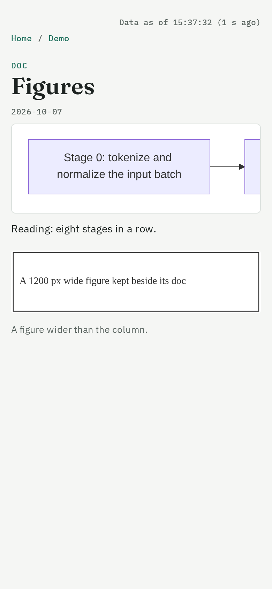
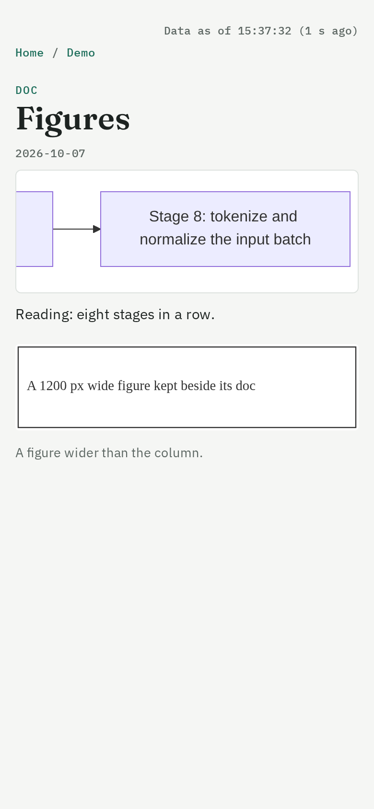
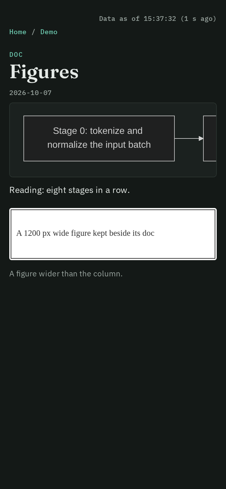

## Goal

> What should be true when this sprint ends, and why now?

A wide Mermaid diagram stays legible at phone width and survives a CDN blip and a theme switch, and a record can show an image file kept next to it.

Today the site loads `mermaid@11` with no exact version and no fallback, lets `useMaxWidth` shrink wide flowcharts to 3-6 px text at 390 px, and sets the theme once at load (`internal/site/site.go:716-720`) (ai-safety 2026-10-07 20:41). The site serves no image files from the store and `style.css` has no img or figure rule, so figures are inlined as base64 (ai-safety 2026-10-07 20:58).

Raised by the pm feedback triage of 2026-10-10 across pm, formal-methods, ai-safety and yeeef-agents.

## Scope

> What's in, and what's explicitly out? Keep this high level; implementation
> details go in a design page.

**In:**
- Pin an exact Mermaid version.
- `flowchart.useMaxWidth=false`, with `pre.mermaid` scrolling sideways.
- Diagrams re-render when the colour scheme changes.
- The service serves `.svg`, `.png`, `.jpg` and `.webp` files from the records store with their content types, confined to the store.
- `pm commit` and `pm check` accept such files.
- An `img`, `figure` and `figcaption` rule in `style.css`.
- Golden pages updated.

**Out:**
- Serving Mermaid from the binary, unless the pin alone does not answer the blip. Record that as a decision.
- Image processing.

## Done when

> What evidence will show the goal is met?

- A golden page with a diagram loads the pinned version with `useMaxWidth` off.
- A serve test gets `200 image/svg+xml` for `records/docs/x.svg` and `404` for a path escaping the store.
- A live check at a 390 px device-emulated viewport, in light and then dark, shows the wide diagram scrolling and the figure inside the column (screenshots in Findings).
- `make test`, `make test-go` and the PR's CI pass.

## Design pages

> Where is the detail?

None yet.

## Progress

> Where is the sprint now? Generated from the work store when the page is rendered.
> Do not write here.

## Decisions

> What did we choose inside this sprint, and why?

::: decision {source=agent date=2026-10-10}
Mermaid stays on the CDN, pinned to mermaid@11.17.2 with unpkg as a second CDN; it is not served from the binary.
The pinned jsdelivr URL is served with Cache-Control public, max-age=31536000, immutable, so a browser that loaded it once keeps it; with jsdelivr blocked in the live check the diagram drew from unpkg. Serving it would embed its minified ESM build, 104 .mjs files of 3.5 MB (jsdelivr file listing), in every pm binary.
:::

## Findings

> What did we learn that changes the design, the plan, or how we work? Add
> results with their numbers.

- Live check at 390 px (Chromium headless shell, isMobile, device scale 2),
  against `pm service run` on a scratch clone made by the harness's `repo`
  fixture, on a doc with a 9-node wide flowchart and a 1200 px SVG figure.
  Light: page scrollWidth 390 (no page scroll); the diagram's pre is 356 px
  wide and scrolls over 2,772 px (scrolled to 2,416); SVG scale 1.0, labels 16
  px (fit-to-width would scale by 356/2756 = 0.13, about 2 px: computed, not
  measured); the figure shows 358 px wide, right edge 374 = the column's.
  Switching the system scheme to dark redrew the diagram (node fill
  rgb(236,236,255) to rgb(31,32,32), body rgb(245,246,244) to rgb(20,25,23));
  setting `data-theme="light"` redrew it light. With jsdelivr blocked, the
  diagram drew from unpkg.com. Screenshots: 
   

- pm check and pm commit already took image files beside a record (Committed
  reads only .md, and pm commit commits any changed store path); no code
  change was needed, and a harness test now holds it byte for byte.

## Delivery report

> Written at close. Each part holds "Not closed yet." until then.

### Outcome

> Done, partial or voided, plus one sentence; then, optionally, bullets of what shipped.

Not closed yet.

### Against "Done when"

> Each item, met or not, with its evidence (a page, a command, a number).

Not closed yet.
